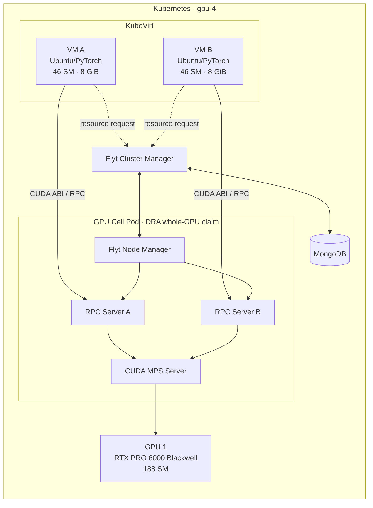
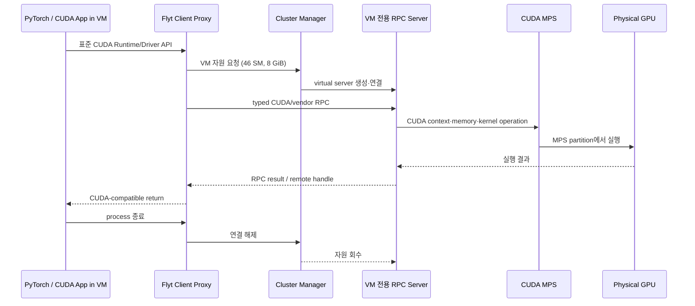
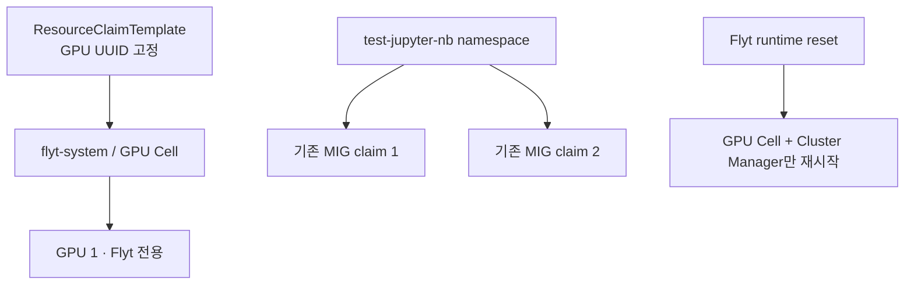
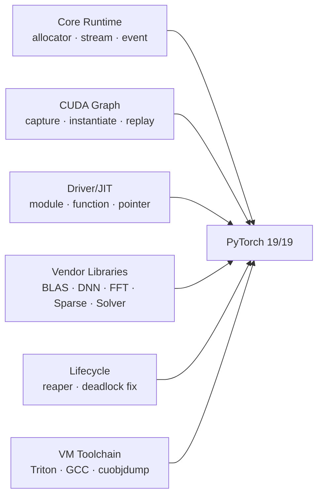
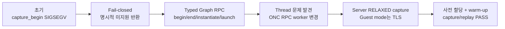
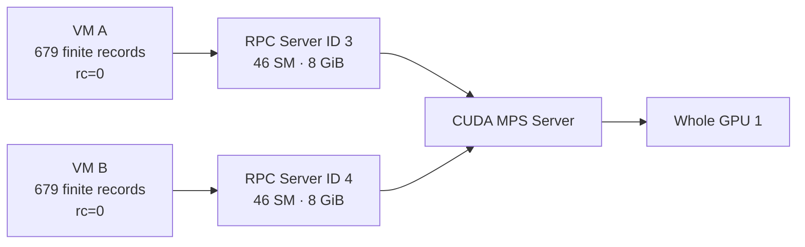
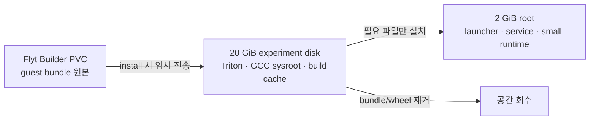

<!--
PPT 제작 안내

- `---`는 슬라이드 구분자다.
- 각 슬라이드의 "화면 구성"은 PPT 편집 지침이며 최종 화면에서는 제거할 수 있다.
- HTML aside notes 블록은 발표자 노트다.
- Mermaid를 지원하지 않는 도구에서는 각 도식 아래의 "도형 배치"를 사용한다.
- 최종 재검증 결과는 2026-08-26~27의 초기 결과를 대체한다.
-->

# Flyt 기반 Kubernetes GPU VM 서비스 검증

## KubeVirt VM + Flyt RPC + CUDA MPS

**핵심 결과**

- VM A: PyTorch 호환성 **19/19 PASS**
- VM B: PyTorch 호환성 **19/19 PASS**
- CUDA Graph 및 두 VM 동시 실행 **PASS**

> 물리 GPU를 VM에 직접 연결하지 않고 일반적인 AI 개발 VM 경험을 제공할 수 있는가?

**화면 구성:** 중앙에 제목, 하단에 `19/19 × 2`, `CUDA Graph PASS`, `Multi-VM PASS` 세 개의 큰 지표 카드.

<aside class="notes">
이 발표는 2026년 8월 26일 최초 실험부터 8월 31일 Track A2 최종 재검증까지의 결과를 다룬다. 초기에는 PyTorch 19개 항목 중 10개만 성공했지만, CUDA RPC와 VM 개발환경을 보완한 뒤 두 VM 모두 전 항목을 통과했다.
</aside>

---

# 1. 연구 배경과 문제 정의

## 원하는 사용자 경험

- 사용자는 일반 VM처럼 SSH, 패키지 설치, Python venv, Jupyter를 사용한다.
- 애플리케이션은 표준 CUDA·PyTorch 인터페이스를 사용한다.
- 여러 VM이 한 GPU를 fractional resource로 공유한다.
- Kubernetes가 배포, 격리, 복구와 반복 실험을 관리한다.

## 기존 방식의 간극

- KubeVirt의 일반 PCI passthrough는 GPU 전체를 VM 한 대에 귀속한다.
- MIG 직접 할당은 하드웨어 분할에는 유리하지만 CUDA 기능·프로파일 제약이 있다.
- NVIDIA vGPU는 VM 친화적이지만 상용 유료 라이선스가 필요해 연구 범위에서 제외했다.

**핵심 문제:** VM의 개발 자유도와 GPU의 세분화·공유를 동시에 만족해야 한다.

**화면 구성:** 왼쪽에 사용자 요구, 오른쪽에 기존 방식의 제약, 가운데에 간극을 표시.

<aside class="notes">
이 연구의 출발점은 단순히 GPU 커널을 실행하는 것이 아니다. VM 내부에서 사용자가 프레임워크와 도구를 자유롭게 설치하고, 그 환경을 Kubernetes 위에서 관리할 수 있어야 한다. 따라서 Pod 기반 원격 실행만으로는 목표를 충족하지 못한다.
</aside>

---

# 2. 연구 질문과 성공 기준

| 연구 질문 | 성공 기준 |
|---|---|
| RQ1. GPU 직접 연결 없이 VM에 CUDA 환경을 제공할 수 있는가? | VM에 `/dev/nvidia0` 없이 CUDA device·compute·memory 시험 성공 |
| RQ2. 최신 PyTorch 개발 경로를 지원할 수 있는가? | 정의한 19개 호환성 항목 전부 PASS |
| RQ3. CUDA Graph와 Triton/Inductor도 동작하는가? | capture/replay 및 `torch.compile` eager/inductor 성공 |
| RQ4. 한 GPU를 두 VM이 동시에 사용할 수 있는가? | VM별 독립 할당, 동시 rc=0, 종료 후 자원 회수 |
| RQ5. 공유 Kubernetes 환경에서 안전한가? | 지정 GPU와 Flyt namespace만 변경, 타 claim·workload 유지 |

**화면 구성:** 질문과 측정 가능한 판정 조건을 2열 표로 표시.

<aside class="notes">
호환성을 인상이나 단일 예제로 판단하지 않고, 사전에 정의한 행렬과 종료 조건으로 측정했다. 특히 그룹별 종료 코드뿐 아니라 테스트가 기록한 내부 JSON status를 최종 판정에 사용했다.
</aside>

---

# 3. 설계 대안 검토

| 대안 | VM 유사성 | GPU 세분화 | 주요 제약 | 판정 |
|---|---:|---:|---|---|
| PCI passthrough | 높음 | 불가 | GPU 전체를 VM 한 대가 점유 | 제외 |
| MIG 직접 할당 | 높음 | 가능 | 프로파일·CUDA 기능 및 운영 제약 | 최종 경로에서 제외 |
| NVIDIA vGPU | 높음 | 가능 | 상용 라이선스 및 전용 driver stack | 제외 |
| 원격 GPU Pod | 낮음 | 가능 | 일반 VM과 다른 개발·실행 모델 | 보조안 |
| **Flyt RPC + CUDA MPS** | **중간→개선 대상** | **가능** | CUDA API 직렬화 범위에 의존 | **Track A2 선택** |

**선택 이유:** GPU는 Kubernetes가 Pod에 안전하게 귀속하고, VM은 Flyt의 CUDA ABI proxy를 통해 GPU를 사용한다.

**화면 구성:** 마지막 행을 강조색으로 표시하고, 비용·호환성·세분화의 균형점을 시각화.

<aside class="notes">
Flyt 방식의 장점은 상용 라이선스 없이 whole GPU에 MPS를 적용해 논리 자원을 분배할 수 있다는 점이다. 반대로 VM과 GPU 사이에 RPC 경계가 생기므로 CUDA API 호환성은 직접 구현하고 검증해야 한다.
</aside>

---

# 4. Track A2 최종 아키텍처



**구조적 특징**

- GPU 1 전체는 DRA를 통해 GPU Cell Pod 하나에만 할당된다.
- VM마다 독립된 `cricket-rpc-server`와 virtual-server RPC ID가 생성된다.
- CUDA MPS가 동일 GPU에서 두 서버의 kernel 실행을 공유한다.
- VM 내부에는 실제 NVIDIA device node를 노출하지 않는다.

**Mermaid 미지원 시 도형 배치:** `VM A/B → 각각 RPC Server → 공통 CUDA MPS → Whole GPU`, 상단에 Cluster Manager/MongoDB 제어선을 배치.

<aside class="notes">
GPU Cell Pod와 VM은 1대1이 아니다. 하나의 GPU Cell 안에서 VM별 RPC server process가 생성되고, 이들이 하나의 MPS server를 공유한다. 이것이 물리 GPU 전체를 Cell에 할당하면서도 VM별 논리 자원을 제공하는 핵심이다.
</aside>

---

# 5. CUDA 호출과 자원 할당 시퀀스



## Handle과 memory의 원칙

- guest handle을 host CUDA에 직접 전달하지 않는다.
- module, function, stream, graph, pointer를 서버 자원으로 매핑한다.
- 미구현 API는 false success가 아니라 명시적 `NOT_SUPPORTED`로 종료한다.

**화면 구성:** 시퀀스 다이어그램을 전체 폭으로 표시하고 아래에 세 원칙만 배치.

<aside class="notes">
초기 장애의 상당수는 guest의 포인터나 handle을 host에서 그대로 사용하거나, 미구현 함수가 성공처럼 보이는 데서 발생했다. 최종 구현은 typed RPC, 길이 검증, handle mapping, fail-closed를 공통 원칙으로 삼았다.
</aside>

---

# 6. Kubernetes 배포와 안전 경계



- namespace: `flyt-system`
- 대상 GPU UUID: `GPU-7d708c42-8d4a-16d5-0746-474567157aa3`
- GPU Cell은 DRA selector로 승인된 GPU만 요청한다.
- 실험 lock으로 VM A/B의 중복 실험을 차단한다.
- 복구 스크립트는 Flyt GPU Cell과 Cluster Manager로 범위를 제한한다.

**최종 안전 감사**

- 기존 `test-jupyter-nb` MIG claim 2개 유지
- 비-Flyt unhealthy Pod 0개
- 실험 종료 후 active Flyt allocation 0개

<aside class="notes">
공유 클러스터이므로 기능 성공만큼 변경 범위가 중요했다. GPU 0의 기존 MIG 구성이나 다른 namespace의 workload는 건드리지 않았고, Flyt 구성요소의 복구만 자동화했다.
</aside>

---

# 7. 실험 환경

| 항목 | 최종 구성 |
|---|---|
| Kubernetes | v1.34.3 |
| KubeVirt | v1.8.4 |
| Guest OS | Ubuntu 22.04.5 LTS, kernel 5.15 |
| VM | VM A/B, 각 4 vCPU · 8 GiB RAM |
| GPU | NVIDIA RTX PRO 6000 Blackwell Server Edition |
| GPU mode | whole GPU, MIG disabled, CUDA MPS enabled |
| Flyt 논리 자원 | VM별 46 SM · 8192 MiB |
| PyTorch | 2.11.0+flyt.cu128 |
| CUDA | 12.8 · sm_120 |
| Triton | 3.7.1 |

## VM 개발환경 특성

- SSH, DNS/HTTPS, apt, Python venv, JupyterLab 검증
- GPU device node 없이 Flyt CUDA ABI 사용
- 2 GiB root + 20 GiB 실험 디스크

**화면 구성:** 왼쪽에 환경 표, 오른쪽에 VM/GPU 사양 카드.

<aside class="notes">
Blackwell sm_120을 대상으로 custom PyTorch wheel을 사용했다. 2GiB root는 개발 VM으로 지나치게 작아서 설치 실패의 원인이 되었고, 이후 큰 패키지와 toolchain을 20GiB 디스크로 옮겼다.
</aside>

---

# 8. 실험 설계

| ID | 실험군 | 주요 판정 |
|---|---|---|
| E0 | 공유 클러스터 안전 Gate | 지정 GPU만 사용, 타 workload 유지 |
| E1 | VM 개발환경 | SSH·네트워크·venv·Jupyter·compiler |
| E2 | 기본 CUDA | device, compute checksum, 8 GiB OOM 경계 |
| E3 | PyTorch 19항목 | VM별 각 항목 내부 status PASS |
| E4 | CUDA Graph | capture, instantiate, replay, 결과 검증 |
| E5 | Triton/Inductor | eager와 inductor 모두 PASS |
| E6 | 두 VM 동시 실행 | 별도 server ID, 동시 rc=0, finite records |
| E7 | lifecycle | 정상·비정상 종료 후 allocation 회수 |
| E8 | 재현성 | patch hash, ABI/static gate, manifest render |

## 실험 격리 원칙

- PyTorch 항목을 subsystem group별 별도 process로 실행
- 각 group 전후 guest IPC와 Flyt runtime 상태 확인
- 종료 코드와 JSON 내부 판정을 함께 사용

<aside class="notes">
하나의 실패가 다음 항목에 영향을 주지 않도록 그룹별 프로세스와 IPC를 격리했다. 특히 compile_modes는 프로세스 종료 코드가 0이어도 내부 extended status가 fail일 수 있어 JSON을 기준으로 판정했다.
</aside>

---

# 9. 구현 범위: CUDA/PyTorch 호환성 확장



## 대표 변경

- async allocator와 mempool RPC
- module content 전송, function/stream/pointer mapping
- cuBLASLt algorithm serialization
- cuDNN legacy training, cuFFT, cuSPARSE, cuSOLVER typed RPC
- client process reaper와 zero-client deadlock 제거
- VM용 Triton/GCC/sysroot/`cuobjdump` 패키징

**화면 구성:** 여섯 기능군이 중앙 `19/19` 결과로 모이는 형태.

<aside class="notes">
패치는 개별 API의 단순 stub 추가가 아니라 실제 PyTorch 실행 경로에 맞춰 구현했다. loader가 요구하는 ABI, remote pointer mapping, variable-size 결과의 길이 검증까지 함께 보완했다.
</aside>

---

# 10. CUDA Graph: crash에서 replay 성공까지



## 핵심 설계

- server: CUDA Driver API로 graph lifecycle 관리
- transport: worker thread가 달라도 동작하도록 `RELAXED` capture
- guest: `cudaThreadExchangeStreamCaptureMode` 상태를 TLS로 유지
- workload: explicit stream, memory pre-allocation, cuBLAS/pointwise warm-up
- 검증: 입력 변경 후 replay 결과가 실제로 변경되는지 확인

<aside class="notes">
CUDA의 GLOBAL과 THREAD_LOCAL capture mode는 begin/end thread 제약이 있다. ONC RPC는 연속 요청을 같은 worker thread에 배정하지 않으므로 server에서 RELAXED mode를 사용했다. 이것은 guest의 API 의미를 버린 것이 아니라 guest thread-local 상태는 client TLS로 보존하고 transport 제약만 흡수한 것이다.
</aside>

---

# 11. PyTorch 호환성: 초기 10/19 → 최종 19/19

| 단계 | VM A | VM B | 해석 |
|---|---:|---:|---|
| 최초 기준선 | 10/19 | 10/19 수준 재현 | 기본 eager 중심만 동작 |
| Track A2 기능 구현 후 | **19/19** | 16/19 | CUDA RPC 기능은 확보, VM B 환경 차이 발견 |
| VM B 환경 보정 후 | **19/19** | **19/19** | 두 VM의 기능·개발환경 일치 |

## 최종 성공률

```text
VM A  ███████████████████  19 / 19  (100%)
VM B  ███████████████████  19 / 19  (100%)
```

**중요:** 최종 19/19는 version-pinned PyTorch 2.11 + CUDA 12.8 실험 프로파일의 결과다.

**화면 구성:** 왼쪽에 단계별 표, 오른쪽에 100% 수평 막대 두 개.

<aside class="notes">
초기 기준선은 문제를 드러내기 위한 결과이고, 8월 31일 최종 재검증이 현재 시스템의 판정이다. VM A는 기능 구현 후 바로 19개를 통과했으며, VM B의 세 실패는 Flyt binary보다 guest 환경 차이에서 발생했다.
</aside>

---

# 12. 최종 19개 호환성 항목

| 범주 | 통과 항목 |
|---|---|
| 기본 환경 | environment, tensor runtime |
| 학습 | autograd/optimizer, AMP, models |
| 메모리 | allocator, `cudaMallocAsync`, pinned memory |
| 실행 제어 | stream/event, CUDA Graph |
| 수학 라이브러리 | cuBLAS, FFT, sparse, linalg |
| 프레임워크 기능 | serialization, RNG, SDPA |
| 개발·컴파일 | eager + Triton/Inductor compile modes |
| DNN | cuDNN convolution/BatchNorm training path |

## 판정

- VM A: `pass=19, fail=0, missing=0`
- VM B: `pass=19, fail=0, missing=0`
- 두 VM의 CUDA Graph checksum 일치

**화면 구성:** 19개 항목을 체크 아이콘이 있는 4열 grid로 변환하는 것을 권장.

<aside class="notes">
단순 tensor 연산뿐 아니라 FFT, sparse, linalg, SDPA, async allocator, CUDA Graph, Inductor까지 포함한다. 따라서 최종 행렬은 기본 eager smoke보다 훨씬 넓은 호환성 범위를 검증한다.
</aside>

---

# 13. VM B의 3개 실패: 원인 분리와 해결

| 실패 항목 | 관측된 원인 | 해결 |
|---|---|---|
| `models` | cuDNN v8 backend engine 선택 실패 | 검증된 typed legacy cuDNN 경로를 기본 사용 |
| `cudnn` | backend descriptor 직렬화 미완성 | `TORCH_CUDNN_V8_API_DISABLED=1` |
| `compile_modes` ① | Triton 3.7.1 누락 | 20 GiB 실험 디스크에 설치 |
| `compile_modes` ② | C compiler·Python header 누락 | relocatable GCC/sysroot와 Python dev header 구성 |
| `compile_modes` ③ | CUBIN 분석용 `cuobjdump` 누락 | guest bundle에 고정 도구 포함 |

## 진단 원칙

```text
Flyt RPC 오류인가? → guest 환경 차이인가? → 저장공간 제약인가?
```

- VM A/B의 library·binary hash와 환경 변수를 비교했다.
- 한 번에 한 원인만 보정하고 해당 항목만 재실험했다.
- 최종 `compile_modes`: `eager=pass`, `inductor=pass`

<aside class="notes">
처음에는 세 항목 모두 Flyt CUDA 문제처럼 보였지만, A/B 비교를 통해 두 부류로 분리했다. cuDNN은 런처 정책 차이였고 compile은 개발 toolchain 누락이었다. 이후 CUBIN 생성까지 진행된 시점에서 cuobjdump 누락이라는 Flyt 패키징 문제를 추가로 발견했다.
</aside>

---

# 14. CUDA Graph 최종 결과

| VM | First checksum | Second checksum | 판정 |
|---|---:|---:|---:|
| VM A | 13062.025390625 | 1624.298095703125 | PASS |
| VM B | 13062.025390625 | 1624.298095703125 | PASS |

## 검증 의미

1. explicit stream에서 graph capture 성공
2. graph instantiate 및 launch 성공
3. replay 완료 후 checksum 일치
4. 입력 변경 뒤 두 번째 checksum 변화 확인
5. 진단 로그를 제거한 최종 server binary에서도 재검증

```text
Capture → Instantiate → Launch → Validate → Change Input → Replay → Validate
```

**화면 구성:** 상단에 두 VM의 동일 수치, 하단에 7단계 실행 흐름.

<aside class="notes">
단순히 API가 성공 코드를 반환하는 것만 확인하지 않았다. 입력을 변경한 뒤 replay 결과가 달라지는 것을 확인해 실제 graph workload가 실행됐음을 검증했다.
</aside>

---

# 15. 두 VM 동시 실행 결과



| 측정 | VM A | VM B |
|---|---:|---:|
| VM IP | 10.0.0.211 | 10.0.0.238 |
| Virtual-server RPC ID | 3 | 4 |
| 논리 SM | 46 | 46 |
| 논리 memory | 8 GiB | 8 GiB |
| 유효 iteration record | 679 | 679 |
| process exit | 0 | 0 |

**종료 8초 후:** `list-vms`에 active allocation 없음.

<aside class="notes">
GPU Cell은 하나지만 VM별 RPC server process와 ID는 분리되어 있다. 두 workload가 동시에 실행되는 동안 MPS server 한 개와 cricket-rpc-server 두 개를 관측했다. 이는 짧은 bounded workload에서의 기능적 동시성과 정상 회수를 입증한다.
</aside>

---

# 16. VM 개발환경과 저장공간 문제

## 발생한 문제

- VM root disk: 2 GiB
- 대형 Flyt guest bundle이 root에 남아 VM A 런처 갱신 실패
- VM B에는 Triton·compiler·Python header를 root에 설치할 여유 부족

## 적용한 구조



- guest bundle과 wheel은 `/tmp`의 20 GiB 디스크에서 설치 후 삭제
- Triton과 relocatable GCC/sysroot도 큰 디스크에 배치
- `run-with-flyt`가 `PYTHONPATH`, `CC`, include/library path 구성
- VM A에서는 재생성 가능한 Flyt cache와 APT index만 정리해 복구

<aside class="notes">
기능 호환성과 일반 VM 경험은 별개의 문제다. 이번에는 20GiB 실험 디스크를 이용해 개발 도구를 제공했지만, 장기적으로는 30GiB 이상의 영속 root PVC와 VM별 사용자 PVC가 필요하다.
</aside>

---

# 17. 재현성과 최종 산출물

| 산출물 | SHA-256 |
|---|---|
| Flyt source diff | `6067a74b…c22b1de` |
| `cricket-rpc-server` | `bf9bbb4f…77ca12b` |
| `cricket-client.so` | `fbd3d25d…29adb2` |
| guest bundle | `40306399…ab524` |
| bundled `cuobjdump` | `9d515ac6…760e8f8` |

## 자동화된 검증

- patch series baseline 및 source diff hash 검사
- shell syntax와 Python AST 검사
- public CUDA identifier·ABI gate
- manifest YAML render 검사
- subsystem별 호환성 결과 요약
- VM lock과 Flyt runtime reset
- 두 VM 동시 실행 및 회수 자동 판정

**최종 검사:** patch/static/render 모두 PASS

<aside class="notes">
실험 결과를 재현하려면 소스 코드만으로는 부족하다. 적용 순서, binary, guest bundle과 보조 도구의 hash를 함께 기록했고, 임시 진단 패치는 최종 series에서 제거했다.
</aside>

---

# 18. 결론과 후속 연구

## 결론

1. KubeVirt VM에 물리 GPU를 직접 연결하지 않고 PyTorch CUDA 환경을 제공했다.
2. whole GPU Cell과 CUDA MPS로 VM별 46 SM/8 GiB 논리 자원을 제공했다.
3. 두 VM에서 PyTorch 19/19, CUDA Graph, Triton/Inductor를 검증했다.
4. 두 VM의 동시 실행과 종료 후 자원 회수를 확인했다.
5. 공유 Kubernetes의 기존 workload와 MIG claim을 보존했다.

## 남은 Gate

- cuDNN v8 backend descriptor 전체 구현
- 장시간 MPS 공정성·성능 및 비정상 대형 kernel 시험
- multi-GPU/NCCL
- 30 GiB 이상 영속 root PVC와 VM별 사용자 PVC
- VM stop/start, network 단절, node 장애 fault matrix
- Native GPU·MIG·Flyt의 성능/비용 비교

> **최종 판정:** version-pinned AI 개발 VM을 위한 기능적 연구 PoC는 성립했다.  
> 모든 CUDA workload와 production-grade tenant isolation은 후속 검증 범위다.

<aside class="notes">
이번 결과는 Flyt가 일반적인 VM 개발환경에 적용될 가능성을 보여준다. 동시에 완전한 CUDA 호환이나 production 서비스라는 과도한 결론은 피해야 한다. 다음 단계는 영속 스토리지와 장기·장애·성능 시험이다.
</aside>

---

# 부록 A. 실험 증적 경로

| 증적 | 경로 |
|---|---|
| 최종 결과보고서 | `docs/2026-08-26-FLYT-VM-SERVICE-VALIDATION-REPORT.md` |
| VM A 19항목 | `results/20260831T061000Z-a2-vm-a-full19/summary.tsv` |
| VM B 최종 19항목 | `results/20260831T114000Z-a2-vm-b-compile-remediation3/combined-summary.tsv` |
| CUDA Graph A/B | `results/20260831T120000Z-a2-final-graph-ab/` |
| 두 VM 동시 실행 | `results/20260831T122000Z-a2-final-multi-vm/` |
| patch catalog | `docs/PATCH_CATALOG.md` |
| known limitations | `docs/KNOWN_LIMITATIONS.md` |

## 결과 해석 우선순위

1. 2026-08-31 Track A2 최종 재검증
2. 2026-08-27 수정 후 재검증
3. 2026-08-26 초기 기준선

<aside class="notes">
과거 결과는 개선 과정을 보여주는 기준선으로 보존한다. 현재 시스템의 최종 판정에는 반드시 8월 31일 결과를 사용한다.
</aside>

---

# 부록 B. PPT 시각 디자인 지침

## 권장 색상

- Kubernetes/control plane: `#326CE5`
- KubeVirt/VM: `#6750A4`
- Flyt RPC: `#00897B`
- CUDA/GPU/MPS: `#76B900`
- 성공: `#2E7D32`
- 제약·주의: `#F9A825`
- 실패·초기 문제: `#C62828`

## 권장 표현

- 결과는 PASS/FAIL 색상뿐 아니라 숫자와 텍스트를 함께 사용한다.
- 초기 10/19와 최종 19/19는 같은 축의 막대그래프로 비교한다.
- 아키텍처에서는 data path는 실선, control path는 점선으로 구분한다.
- 긴 hash와 증적 경로는 본문보다 발표자 노트 또는 부록에 둔다.
- Mermaid diagram은 PPT 도형으로 다시 그릴 때 VM별 RPC server 경계를 유지한다.

## 한 문장 요약

> **Flyt RPC가 CUDA 호환 경계를 제공하고, Kubernetes GPU Cell의 MPS가 하나의 whole GPU를 두 KubeVirt 개발 VM에 논리적으로 분배했다.**
