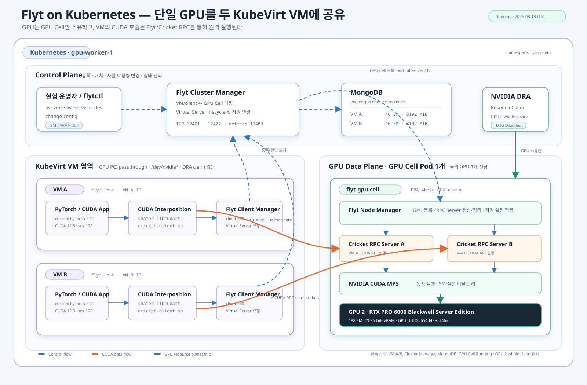

# Flyt 기반 Kubernetes 단일 GPU 공유 실험 결과 보고서

> 공개용으로 정제한 과거 실험 기록이다. 내부 IP, 실제 GPU UUID, 사용자별
> 경로와 namespace는 예시 값으로 치환했다. 현재 재현 절차는 저장소 루트의
> `README.md`와 `docs/REPRODUCING.md`를 따른다.

## 1. 문서 정보

| 항목 | 값 |
|---|---|
| 작성일 | 2026-08-14 UTC |
| 실험 수행일 | 2026-08-13 UTC |
| 대상 클러스터/노드 | Kubernetes / `gpu-worker-1` |
| Namespace | `flyt-system` |
| Flyt fork | `https://github.com/WoogiBoogi1129/flyt_custom_for_k8s` |
| Flyt 기준 commit | `596a86939bae125d127a9ed6f70d92c332f47644` |
| PyTorch | 2.11.0, commit `70d99e998b4955e0049d13a98d77ae1b14db1f45` |
| CUDA/cuDNN | CUDA 12.8 / cuDNN 9 |
| 대상 GPU | NVIDIA RTX PRO 6000 Blackwell Server Edition, GPU 2 |
| GPU UUID | `GPU-REDACTED` |
| 보고서 상태 | 실험 완료, 인프라는 실행 중 |

이 보고서에서 결과의 근거 수준은 다음과 같이 구분한다.

| 표기 | 의미 |
|---|---|
| **Measured** | 로그 또는 상태 조회에서 직접 측정된 값 |
| **Derived** | Measured 값으로부터 계산한 비율이나 증감률 |
| **Observed** | 동작을 관찰했으나 독립된 정량 기준을 충족하지 않은 결과 |
| **Not proven** | 필요한 검증 조건을 충족하지 못했거나 선행 오류로 실행하지 못한 항목 |

> **저장소 상태:** Flyt 수정은 로컬 브랜치
> `codex/k8s-single-gpu-pytorch-poc`의 미커밋 working tree에 있다. 원격 GitHub에는
> 기준 commit `596a869...`만 존재하며, 이 보고서 작성 시점까지 commit, push,
> PR 생성은 수행하지 않았다. `flyt-k8s-poc` 디렉터리도 아직 별도 Git
> 저장소가 아니다.

## 2. Executive Summary

이번 실험은 기존 Cricket/MPS 기반 단일 GPU 공유 실험을 Flyt 기반
Kubernetes/KubeVirt 구조로 변경하고, GPU가 직접 연결되지 않은 두 VM에서
CUDA와 PyTorch를 실행하며 SM 및 VRAM 요청량의 실행 중 변경 가능성을
검증하는 것을 목적으로 했다.

### 2.1 핵심 결과

| 검증 목표 | 결과 | 핵심 수치 | 근거 수준 |
|---|---|---:|---|
| Flyt Kubernetes 배포 | 성공 | GPU Cell 1개, KubeVirt VM 2대 | Measured |
| Native CUDA 실행 | 성공 | VM 간 46 SM 성능 차이 0.63% | Measured/Derived |
| Native workload의 live SM 변경 | 성공 | 46→92 SM에서 양쪽 VM 약 1.804배 | Measured/Derived |
| Live VRAM 설정값 변경 | 성공 | 4096↔8192 MiB, 변경 요청 3/3 성공 | Measured |
| 실제 VRAM 동적 enforcement | 미검증 | PyTorch 3072 MiB 할당 전 VMM API 오류 | Not proven |
| PyTorch core 호환성 | 부분 성공 | VM별 9/17, 52.94% | Measured/Derived |
| PyTorch optional 호환성 | 실패 | VM별 0/2 | Measured |
| PyTorch 실행 중 SM 변경 | 실패 | 첫 46→92 변경 후 `cublasSetStream` 오류 | Measured |
| PyTorch 전체 호환성 | 실패 | cuDNN, FFT, Solver, Stream/Graph 등 실패 | Measured |

### 2.2 핵심 결론

1. **Native CUDA workload에서는 실행 중 SM 요청량을 변경할 수 있으며 실제
   성능 변화까지 확인됐다.** VM A/B 모두 46→92 SM에서 중앙 지연시간이 약
   44.6% 감소했다.
2. **PyTorch workload에 같은 결론을 적용할 수 없다.** 실행 중 SM 변경 후
   PyTorch의 cuBLAS handle/stream 경로가 실패해 프로세스가 종료됐다.
3. **VRAM은 Flyt 제어 평면의 설정값 변경까지만 증명됐다.** 실제 allocation
   가능량 확대, 축소 시 기존 allocation 처리, quota enforcement는 증명되지
   않았다.
4. **현재 구현은 Native CUDA 기반 동적 SM PoC로는 유효하지만 범용 PyTorch
   GPU 가상화 환경으로 사용할 수준은 아니다.**

## 3. 실험 배경과 목적

### 3.1 기존 Cricket 기반 실험

기존 환경은 Cricket RPC와 CUDA MPS를 이용해 단일 GPU를 여러 VM에서
사용하는 구조였다. CUDA API remote execution 자체는 검증할 수 있었지만,
다음 운영 기능이 부족했다.

- VM/client와 GPU server의 lifecycle을 수동으로 관리해야 함
- VM별 SM/VRAM 요구량을 중앙에서 저장하고 조회하는 기능 부족
- Kubernetes GPU 소유권과 remote CUDA server lifecycle의 결합 부족
- 실행 중 자원 변경을 공통 control plane으로 수행하기 어려움
- GPU 한 장을 관리하는 단위를 명확히 표현하기 어려움

### 3.2 Flyt 전환 목적

Flyt는 Cricket RPC를 데이터 경로로 사용하면서 Cluster Manager, Node
Manager, Client Manager 및 VM resource database를 추가한다. 이번 전환의
구체적인 목표는 다음과 같다.

1. 물리 GPU 한 장을 GPU Cell Pod 한 개가 전담한다.
2. GPU가 직접 연결되지 않은 KubeVirt VM 두 대에서 CUDA를 실행한다.
3. VM별 기본 요구량을 MongoDB와 Cluster Manager에서 관리한다.
4. `flytctl`을 통해 활성 client의 SM/VRAM 요청량을 변경한다.
5. Native CUDA와 PyTorch의 live reconfiguration 결과를 분리 평가한다.
6. PyTorch 주요 subsystem의 지원 및 미지원 범위를 정량화한다.

## 4. 실험 범위와 성공 기준

### 4.1 포함 범위

- GPU 2 MIG 해제 및 whole-GPU DRA 할당
- Flyt Builder, MongoDB, Cluster Manager, GPU Cell 배포
- GPU 미연결 KubeVirt VM A/B 구성
- Flyt client bundle 및 custom PyTorch wheel 설치
- 기본 CUDA capability, compute, memory probe
- PyTorch 주요 CUDA subsystem 호환성 행렬
- Native CUDA 장기 실행 중 SM/VRAM 설정 변경
- PyTorch 장기 실행 중 SM 변경
- 결과 로그, source patch, artifact checksum 수집

### 4.2 제외 또는 미완료 범위

- 다중 물리 GPU 및 GPU Cell 간 이동
- NCCL, distributed training, multi-GPU collective
- 장시간 모델 convergence 및 학습 정확도 비교
- production SLA, 장애 복구 시간, 보안 성능 평가
- VRAM 축소 시 기존 allocation 회수 정책 검증
- VRAM 확대 후 실제 신규 allocation 증가 검증
- 전체 PyTorch operator 조합의 수학적 완전성 증명

### 4.3 사전 정의한 성공 기준

| 실험 | 성공 기준 |
|---|---|
| 기본 CUDA | device 1개, checksum 일치, 기대한 OOM 발생 |
| VM 간 기본 성능 | 동일 SM에서 큰 성능 편차 없이 실행 |
| Native live SM | 프로세스 재시작 없이 iteration 연속 |
| SM 성능 반영 | 92 SM 중앙 지연시간이 46 SM 대비 5% 이상 감소 |
| Live memory control | workload 실행 중 변경 명령 성공 및 다른 VM 중단 없음 |
| PyTorch core | 17개 core 항목 모두 성공 |
| PyTorch live SM | SM 변경 후 프로세스와 iteration 연속 |
| PyTorch memory boundary | 4096 MiB에서 3072 MiB 성공, 5120 MiB OOM |

## 5. 실험 환경

### 5.1 하드웨어 및 GPU 구성

| 항목 | 값 |
|---|---:|
| 물리 GPU 수 | 1개 |
| GPU | NVIDIA RTX PRO 6000 Blackwell Server Edition |
| GPU index | 2 |
| 전체 SM | 188 |
| 전체 VRAM | 97,887 MiB |
| Compute Capability | 12.0 |
| MIG current/pending | Disabled / Disabled |
| VM 수 | 2대 |
| VM별 기본 SM | 46 |
| VM별 기본 memory | 8192 MiB |
| VM 한 대의 SM 비율 | 24.47% (Derived) |
| 초기 두 VM 총 SM 비율 | 48.94% (Derived) |

### 5.2 소프트웨어 구성

| 계층 | 구성 |
|---|---|
| Orchestration | Kubernetes, KubeVirt |
| GPU 할당 | NVIDIA DRA whole-GPU ResourceClaim |
| Flyt | fork commit `596a869...` + local patch 9개 |
| CUDA | 12.8, shared cudart |
| GPU code | `sm_120` + `compute_120` PTX |
| cuDNN | 9 |
| PyTorch | 2.11.0 custom wheel |
| VM guest | Ubuntu 기반, `/opt/flyt-client`, `/opt/flyt-pytorch` |
| VM GPU device | 없음: PCI passthrough 및 `/dev/nvidia*` 미사용 |

### 5.3 Artifact

| Artifact | 크기 | SHA-256 |
|---|---:|---|
| Flyt guest bundle | 2,191,678,095 bytes, 약 2.04 GiB | `a88e0f416809b7760c44f639231d305caa89c05f7d509586b3e3101ef84bbb9d` |
| PyTorch wheel | 434,708,176 bytes, 약 414.6 MiB | `9b32eeda77979cc571ade2f817a0d2a78c17e079cf3cc5d9c468fc41da70c4ce` |

## 6. Flyt Kubernetes 아키텍처



### 6.1 구성요소

| 구성요소 | 위치 | 역할 |
|---|---|---|
| PyTorch/CUDA App | KubeVirt VM | 사용자 workload |
| `cricket-client.so` | KubeVirt VM | CUDA API interposition 및 RPC 변환 |
| Flyt Client Manager | KubeVirt VM | client 등록 및 Virtual Server 요청 |
| Flyt Cluster Manager | Kubernetes Pod | VM/client/GPU Cell 매핑 및 자원 변경 |
| MongoDB | Kubernetes Pod | VM별 최소 SM/VRAM 요구량 저장 |
| Flyt Node Manager | GPU Cell Pod | GPU 및 RPC Server lifecycle 관리 |
| Cricket RPC Server | GPU Cell Pod | VM별 remote CUDA API 실행 |
| CUDA MPS | GPU Cell Pod | 단일 GPU 동시 실행 및 SM 실행 자원 관리 |
| DRA ResourceClaim | Kubernetes | GPU 2 whole device를 GPU Cell에 할당 |
| `flytctl` | 운영자/Cluster Manager | 상태 조회 및 `change-config` 수행 |

### 6.2 Control flow

```text
flytctl
   │
   ▼
Cluster Manager ─── MongoDB
   │
   ▼
Node Manager ─── Virtual Server / MPS configuration
```

Control plane은 client 등록, GPU Cell 선택, VM 요구량 조회, SM/VRAM 변경을
담당한다. 실제 tensor와 CUDA API 호출은 이 경로를 통과하지 않는다.

### 6.3 Data flow

```text
PyTorch/CUDA App
   │
shared libcudart
   │
cricket-client.so
   │ TCP/RPC
   ▼
Cricket RPC Server
   │
CUDA MPS
   │
Physical GPU 2
```

VM에는 NVIDIA PCI device와 `/dev/nvidia*`가 없다. GPU 소유권은 GPU Cell
Pod만 가지며, VM의 CUDA 호출은 네트워크를 통해 GPU Cell에서 실행된다.

### 6.4 Client lifecycle

1. VM에서 `/opt/flyt-client/run-with-flyt`로 CUDA/PyTorch 프로세스를 실행한다.
2. `cricket-client.so`가 CUDA 호출을 가로채 Client Manager에 등록한다.
3. Client Manager가 Cluster Manager에 Virtual Server를 요청한다.
4. Cluster Manager가 MongoDB의 VM 요구량을 읽는다.
5. Node Manager가 GPU Cell 안에 해당 client용 Cricket RPC Server를 생성한다.
6. 이후 CUDA data plane은 VM과 RPC Server 사이에서 직접 동작한다.
7. 정상 종료 시 client와 Virtual Server가 해제돼야 한다.

## 7. Cricket 기반 환경에서 Flyt로의 변경

| 항목 | 기존 Cricket/MPS | Flyt Kubernetes |
|---|---|---|
| GPU 관리 단위 | 수동 server/MPS 구성 | GPU Cell Pod |
| GPU 소유권 | 실험별 개별 구성 | DRA whole-GPU claim |
| VM 등록 | 정적/수동 | Client Manager 동적 등록 |
| 자원 요구량 | 실행 인자 중심 | MongoDB 문서 |
| 제어 평면 | 제한적 | Cluster Manager + `flytctl` |
| CUDA data path | Cricket RPC | Cricket RPC 유지 |
| 자원 변경 | 서버/프로세스 직접 조작 | `change-config` |
| VM GPU 연결 | 구성에 따라 달라짐 | 직접 GPU 미연결 |
| 빌드/배포 | 수동 artifact | Builder Pod + PVC + guest bundle |

Flyt 전환에서 핵심은 Cricket data plane을 제거한 것이 아니라, 그 위에 GPU
Cell lifecycle과 VM별 자원 정책을 관리하는 control plane을 추가한 것이다.

## 8. 구현 변경

### 8.1 Flyt source 변경 요약

기준 commit 대비 9개 파일이 변경됐으며 변경량은 `+289/-97`줄이다.

| 변경 | 관련 파일/patch | 목적 | 관찰된 효과 |
|---|---|---|---|
| K8s 설정 절대 경로 | `config.rs`, `flyt-k8s-config-paths.patch` | `/etc/flyt/*.toml` 사용 | Pod/VM working directory 비의존 |
| IPC queue key | `vcuda_client_handler.rs`, `flyt-ipc-ftok.patch` | `ftok()` 문자열 NUL 종료 | Client Manager queue key 일치 |
| cuDNN 9 build | `cpu-client-cudnn.c`, `flyt-cudnn9.patch` | 제거된 legacy API 조건부 컴파일 | CUDA 12.8/cuDNN 9 빌드 성공 |
| Driver entry point | `cpu-client-runtime.c`, `flyt-pytorch-driver-entry.patch` | 최신 PyTorch의 Driver wrapper 검색 | PyTorch import와 기본 경로 진행 |
| Event flags | 동일 patch | `cudaEventRecordWithFlags` RPC | 최신 runtime ABI 보완 |
| Extended launch | 동일 patch | `cudaLaunchKernelExC` 기본 경로 | attribute 없는 launch 지원 |
| Blackwell ELF | `cpu-elf2.c` | `EIFMT_BVAL` 처리 | `sm_120` fatbin parsing |
| TCP pinned memory | host-memory patch 2개 | local allocation 추적/복사/attribute | pinned memory 시험 통과 |
| Event map | `cpu-server-runtime.c`, event-map patch | 반전된 event lookup 조건 수정 | autograd/cuBLAS/AMP 안정화 |
| PyTorch build profile | `pytorch_support/*` | 2.11, CUDA 12.8, shared cudart | custom wheel 생성 |
| EOF 정규화 | `flyt-source-eof.patch` | byte 단위 재현성 | 기능 변화 없음 |

9개 patch를 기준 commit에 처음부터 순서대로 적용한 결과, 현재 수정된 Flyt
source와 byte 단위로 일치했다.

### 8.2 Kubernetes 구성

주요 manifest는 다음과 같다.

| Manifest | 역할 |
|---|---|
| `00-quota.yaml` | Namespace 자원 범위 |
| `05-config.yaml` | Flyt manager 설정 |
| `10-builder.yaml` | Flyt 고정 commit checkout, patch, 빌드, bundle |
| `12-pytorch-builder.yaml` | PyTorch 2.11 custom wheel 빌드 |
| `15-mongodb.yaml` | VM 요구량 database |
| `18-cluster-manager.yaml` | Flyt control plane |
| `20-gpu-cell.yaml` | DRA GPU claim, Node Manager, MPS |
| `30-vms.yaml` | KubeVirt VM A/B |

cuDNN 실패 경로에서 GPU Cell Pod가 host OOM으로 종료되지 않도록 container
memory limit은 24 GiB로 조정했다. 이것은 GPU VRAM quota와 별개인 Kubernetes
host memory 설정이다.

### 8.3 기존 GPU 2 workload 처리

GPU 2의 기존 MIG workload는 MIG를 다시 활성화하는 상위 자동화가 있었다.
실험 중 자동 재생성을 방지하기 위해 기존 Pod와 같은 이름의 무GPU maintenance
placeholder를 유지했고, 기존 workload의 PVC와 데이터는 삭제하지
않았다. GPU 2는 whole-GPU 모드로 전환해 GPU Cell이 DRA claim으로 소유했다.

## 9. 실험 설계와 측정 방법

| ID | 실험 | 독립 변수 | 주요 측정값 |
|---|---|---|---|
| E1 | 기본 CUDA capability | VM A/B | device, SM, checksum |
| E2 | Native compute | VM A/B, 46 SM | runtime, nominal GFLOPS |
| E3 | Native memory | 8192 MiB quota | 할당량, OOM 시점 |
| E4 | API surface audit | API library | 요구/export symbol 수 |
| E5 | PyTorch 호환성 | subsystem/VM | 통과 수, 오류, duration |
| E6 | Native live SM | 46/92 SM | iteration 연속성, latency |
| E7 | PyTorch live SM | 46→92 SM | 프로세스 생존, cuBLAS 오류 |
| E8 | Live memory control | 4096/8192 MiB | 응답 코드, workload 연속성 |
| E9 | PyTorch memory boundary | 3072/5120 MiB allocation | 성공/OOM 또는 선행 오류 |

### 9.1 E1~E3 Native probe 설정

- capability checksum 기대값: `4,194,304`
- compute blocks: 1024
- threads per block: 256
- FMA iterations: 200,000
- memory chunk: 256 MiB
- 기본 VM memory quota: 8192 MiB

### 9.2 E5 PyTorch 행렬

Core 17개와 optional 2개를 VM별로 그룹 격리해 실행했다. Stream/Graph 등
runtime을 비정상 상태로 만드는 시험 이후에는 GPU Cell과 Client Manager를
재시작해 다음 결과에 영향을 주지 않도록 했다.

### 9.3 E6 live SM 분석

두 VM에서 native CUDA FMA probe를 장기 실행하고 다음 순서로 변경했다.

```text
46/46 → 92/46 → 46/92 → 46/46 SM
```

전환 직전/직후 구간을 제외하고 중앙 latency를 계산했다. baseline과 boosted
구간은 VM별 최소 30개 이상의 표본을 요구했으며, 실제로 1,642개 이상을
사용했다.

## 10. 실험 결과

### 10.1 E1 기본 CUDA capability

| 측정 | VM A | VM B |
|---|---:|---:|
| VMI IP | `VM_A_IP` | `VM_B_IP` |
| CUDA device count | 1 | 1 |
| GPU 이름 | RTX PRO 6000 Blackwell | RTX PRO 6000 Blackwell |
| 보고된 SM | 46 | 46 |
| checksum | 4,194,304 | 4,194,304 |
| 기대 checksum | 4,194,304 | 4,194,304 |
| API call count | 16 | 16 |
| `memcpy-cnt` counter (bytes) | 12,582,912 | 12,582,912 |

두 VM 모두 동일한 virtual GPU capability를 관찰했다. VM에는 직접 GPU
device가 없으므로 이 값은 Flyt/Cricket 경로가 제공한 결과다.

### 10.2 E2 Native compute

| 측정 | VM A | VM B |
|---|---:|---:|
| SM | 46 | 46 |
| 실행시간 | 0.021042초 | 0.020910초 |
| nominal GFLOPS | 4,983.286 | 5,014.593 |
| checksum | 274,648.0625 | 274,648.0625 |
| checksum 일치 | true | true |

Derived 결과:

- 평균 실행시간: `0.020976초`
- 평균 nominal 성능: `4,998.940 GFLOPS`
- VM 간 성능 차이: `0.628%`

이 값은 특정 FMA probe의 nominal throughput이며 GPU의 일반적인 application
성능이나 vendor peak 성능을 의미하지 않는다.

### 10.3 E3 Native memory

| 측정 | VM A | VM B |
|---|---:|---:|
| quota | 8192 MiB | 8192 MiB |
| chunk | 256 MiB | 256 MiB |
| 성공 횟수 | 29 | 29 |
| 총 성공 할당 | 7424 MiB | 7424 MiB |
| 다음 allocation | OOM | OOM |

Derived 결과:

- quota 대비 마지막 성공 할당량: `90.625%`
- quota와 마지막 성공 할당량 차이: `768 MiB`
- VM 간 결과 차이: `0 MiB`

이 768 MiB 차이는 CUDA context, MPS, runtime 및 allocator overhead를 포함할
수 있으나, 이번 실험에서는 항목별 breakdown을 측정하지 않았다.

### 10.4 E4 API surface audit

| API 계층 | PyTorch 요구 symbol | Flyt 직접 대응 | 직접 대응률 |
|---|---:|---:|---:|
| CUDA Runtime | 78 | 78 | 100.0% |
| CUDA Driver | 29 | 20 | 69.0% |
| cuBLAS | 54 | 51 | 94.4% |
| cuBLASLt | 11 | 10 | 90.9% |
| cuDNN | 84 | 52 | 61.9% |
| cuSolver | 145 | 113 | 77.9% |
| cuSparse | 98 | 0 | 0% |
| cuFFT | 7 | 0 | 0% |
| NVRTC | 13 | 0 | 0% |

이 표는 정적 symbol 일치율이다. Vendor library가 내부 Driver API를 이용해
간접 동작할 수 있고, 반대로 symbol이 있어도 stub이거나 semantics가 불완전할
수 있으므로 runtime 결과를 우선한다.

### 10.5 E5 PyTorch 호환성

#### 정량 집계

| 구분 | VM별 통과 | VM별 전체 | 통과율 |
|---|---:|---:|---:|
| Core | 9 | 17 | 52.94% |
| Optional | 0 | 2 | 0% |
| 전체 | 9 | 19 | 47.37% |

두 VM 합산 결과:

- Core: `18/34`
- Optional: `0/4`
- 전체: `18/38`

#### 통과 항목

| 항목 | VM A duration | VM B duration |
|---|---:|---:|
| environment | 0.0127초 | 0.0192초 |
| tensor runtime | 0.0318초 | 0.0418초 |
| pinned memory | 0.0300초 | 0.0265초 |
| cuBLAS | 0.0567초 | 0.0619초 |
| allocator | 0.0951초 | 0.0995초 |
| AMP | 0.6953초 | 0.7210초 |
| autograd + AdamW | 2.5739초 | 3.2424초 |
| serialization | 0.0488초 | 0.0793초 |
| RNG | 0.0275초 | 0.0389초 |

duration은 개별 test function 구간이며 초기 Flyt 연결, fatbin discovery 및
프로세스 전체 wall time은 포함하지 않는다.

#### 실패 항목과 직접 오류

| 항목 | 오류/원인 |
|---|---|
| cuDNN | `GET was unable to find an engine to execute this computation` |
| CNN models | cuDNN Conv 경로에서 같은 engine 오류 |
| cuFFT | `CUFFT_INTERNAL_ERROR` |
| cuSolver linalg | remote `dlopen libtorch_cuda_linalg.so failed` |
| sparse | `cuMemAddressReserve` 미구현 |
| stream/event | `Invalid configuration` |
| CUDA Graph | capture용 Stream 생성에서 실패 |
| SDPA backward | CUDA unknown error, `cudaFuncSetAttribute` 경로 불안정 |
| `cudaMallocAsync` | `cudaDeviceGetDefaultMemPool` 미구현 |
| `torch.compile` | eager 내부 경로는 성공, Triton 미설치로 Inductor 미검증 |

### 10.6 E6 Native CUDA live SM

모든 SM 및 memory `change-config` 요청 7건이 `200 Resource updated
successfully`를 반환했다.

#### VM A

| 구간 | 표본 수 | 중앙 latency |
|---|---:|---:|
| 46 SM baseline | 1642 | 0.021227초 |
| 92 SM boosted | 2198 | 0.011765초 |

Derived 결과:

- latency ratio: `0.5542`
- 지연시간 감소: `44.58%`
- speedup: `1.804배`

#### VM B

| 구간 | 표본 수 | 중앙 latency |
|---|---:|---:|
| 46 SM baseline | 1642 | 0.021251초 |
| 92 SM boosted | 2281 | 0.011780초 |

Derived 결과:

- latency ratio: `0.5543`
- 지연시간 감소: `44.57%`
- speedup: `1.804배`

두 VM에서 iteration은 전환 중 연속이었고 결과는 finite였다. 따라서 native
workload에서는 단순한 database 값 변경을 넘어 SM 설정 변화가 실제 실행
성능에 반영됐다고 판단한다.

### 10.7 E7 PyTorch live SM

PyTorch `torch.mm` 장기 실행 상태에서 VM A를 46→92 SM으로 변경했다.

변경 전 누적 관찰값:

- CUDA/Flyt API call count: `173,445`
- `memcpy-cnt` counter: `4,145 bytes`
- SM 변경량: `+46`, 2배

첫 SM 변경 후 VM A 프로세스는 다음 오류로 종료됐다.

```text
RuntimeError: CUDA error: <unknown>
when calling `cublasSetStream(handle, stream)`
```

Native probe와 달리 PyTorch는 cuBLAS handle과 CUDA stream 상태를 장기간
유지한다. 현재 Flyt의 live reconfiguration이 이 상태를 보존하거나 다시
연결하지 못한 것으로 해석한다.

### 10.8 E8 Live memory control

Native FMA workload가 실행 중인 VM A에 다음 상태를 적용했다.

```text
4096 → 8192 → 4096 → 8192 MiB
```

| 측정 | 값 |
|---|---:|
| memory 변경 요청 | 3회 |
| 성공 응답 | 3/3 |
| 확대량 | +4096 MiB, 2배 |
| 축소량 | -4096 MiB, 50% |
| VM B memory | 전 구간 8192 MiB |
| 최종 VM A memory | 8192 MiB |
| 최종 MongoDB 기준값 | A/B 각각 46 SM, 8192 MiB |

작은 native FMA workload는 전환 중 계속 실행됐다. 그러나 이 workload는
VRAM을 quota 근처까지 사용하지 않았으므로 실제 memory enforcement 결과로
해석할 수 없다.

### 10.9 E9 PyTorch memory boundary

목표 조건은 다음과 같았다.

| quota | 요청 | 기대 결과 |
|---:|---:|---|
| 4096 MiB | 3072 MiB | 성공 |
| 4096 MiB | 5120 MiB | `torch.OutOfMemoryError` |

첫 3072 MiB 요청이 quota 판정 전 다음 오류로 실패했다.

```text
r.cuMemAddressReserve_ INTERNAL ASSERT FAILED
Can't find cuMemAddressReserve
```

따라서 boundary 조건은 `0/2` 검증됐다. 이것은 3072 MiB가 quota에 의해
거절됐다는 뜻이 아니라 PyTorch allocator가 요구하는 Driver VMM API가 Flyt에
없어 quota 시험까지 도달하지 못했다는 뜻이다.

## 11. 결과 해석

### 11.1 증명된 내용

- **Measured:** GPU가 직접 연결되지 않은 두 VM에서 Flyt를 통한 CUDA 실행
- **Measured:** 동일 46 SM에서 두 VM 모두 checksum 일치
- **Derived:** VM 간 native FMA 성능 차이 0.628%
- **Measured:** Native workload 실행 중 46→92→46 SM 변경과 iteration 연속성
- **Derived:** 92 SM에서 양쪽 VM 약 1.804배 speedup
- **Measured:** 실행 중 4096/8192 MiB 설정값 변경과 3/3 성공 응답
- **Measured:** VM별 기본 8192 MiB에서 7424 MiB 할당 후 기대 OOM

### 11.2 증명되지 않은 내용

- **Not proven:** 4096→8192 MiB 확대 후 추가 4096 MiB를 실제 할당할 수 있음
- **Not proven:** 8192→4096 MiB 축소 시 기존 allocation 회수 또는 보존 정책
- **Not proven:** 한 VM에서 반환한 VRAM을 다른 VM이 즉시 사용할 수 있음
- **Not proven:** PyTorch memory quota enforcement
- **Not proven:** PyTorch의 안정적인 live SM 변경
- **Not proven:** 전체 PyTorch operator와 model 호환성

### 11.3 실험으로 반증된 주장

- 현재 Flyt가 PyTorch 주요 subsystem 전체와 호환된다는 주장
- Native CUDA의 live SM 성공을 PyTorch live training에 그대로 적용할 수
  있다는 주장
- Flyt의 memory 숫자 변경 성공만으로 실제 VRAM 재할당을 증명했다는 주장

## 12. 확인된 제약 및 원인 분석

| 우선순위 | 결함 | 영향 | 후속 검증 |
|---|---|---|---|
| P0 | `cuMemAddressReserve` 계열 미구현 | 큰 allocation, sparse, PyTorch quota 차단 | Driver VMM 구현 후 E9 재실행 |
| P0 | live cuBLAS handle/stream 불안정 | PyTorch SM 변경 후 프로세스 종료 | handle migration/rebind 설계 |
| P1 | CUDA Stream semantics | Stream/Event/Graph 실패 | stream 생성·priority·sync 행렬 |
| P1 | CUDA Graph capture | graph 기반 최적화 불가 | capture/replay lifecycle |
| P1 | cuDNN backend engine | CNN/Conv 실패 | cuDNN 9 RPC coverage 확장 |
| P1 | remote DSO loading | cuSolver linalg 실패 | `libtorch_cuda_linalg.so` 전달/로드 |
| P2 | cuFFT/cuSparse coverage | FFT/sparse 실패 | library RPC 또는 driver 기반 경로 |
| P2 | mempool API | `cudaMallocAsync` 실패 | mempool lifecycle 구현 |
| P2 | `cudaFuncSetAttribute` | SDPA/fused kernel 불안정 | client/server function mapping |
| P2 | server child 회수 | zombie/stale RPC process | lifecycle 및 SIGCHLD 처리 |

## 13. 종합 결론

이번 PoC는 다음 범위에서 성공했다.

> Flyt를 Kubernetes/KubeVirt에 배포하고 GPU Cell Pod 한 개가 물리 GPU 한 장을
> 소유하도록 구성했다. GPU가 없는 두 VM에서 CUDA를 remote 실행했으며,
> native CUDA 장기 실행 중 VM별 SM 요청량을 46/92로 변경하고 양쪽 VM에서
> 약 1.804배의 성능 변화를 확인했다.

그러나 다음 범위는 성공했다고 볼 수 없다.

> PyTorch core 호환률은 52.94%였고, PyTorch 실행 중 SM 변경은
> `cublasSetStream` 오류로 실패했다. VRAM은 control-plane 설정값 변경만
> 확인됐으며 실제 allocation 확대·축소와 enforcement는 검증되지 않았다.

따라서 현재 구현의 적절한 기술적 평가는 다음과 같다.

> **Native CUDA 기반 단일 GPU 동적 SM 분할 PoC로는 유효하다. 범용 PyTorch
> workload의 SM·VRAM을 실행 중 안전하게 재할당하는 플랫폼으로는 아직
> 사용할 수 없다.**

## 14. 후속 개발 계획

### 단계 1: PyTorch memory 경로

1. `cuMemAddressReserve`, `cuMemCreate`, `cuMemMap`, `cuMemSetAccess` 등 Driver
   VMM API 구현
2. 4096 MiB quota에서 3072/5120 MiB boundary 재시험
3. 4096→8192 후 동일 프로세스의 추가 allocation 검증
4. 8192→4096 시 기존 allocation 정책 정의 및 데이터 무결성 확인

### 단계 2: Live SM과 handle lifecycle

1. Virtual Server resource 변경 시 server process 재생성 여부 추적
2. cuBLAS/cuBLASLt handle 및 stream mapping 보존
3. PyTorch `torch.mm` 장기 실행 재시험
4. optimizer, AMP, model training 순서로 범위 확대

### 단계 3: PyTorch subsystem 확대

1. CUDA Stream/Event/Graph
2. cuDNN backend engine
3. remote cuSolver DSO loading
4. cuFFT/cuSparse
5. SDPA와 fused kernel attribute
6. Triton 설치 후 Inductor 검증

### 단계 4: 운영 안정성

1. stale client/Virtual Server 자동 회수
2. zombie child 회수
3. GPU Cell 재시작 후 client 복구
4. 장시간 soak test 및 반복 reconfiguration
5. Flyt source와 PoC를 Git에 commit하고 CI/PR 구성

## 15. 재현 방법

### 15.1 기본 배포 순서

```bash
cd <repository-root>

./scripts/preflight.sh
./scripts/ensure-secrets.sh
kubectl apply -f manifests/15-mongodb.yaml
kubectl apply -f manifests/18-cluster-manager.yaml
kubectl apply -f manifests/20-gpu-cell.yaml
kubectl apply -f manifests/30-vms.yaml
./scripts/seed-vm-resources.sh
./scripts/install-guests.sh
```

기본 `preflight.sh`는 배포 전 안전 gate이므로 이미 실행 중인 GPU Cell의 MPS도
기존 GPU 점유로 간주한다. `collect-evidence.sh`는 GPU Cell이 Ready이고 유일한
compute process가 MPS일 때만 post-deploy 검증 모드를 사용한다.

### 15.2 실험 실행

```bash
./scripts/run-basic-tests.sh
./scripts/audit-api-surface.sh
./scripts/run-pytorch-matrix.sh
./scripts/collect-evidence.sh
```

`run-pytorch-matrix.sh`는 호환성 실패가 발생해도 그룹을 격리하고, Native live
SM 증적을 PyTorch quota 시험 전에 저장하도록 구성돼 있다. 종료 trap은 활성
client 설정과 MongoDB VM 기준값을 46 SM/8192 MiB로 복구한다.

### 15.3 VM에서 직접 PyTorch 실행

```bash
/opt/flyt-client/run-with-flyt \
  /opt/flyt-pytorch/venv/bin/python experiment.py
```

일반 `python`만 실행하면 Flyt interposition과 client 등록 경로를 사용하지
않으므로 반드시 wrapper를 사용해야 한다.

## 16. 작성 시점 인프라 상태

### 16.1 실험 증적 수집 시점

2026-08-13 09:39 UTC 최종 증적 수집 시점에는 다음 상태였다.

- GPU 2 MIG current/pending: Disabled/Disabled
- GPU Cell: Running/Ready
- VM A/B: Running/Ready
- Flyt client 목록: 0개
- MongoDB 기준값: A/B 각각 46 SM, 8192 MiB
- MPS server: 실행 중
- 인프라는 GPU 2 whole-device claim 유지

즉 workload는 종료됐지만 GPU Cell, MPS, VM을 포함한 인프라는 완전히 종료하지
않았다.

### 16.2 보고서 작성 시점 live 상태

2026-08-14 12:07 UTC에 다시 조회한 상태는 다음과 같다.

| 항목 | 값 | 근거 수준 |
|---|---:|---|
| GPU utilization | 0% | Measured |
| GPU memory used | 773 MiB | Measured |
| GPU power | 약 87 W | Measured |
| MPS server memory | 58 MiB | Measured |
| Cricket RPC Server memory | 706 MiB | Measured |
| Flyt client mapping | VM A client 2, 46 SM, 8192 MiB | Measured |
| Guest의 대응 CUDA/PyTorch app | 발견되지 않음 | Observed |

VM A guest에서는 대응하는 `run-with-flyt`, PyTorch 또는 native probe process가
발견되지 않았지만 Cluster Manager에는 active client와 Virtual Server가 남아
있었다. 따라서 이 매핑은 stale lifecycle 상태일 가능성이 높다. 원인 분석을
위해 보고서 작성 과정에서는 해당 server나 client를 종료하지 않았다.

### 16.3 완전 종료의 정의

다음 조건을 모두 만족해야 GPU 점유까지 포함한 완전 종료로 판단한다.

1. VM 내부 실험 process와 Flyt client가 0개
2. VM A/B 정지
3. GPU Cell Pod 삭제
4. DRA GPU claim 해제
5. `nvidia-cuda-mps-server`와 Cricket RPC Server 종료
6. GPU 2의 compute process가 0개이고 idle memory만 남음

MongoDB, Cluster Manager, builder 및 PVC는 GPU를 사용하지 않으므로 결과
보존을 위해 유지할 수 있다. MIG를 다시 활성화할지는 이후 GPU 2 운영 정책에
따라 별도로 결정해야 한다.

## 17. 증적 및 부록

### 17.1 주요 결과 링크

- [아키텍처 SVG](flyt-whole-gpu-architecture.svg)
- [구현 상태](IMPLEMENTATION_STATUS.md)
- [배포 및 검증 Runbook](FLYT_PYTORCH_DEPLOYMENT_RUNBOOK.md)
- [기본 CUDA 결과](results/20260813T072138Z-basic/)
- [API surface audit](results/20260813T072201Z-api-audit/)
- [PyTorch 전체 행렬](results/20260813T081220Z-pytorch-final/)
- [PyTorch 호환성 집계](results/20260813T081220Z-pytorch-final/compatibility-summary.json)
- [PyTorch live SM 실패 증적](results/20260813T085212Z-dynamic-final3/pytorch-live-sm-failure.txt)
- [Native live SM/memory 결과](results/20260813T091154Z-dynamic-fma-final3/)
- [SM 정량 분석](results/20260813T091154Z-dynamic-fma-final3/reallocation-analysis.json)
- [최신 linalg 재검증](results/20260813T092500Z-pytorch-linalg-rerun/)
- [최종 증적과 SHA-256](evidence/20260813T093954Z/)

### 17.2 주요 자동화

- `scripts/preflight.sh`: GPU/MIG/DRA 안전 gate
- `scripts/seed-vm-resources.sh`: VM 요구량 등록 및 원복
- `scripts/install-guests.sh`: Flyt/PyTorch guest 설치
- `scripts/run-basic-tests.sh`: Native CUDA probe
- `scripts/audit-api-surface.sh`: PyTorch/Flyt symbol 비교
- `scripts/run-pytorch-matrix.sh`: 호환성 및 live reconfiguration
- `pytorch/tests/analyze_reallocation.py`: 표본 연속성 및 latency 분석
- `scripts/collect-evidence.sh`: 상태, 로그, patch, checksum 수집
- `scripts/cleanup.sh`: 범위가 제한된 종료/정리

### 17.3 재현 patch

```text
patches/flyt-k8s-config-paths.patch
patches/flyt-cudnn9.patch
patches/flyt-ipc-ftok.patch
patches/flyt-pytorch-driver-entry.patch
patches/flyt-source-eof.patch
patches/flyt-pytorch-host-memory.patch
patches/flyt-pytorch-host-memory-copy.patch
patches/flyt-pytorch-event-map.patch
patches/flyt-pytorch-build-profile.patch
```

### 17.4 결과 해석 시 주의사항

1. 정적 API coverage는 runtime 호환률이 아니다.
2. `change-config`의 HTTP 200 응답은 실제 GPU 자원 enforcement의 충분조건이
   아니다.
3. Native CUDA 성공을 PyTorch 전체 호환성으로 일반화할 수 없다.
4. 46→92 SM의 1.804배 결과는 해당 FMA probe에 한정된다.
5. 7424 MiB allocation 결과는 static 8192 MiB quota 시험이며 live VRAM
   축소/확대 시험 결과가 아니다.
6. 현재 인프라가 실행 중이므로 `nvidia-smi`의 MPS/RPC process는 실험 종료와
   인프라 완전 종료를 구분해 해석해야 한다.
