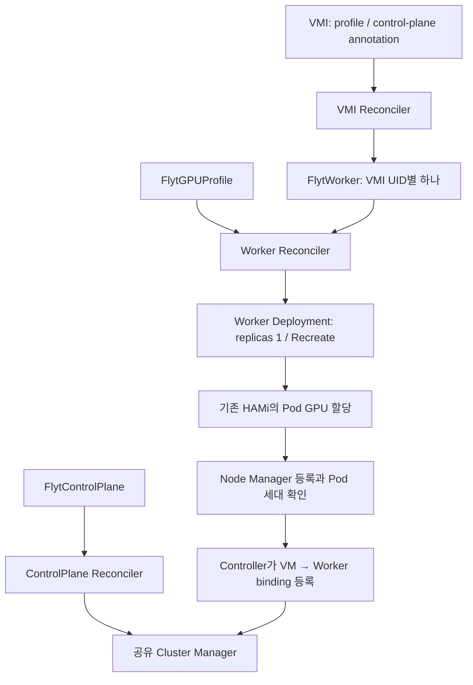

# 3단계: CRD 기반 FLYT-HAMi Controller

**소스 구현 완료, 검증·배포 NOT_RUN.** `stage/02-per-vm-worker`의
`6423897213057bf3ec0411c213f880ad549dda5f`에서 `stage/03-controller`를 분기했다.
패치 적용 검사, 의존성 해결, 빌드, 정적 검사, CRD/CEL 검사, 렌더, GPU 시험,
클러스터 명령을 실행하지 않았다. 아래 명령은 향후 검증·설치를 위한 절차다.
기존 1·2단계 디렉터리, 기본 이미지와 patch series는 수정하지 않았다.

## CRD별 관리 책임

모든 CR은 `flyt.dev/v1alpha1`, Namespaced다. Controller 한 설치는 한 namespace만
관리하며 VMI와 세 CR이 같은 namespace에 있어야 한다. API schema는 `deploy/*.json`에
정적 문서로 제공한다. JSON은 kubectl이 읽을 수 있는 매니페스트 형식이다.

| CRD | 사용자가 선언하는 내용 | Controller가 관리하는 대상 |
|---|---|---|
| `FlytGPUProfile` (`fgp`) | 승인 여부, nodeName, GPU UUID, cores %, memoryMiB, Worker image, RuntimeClass, HAMi namespace | 승인·등록 전제의 Ready 조건, 참조 중인 Worker 수, 삭제 보호 |
| `FlytControlPlane` (`fcp`) | Manager image, 인증 Secret 이름, clusterDomain, imagePullSecrets | Manager Deployment·Service·ConfigMap·기본 NetworkPolicy, API epoch, 잔여 binding 정리 |
| `FlytWorker` (`fw`) | UID를 포함한 VMI/Profile/ControlPlane 참조, suspend | VMI별 Worker Deployment·headless Service·ConfigMap·두 NetworkPolicy, 동적 binding, 개별 삭제 |

Profile의 `approved`와 Worker의 `suspend`만 실행 중 변경할 수 있다. 나머지 spec은
CEL transition rule로 고정했다. Profile의 quota나 이미지를 변경하려면 새 Profile을
만들고 해당 VMI의 선택을 바꾼다. 이때 해당 Worker의 기존 CUDA 세션은 종료된다.
ControlPlane 이미지 변경은 새 CR로 명시적으로 전환한다. 공유 Manager 재시작에 따른
영향을 숨기는 자동 이미지 교체는 없다.

Profile에는 `nvidia.com/gpu=1`, `nvidia.com/gpucores=cores`,
`nvidia.com/gpumem=memoryMiB`를 적용한다. cores는 1..100, memoryMiB는 256..1048576,
maxClients는 1..32이며 기본값은 8이다. 실제 장치 용량·할당 가능 여부는 HAMi의 책임이다.
30%/8GiB 및 70%/16GiB 예제는 같은 승인 GPU를 참조하지만 예약 성공을 보장하지 않는다.

Pod/Deployment/Service는 Kubernetes 기본 리소스를 사용한다. Worker 안의 rpcbind,
Node Manager, CUDA client별 RPC 프로세스는 supervisor가 관리하며 프로세스마다 CRD를
만들지 않는다. CRD 상태는 원하는 배포와 관찰 결과를 표현하고 CUDA handle을 저장하지 않는다.
이 단계의 최소 정적 Profile은 후속 quota 인터페이스 작업 일부를 앞당긴 것이다.
사용자별 GPU 요청 정책, ResourceQuota, live resizing, SHM은 후속 범위다.

## Reconcile과 상태

Go/controller-runtime의 VMI·Profile·ControlPlane·Worker 네 reconcile loop를 사용한다.
watch와 15초 재시도로 누락된 관찰을 보완하고 Lease leader election으로 한 리더가
변경하도록 했다. 소유 리소스는 CR UID가 일치할 때만 갱신·삭제한다. 동일 이름의 외부
리소스는 인수하지 않으며 VMI/Profile/ControlPlane 참조도 이름과 UID를 함께 검사한다.



VMI가 opt-in하면 VMI에 `flyt.dev/cleanup` finalizer를 먼저 붙인다. Running 상태와
pod-network IPv4 주소를 관찰한 뒤 `fw-<하이픈을 제거한 VMI UID>`라는 Worker를 만든다.
VMIP를 status에 기록한 다음 리소스를 생성하므로 중간에 Controller가 재시작해도
이전 네트워크 정체성을 기준으로 정리할 수 있다. Worker는 Pod→ReplicaSet→Deployment→CR의
소유 UID 체인, nodeName, GPU UUID를 확인한 후 Manager에 등록한다.

각 CR의 `status.conditions`에는 Ready, reason, message, observedGeneration을 기록한다.
공통 phase는 Pending/Ready/Blocked/Suspended/Terminating이다. ControlPlane의 endpoint는
guest용 Service IP:12402, Worker의 endpoint는 Pod IP:111(rpcbind discovery)이다.
Worker status는 Pod UID/IP, VMIP, Worker 실행 generation과 Manager epoch도 기록한다.
Blocked/Pending 상태의 endpoint 등은 마지막 관찰값일 수 있으므로 반드시 현재 generation의
Ready 조건과 함께 해석해야 한다. Ready는 현재 제어 경로 등록을 뜻하며 CUDA 동작 검증 결과가 아니다.
Controller `/healthz`, `/readyz`는 프로세스 health이며 GPU나 dependency 준비 상태를 뜻하지 않는다.

## 동적 binding과 기존 RPC 경로

별도 stage-3 Flyt 패치를 기본 패치 → stage-2 패치 뒤에 적용하도록 했다.
`bindings.rs`와 `patches/0001-dynamic-bindings.patch`의 동일 모듈을 함께 보관한다.
수정 시 두 파일도 함께 갱신해야 한다. `FLYT_BINDING_API=1`에서만 새 경로를 사용한다.
ControlPlane의 ConfigMap/Deployment에는 VM 목록을 넣지 않으므로 VM 추가·삭제가
공유 Manager의 rollout을 유발하지 않는다. VM별 Manager ingress 정책도 Worker가 소유한다.

| 연결 | 용도 |
|---|---|
| Worker → Manager TCP 12401 | 기존 Node Manager 프로토콜 앞에 Pod UID·랜덤 generation hello 추가 |
| Controller → Manager TCP 12404 | token 인증 JSON line API: ping/list/observe/bind/unbind |
| Guest → Manager TCP 12402 | 기존 FLYT endpoint 할당 |
| Guest → Worker Pod IP TCP 111 및 동적 TCP 포트 | 기존 ONC RPC 실행 |

Manager는 실제 접속 source IP와 hello를 기록하고 Controller가 읽은 Kubernetes Pod UID/IP와
대조한다. observe는 Node Manager의 GPU-info command/response로 연결을 다시 확인한다.
bind는 Worker UID, VMI UID, VMIP, Pod UID/IP, generation을 저장하며 중복 IP/UID와 오래된
세대를 거부한다. 같은 bind/unbind는 반복 가능하고 세대 교체는 이전 unbind 후 수행한다.
지연된 client 정리도 원래 binding 세대를 대조해 교체된 Worker에 적용되지 않도록 했다.

unbind는 해당 Node Manager 연결과 VM client 기록을 제거한다. Worker supervisor는
Node Manager 종료 시 해당 컨테이너의 RPC 자식 프로세스 그룹을 종료한다. CUDA RPC 메시지,
pointer/handle mapping은 기존 구현을 유지한다. 내부 binding API는 CUDA 데이터 경로가 아니다.
Manager의 제어 명령은 read/write gate로 동기화하므로 느린 제어 요청은 다른 등록 요청을
지연시킬 수 있다. 독립 Worker의 CUDA RPC 연결을 의도적으로 끊지는 않는다.

## 삭제와 장애 복구 범위

VMI 종료·삭제 또는 자동 생성 Worker의 opt-out은 그 Worker만 삭제한다.
정리 순서는 **binding 해제 → owned Deployment foreground 삭제 → 모든 Worker Pod 객체
소멸 대기 → Service/ConfigMap/NetworkPolicy 삭제 → Worker finalizer 해제 → VMI finalizer 해제**다.
종료 대기 동안 기존 NetworkPolicy를 유지한다. Pod 객체 소멸은 Kubernetes 관찰 기준이며
물리 GPU quota 반환 완료를 별도 증명하지 않는다. quota 회수는 향후 HAMi 시험에서 확인해야 한다.

ControlPlane/Profile은 참조 Worker가 남아 있으면 Terminating/InUse로 대기하며 이미 준비된
Worker를 유지한다. 새 할당은 막는다. Profile `approved=false`는 명시적 승인 철회이므로
해당 Profile 사용자 모두를 중지한다. Worker `suspend=true`는 CR을 보존하면서 자원을 정리한다.
Controller를 제거하기 전에 이 순서로 CR 정리를 완료해야 한다. 그렇지 않으면 finalizer가 남는다.

| 상황 | 구현한 처리와 한계 |
|---|---|
| Controller 재시작 | CR과 owned 리소스를 다시 읽어 등록을 복원; 동일 binding은 유지 |
| Worker 컨테이너 재시작 | Pod UID가 같아도 랜덤 generation 변경; 이전 binding 종료 후 신규 등록 |
| Worker Pod 삭제/Crash | Deployment 재생성과 소유 UID 확인 후 신규 등록; CUDA client 재시작 필요 |
| Manager 재시작 | RAM binding/epoch 초기화, Worker 재연결 후 CR로 재구성; 공유 Manager 사용자 세션 종료 가능 |
| 같은 이름의 VMI 재생성 | VMI UID가 다르므로 새 Worker 생성; 이전 할당 승계 금지 |
| 삭제 중 Controller 장애 | finalizer를 남기고 다음 reconcile에서 정리 재개 |
| Manager API 불통 | 해당 Manager Pod가 남아 있으면 정리 대기; Pod가 전혀 없으면 RAM binding도 없다고 보고 진행 |
| 노드 단절/종료 지연 | Pod 객체가 남아 있는 동안 대기; timeout만으로 quota 반환을 가정하거나 강제 삭제하지 않음 |

자동 생성 Worker만 직접 삭제하고 VMI annotation을 남기면 다시 생성된다. 영구 opt-out은
VMI annotation을 지우고, VM 재시작에도 유지하려면 VM template에서도 제거한다.
finalizer 강제 제거, Pod force-delete, namespace 강제 삭제나 노드 partition 후 강제 재사용은
이 수명주기 보장의 범위 밖이다. CUDA 세션·메모리·handle의 투명 복원과 live migration도 지원하지 않는다.

## 배포 전제와 GPU 범위

설치 대상은 기존 VMI를 둘 `flyt-hami-stage3` namespace다. namespace/KubeVirt/RuntimeClass는
이 매니페스트가 만들지 않는다. 다른 namespace를 쓰려면 RBAC, Deployment args, 예제와
webhook allowlist를 모두 같은 값으로 조정해야 한다. 접두사는 `flyt-hami-`로 제한한다.

기존 `flyt-hami-stage1` release(HAMi 2.8.0)가 승인된 **GPU UUID 하나만** 노출해야 한다.
숫자 슬롯 2가 어떤 UUID인지는 관리자가 물리 인벤토리로 확정해야 한다. Controller는 슬롯을
추측하거나 GPU Enable 설정을 바꾸지 않는다. GPU 0/1, NVIDIA driver, MIG/MPS mode,
다른 device plugin, 외부 ML Platform 설정을 변경하는 코드 경로·권한은 제공하지 않는다.
외부 플랫폼의 사용 해제와 해당 GPU의 무점유 상태는 별도 전제이며 이번 개발에서 재확인하지 않았다.

Controller는 Node Ready/cordon/vendor label, 기존 HAMi 등록 UUID·plugin Ready,
RuntimeClass와 webhook 범위를 읽는다. 외부 device plugin/다른 GPU workload가 같은 노드에 있으면
보수적으로 차단하므로 승인 GPU 외의 장치를 쓰는 작업도 배포를 막을 수 있다. 이를 자동 해제하지 않는다.
API의 label/annotation 관찰은 호스트 프로세스나 실제 GPU 소유권을 증명하지 못한다.
Profile 승인 권한, namespace의 Pod/Secret 작성 권한은 신뢰하는 관리자에게만 부여해야 한다.

NetworkPolicy를 실제 적용하는 CNI와 guest→Pod/Service IPv4 라우팅이 필요하다. guest의
Manager 접속 source IP가 VMI pod-network status IP와 같아야 한다. Worker Service 하나로
동적 RPC 포트를 프록시하지 않으며 Guest는 Worker Pod IP에 직접 접근해야 한다.
정책의 DNS 경로는 kube-system의 `k8s-app=kube-dns`를 가정한다. NodeLocal DNS, Multus 전용 IP,
IPv6, 다른 NAT 구조는 현재 기본 구성에 포함하지 않는다.

내부 API token은 Kubernetes Secret에서 읽고 Manager에 파일로 마운트한다. **TCP 12404에는 TLS가
없다.** NetworkPolicy와 신뢰하는 namespace가 전제다. 기존 guest RPC의 source IP 확인도
암호학적 VMI UID 인증이 아니다. NetworkPolicy는 다른 정책과 합산되므로 외부 allow-all 정책이
있으면 격리가 약해질 수 있다. 상용 다중 tenant 보안 완성으로 간주하지 않는다.

## 향후 설치 절차 — 이번 작업에서 실행하지 않음

1. 별도 검증 환경에서 의존성과 CRD/CEL·패치·빌드 검사를 먼저 수행한다. 아래 build 도구는
   `git archive HEAD`의 추적 파일만 사용하므로 변경 내용을 먼저 커밋해야 한다.

   ```bash
   ./experiments/controller/build.sh controller REGISTRY/flyt/controller:stage3
   ./experiments/controller/build.sh worker REGISTRY/flyt/worker:stage3
   ./experiments/controller/build.sh cluster-manager REGISTRY/flyt/manager:stage3
   ./experiments/controller/build.sh guest-artifacts REGISTRY/flyt/guest:stage3
   ```

   도구는 이미지 push를 하지 않는다. 검증 후 registry에 직접 push하고 확보한 digest를
   `deploy/controller.yaml`과 `examples.yaml`의 이미지 자리에 넣는다. 사설 registry는
   Controller Deployment의 imagePullSecrets도 별도로 추가한다. ControlPlane imagePullSecrets는
   Manager와 Worker에 전달된다. Stage-2 이미지에는 동적 API가 없으므로 그대로 사용하지 않는다.
   guest-artifacts의 `/opt/flyt/guest`를 추출해 기존 guest 설치 절차에 연결한다.

2. 기존 HAMi 설치와 GPU 사용 해제가 준비된 **최초 설치 전 유휴 상태**에서 다음 설정을 만든다.

   ```bash
   mkdir -p .local/stage3
   cp experiments/controller/prepare.example.json .local/stage3/prepare.json
   # context, namespace, node, 정확한 GPU UUID 전체 목록과 확인 항목을 실제 값으로 편집
   python3 experiments/controller/prepare.py preflight --config .local/stage3/prepare.json
   python3 experiments/controller/prepare.py enable-webhook --config .local/stage3/prepare.json
   ```

   prepare는 로컬 nvidia-smi와 Kubernetes/Helm을 읽는다. enable-webhook만 기존 release의
   namespace/object selector 두 필드에 stage-3를 추가하며 resourceVersion test로 동시 변경을
   거부한다. 기존 stage-1/2 범위는 유지한다. 노드/플러그인/GPU 설정은 수정하지 않는다.
   관리자용 도구이고 Controller RBAC에는 webhook 수정 권한이 없다. Worker가 동작한 이후에는
   초기 유휴 조건이 맞지 않으므로 prepare 재실행을 운영 health 검사로 사용하지 않는다.

   이후 기존 HAMi release를 Helm upgrade할 때는 이전 단계 renderer 대신
   `experiments/controller/helm-post-render.py`를 사용한다. `requirements.txt`를 별도 Python
   환경에 설치하고 `FLYT_HAMI_NAMESPACES`에 실제 1·2·3단계 namespace를 쉼표로 지정한다.
   검토된 기존 values와 chart 2.8.0을 그대로 유지한 upgrade의 `--post-renderer`로 연결한다.
   renderer만 바꿨다고 Helm upgrade 전체의 다른 변경이 안전해지는 것은 아니다.

3. 승인한 context를 명시하여 랜덤 token Secret과 CRD를 준비한다. 아래 변수는 실제 값으로 바꾼다.

   ```bash
   FLYT_CONTEXT=REPLACE_WITH_CONTEXT
   umask 077
   openssl rand -hex 32 > .local/stage3/token
   kubectl --context "$FLYT_CONTEXT" -n flyt-hami-stage3 create secret generic flyt-binding-auth --from-file=token=.local/stage3/token
   kubectl --context "$FLYT_CONTEXT" apply -f experiments/controller/deploy/flytgpuprofiles.json
   kubectl --context "$FLYT_CONTEXT" apply -f experiments/controller/deploy/flytcontrolplanes.json
   kubectl --context "$FLYT_CONTEXT" apply -f experiments/controller/deploy/flytworkers.json
   kubectl --context "$FLYT_CONTEXT" wait --for=condition=Established crd/flytgpuprofiles.flyt.dev crd/flytcontrolplanes.flyt.dev crd/flytworkers.flyt.dev --timeout=60s
   kubectl --context "$FLYT_CONTEXT" apply -f experiments/controller/deploy/rbac.yaml
   kubectl --context "$FLYT_CONTEXT" apply -f experiments/controller/deploy/controller.yaml
   ```

   token을 로그나 Git에 넣지 않는다. `deploy/kustomization.yaml`도 제공하지만 초기 설치는
   위와 같이 CRD Established를 먼저 기다린다. 이번 구현에는 API admission 검증 결과가 없다.

4. `examples.yaml`의 image digest, node, UUID, RuntimeClass를 먼저 채운다. 두 Profile의
   `approved`는 기본 false다. 물리 사용 해제와 초기 관찰을 완료한 후에만 승인한다.

   ```bash
   kubectl --context "$FLYT_CONTEXT" apply -f experiments/controller/examples.yaml
   kubectl --context "$FLYT_CONTEXT" -n flyt-hami-stage3 patch flytgpuprofile gpu2-small --type=merge -p '{"spec":{"approved":true}}'
   kubectl --context "$FLYT_CONTEXT" -n flyt-hami-stage3 annotate vmi REPLACE_WITH_VMI flyt.dev/profile=gpu2-small flyt.dev/control-plane=main --overwrite
   kubectl --context "$FLYT_CONTEXT" -n flyt-hami-stage3 get fgp,fcp,fw
   ```

   재부팅 시에도 opt-in을 유지하려면 해당 VM의 `spec.template.metadata.annotations`에
   같은 두 annotation을 저장한다. Controller는 VM을 만들거나 guest에 SSH하지 않는다.
   자동 생성 대신 `worker.example.yaml`의 세 참조 UID와 결정적 이름을 채운 수동 CR도 가능하다.

5. Worker가 현재 generation에서 Ready가 된 뒤 guest 설정을 로컬에 생성한다.

   ```bash
   python3 experiments/controller/guest-config.py --context "$FLYT_CONTEXT" --worker REPLACE_WITH_FW_NAME --output .local/stage3/guest-config
   ```

   도구는 CR/VMI/Service/Pod의 현재 identity를 읽고 `client-mgr.toml`, `binding.json`을 쓴다.
   이 결과는 원자적 트랜잭션이 아닌 관찰 snapshot이다. 설치 직전에도 Ready 상태를 확인하고
   그 VMI의 CUDA client를 중지한 뒤 `/etc/flyt/client-mgr.toml`로 명시적으로 설치한다.
   metrics-port 등 기존 config key는 호환성 때문에 유지하지만 metrics listener는 사용하지 않는다.

## 구현 파일과 검증 대기

Controller 소스는 [`controllers/flyt`](../../controllers/flyt/README.md), runtime 변경은
`bindings.rs`, `worker.py`, `patches/series`에 있다. 별도 Containerfile은 stage-2 supervisor와
guard를 재사용하고 stage-3 실행 identity를 덧붙인다. `versions.json`에 기준 SHA, 의존성과
각 검증 항목의 NOT_RUN을 기록했다. Go 직접 의존성은 controller-runtime v0.17.6,
Kubernetes library v0.29.2이며 API 타입 사용 범위는 별도 호환성 검증이 필요하다.

Go `go.sum`은 아직 없고 향후 Containerfile의 명시적 빌드가 go mod tidy 후 생성한다.
Controller 이미지 `/metadata/go.mod`, `/metadata/go.sum` 또는 `dependency-lock` target으로
이를 추출해 고정해야 한다. Go builder는 현재 tag 기준이며 digest 고정이 남아 있다.
빌드 성공, 재현성, 대상 Kubernetes 버전 호환성을 확인했다고 주장하지 않는다.

다음 검증은 모두 대기 중이다.

| 검증 영역 | 필요한 확인 |
|---|---|
| 소스·패키징 | 기본→2→3단계 patch 적용, Rust/Go 빌드, Python 정적 검사, 이미지 실행·메타데이터 |
| Kubernetes API | CRD 구조/CEL 비용·불변 필드/default/status, RBAC, namespace cache와 leader election |
| Reconcile | 반복 이벤트, 동시 status/spec 변경, 누락 리소스 복구, 외부 owner 충돌, Ready 전이 |
| Binding | 잘못된 token, 중복 UID/IP, stale generation, Node Manager 단절, 지연 cleanup, Manager epoch 변경 |
| Lifecycle | 생성 전 삭제, 삭제 중 Controller crash, Worker crash, VMIP 변경, suspend/resume, dependency 삭제 대기 |
| VM 간 영향 | A 삭제·재할당 시 B의 Worker/Manager 연결과 CUDA 작업 유지, shared Manager 무불필요 rollout |
| 인프라 범위 | 대상 UUID 외 GPU 설정·프로세스 불변, 외부 플랫폼 충돌 차단, plugin/RuntimeClass/CNI 전제 |
| 실제 GPU | HAMi interception 경로, 합산 memory/core quota, 종료 후 allocation 회수, 다중 client·다중 VM |
| 호환성 | 기존 PyTorch 19항목과 CUDA Graph 등 회귀 시험; 과거 MPS 결과를 stage-3 PASS로 사용하지 않음 |

현재 결과물은 CRD 기반 배포·수명주기를 구현한 개발 브랜치다. 실제 운영 가능한 상태라는
판정은 위 검증을 완료한 뒤 내린다.
