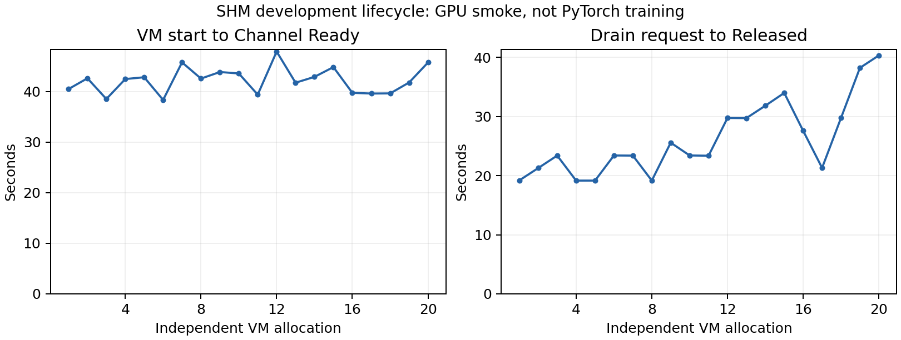
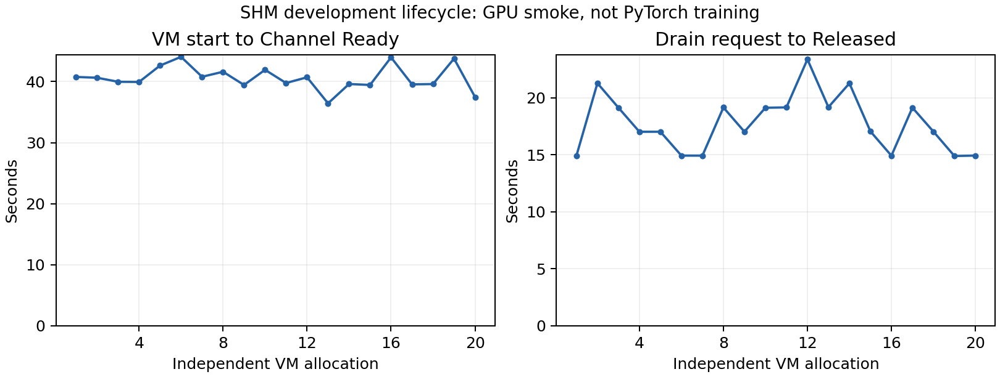

# SHM/HAMi 후속 구현·실증 작업 기록

작업일: 2026-09-22 KST. 대상: gpu-4, `flyt-evidence` namespace.
작업 시작 기준 커밋: `6bc0332`, 중간 반영: `1c07d1c`.
**실제 구현·개발 검증 결과 보고서다. 요청한 전체 PyTorch 학습·성능 실증은 아직 완료되지 않았다.**

## 주장과 증거 요약

| 주장 | 개발 실험 ID | 판정 기준 | 측정 결과 | 한계 |
|---|---|---|---|---|
| 실제 VM→SHM→HAMi→GPU 실행 | `run-evidence-final-gpu-a/b` | 복사값·PTX 결과 일치, 두 Channel 회수 | 두 VM 2,341/2,331회 결과 검사 PASS | PyTorch 학습 정확성 아님 |
| 메모리 경계와 OOM 복구 | `run-evidence-final-mem-1024/4096` | 경계 성공·초과 거절·재할당·계상 복구 | 1 GiB·4 GiB 모두 PASS | 설치 limiter의 전체 계약·compute 제한은 미확정 |
| 두 세션의 합산 초과 차단 | `run-evidence-final-aggregate-v2` | 각각 2,576,980,377 B 동시 요청 시 둘 다 성공하지 않음, 정상 종료 | `[성공, OOM]`, 실행·회수 PASS | 4 GiB 사례; 1 GiB는 미입증 |
| 정상 준비·회수·재사용 | `lifecycle-final-20` | 매회 실제 연산·Released·잔여 Worker 부재·후속 PVC 재사용 | 최종 버전 20/20 PASS, 마지막 합산 시험도 PVC 재사용 | 개발 관측 시간; 본 성능 비교 아님 |
| 강제 삭제 Worker의 잔류 방지 | `fault-final-worker-pod-retry` | 대상 종료·동료 PTX 성공·회수·잔여 Pod 부재 | 수정 후 5/5 PASS | 최초 5회는 잔여 Pod 감사에서 FAIL; 학습·노드 단절은 미검증 |

실행별 자료는 [공개 개발 결과](results/2026-09-22/README.md),
전체 계획의 미완료 상태는 [본 실험 상태 JSON](results/2026-09-22/main-experiment-status.json)을 따른다.

## 구현과 조치

| 문제 | 확인한 원인 | 조치 | 현재 확인 범위 |
|---|---|---|---|
| QEMU ivshmem 미지원 | launcher의 CentOS QEMU 장치 구성에 ivshmem 없음 | 동일 10.1.0-20.el9 소스 RPM의 downstream 패치를 적용하고 CONFIG_IVSHMEM 활성화 | 최종 launcher에서 ivshmem-plain 확인 |
| 빌드 소스 경로 오류 | 재귀 검색이 하위 Brotli configure 선택 | 정확한 QEMU 소스 루트로 고정 | 빌드 통과 |
| configure 옵션 오류 | 해당 버전에 enable-vhost-vsock 옵션 없음 | 지원 옵션과 장치 설정 사용 | configure 통과 |
| Python 빌드 의존성 | tomli 미설치 | meson/tomli/pycotap 버전 고정 | QEMU 컴파일 통과 |
| BIOS 탐색 실패 | custom 설치 위치에서 QEMU 상대 경로가 달라짐 | 펌웨어 디렉터리 제공 및 -L 경로 명시 | QMP 초기화와 실제 VM 부팅 통과 |
| VGA와 PCI 슬롯 충돌 | custom argv의 ivshmem이 libvirt VGA보다 먼저 slot 1 점유 | XML의 PCI 주소를 검사해 빈 root slot 명시 | 실제 VM 부팅, BAR `0000:00:1e.0` 확인 |
| hook의 root controller 거절 | KubeVirt는 libvirt가 root controller를 채우기 전 XML로도 hook 호출 | 알려진 q35 machine의 암묵적 root 지원; 다른 미지원 구성은 거절 | 회귀 검사 및 실제 VM 통과 |
| 실험 runner의 PCI 탐색 구문 오류 | 원격 Python 문자열에 literal newline 삽입 | `chr(10)`으로 분리자 생성 | 후속 VM의 BAR 탐색 통과 |
| 로컬 이미지 pull 실패 | 지정 digest의 Worker/hook이 런타임 저장소에서 조회되지 않음 | 보존 OCI의 정확한 digest를 확인해 재import | Worker 실제 실행 확인 |
| 최종 controller digest 불일치 | OCI export의 manifest 변환으로 build digest와 archive/runtime digest가 다름 | archive manifest SHA256 검증·기록을 import 도구에 추가하고 실제 runtime digest를 Helm values에 고정 | 초기 준비 실패 보존, 준비/reclaim Pod의 이미지 복구 후 회수; 새 allocation으로 재시험 |
| 종료 증거 관측 경쟁 | launcher API 객체가 terminal 상태 수집 전에 삭제될 수 있음 | controller 소유 finalizer로 객체 보존, Detached 저장 후 해당 finalizer만 제거 | 실패한 첫 VM에서 Guest/Worker Detached→Released 및 reclaim 완료 |
| 불완전한 종료 판정 | 일부 container status만 존재해도 이전 조건 통과 가능 | 일반/init/ephemeral container 전체 이름과 종료 상태 일치 요구 | 단위 검사 통과 |
| Guest 메모리 조회 누락 | cudaMemGetInfo SHM 경로 없음 | 0x1013 opcode, Worker 실제 조회 및 16-byte LE 응답, Guest Runtime/Driver wrapper 추가 | 1 GiB·4 GiB VM의 quota·잔여량 조회 성공 |
| OOM 이후 정상 요청까지 실패 | 실행기가 cudaMalloc의 error 2도 치명적 오류로 취급해 session 종료 | 메모리 부족만 복구 가능한 거절로 처리; 다른 오류의 보수적 종료 유지 | 단위 검사와 실제 VM 2개 quota의 OOM 후 재할당·계상 복구 통과 |
| 종료 session의 확장 API 호출 가능성 | 추가한 메모리 조회가 executor의 owner/closing 검사 밖에 있었음 | `flyt_cuda_exec_check` 추가; 메모리 조회·확장 호출·async reap 진입 전 검사, 치명적 오류 뒤 CUDA destructor 호출 생략 | Worker v3b 회귀 검사와 실제 VM 메모리·두 VM PTX·Worker 종료 재검증 통과 |
| 합산 메모리 probe fork | Guest 라이브러리는 fork 상속 상태를 의도적으로 거절 | 각 자식이 exec 후 독립 slot으로 연결하도록 변경 | 4 GiB 합산 초과 차단 PASS, 1 GiB는 개별 성공 전제 부족으로 BLOCKED |
| 이전 VMI admission 시험의 다른 정책 거절 | 실행 중 VMI에 추가된 KubeVirt 예약 label을 CREATE 요청에 복사 | FLYT label만 유지해 SHM 정책까지 요청 전달 | 최초 FAIL 보존, 수정 후 실제 webhook의 `channel unavailable` 거절 확인 |
| 강제 삭제 Worker가 같은 allocation에서 재생성됨 | 종료 관측이 원래 Pod를 해제한 뒤 `ensure`가 없는 Pod를 다시 생성 | `workerPodUID`가 고정된 이후에는 신규 생성 금지, 부재 시 Draining | 2개 회귀 검사 및 새 controller의 Worker Pod 장애 5회 통과 |
| 잔여 Pod가 있어도 장애 시험이 PASS | Released·연산·backing 기준만 검사하고 종료 Pod 객체 잔류를 누락 | Released 뒤 Worker Pod 부재도 요구하고 최종 잔여 자원 감사 추가 | 최초 Worker Pod 장애 5회는 후속 감사에서 FAIL로 정정 |
| 합산 probe의 결과 출력 후 SSH 종료 | 두 자식 세션 종료 뒤 세션 없는 부모까지 다시 10초 대기하는 동안 정상 VM 회수 시작 | aggregate 부모의 추가 대기만 제거하고 probe를 별도 빌드 | 최초 실행 FAIL 보존; 수정 probe에서 `[성공, OOM]`, 정상 종료·회수 PASS |

소스 RPM: [CentOS Stream 공식 Koji](https://kojihub.stream.centos.org/kojifiles/packages/qemu-kvm/10.1.0/20.el9/src/qemu-kvm-10.1.0-20.el9.src.rpm).
SHA256: `daf957b455f55bac4aa7268a5d57d279ae65aa579f89b0b6e758e7df9e9cafad`.
CentOS·launcher 기반 image와 Python 빌드 의존성은 Containerfile에서 고정한다.

## 변경된 동작

- `images/flyt/Qemu.Containerfile`: 해당 QEMU의 배포판 패치를 보존하는 ivshmem launcher 빌드.
- `domain_hook.py`: root-bus의 기존 PCI 주소와 chipset 예약 슬롯을 피하는 명시적 주소 할당.
- `observe.py`: 종료 증거를 먼저 저장하고 Pod 보존을 나중에 해제. API 실패/노드 단절/부분 상태에서는 회수 완료로 판정하지 않는다.
- active controller에만 Pod update 권한 추가. review 권한은 그대로 유지한다.
- `prepare-evidence-vm.py`: 새 UID로 VM/Profile/Request/Channel 생성. 이전 Channel이 Released일 때만 PVC 재사용.
- `import-evidence-image.py`: 임시 관리 Pod로 지정 OCI만 host CRI-O 저장소에 import. 서비스 재시작·GPU binding 변경 없음.
- `set-evidence-launcher.py`: KubeVirt customization으로 새 VMI launcher 선택. 기존 실행 VM의 이미지는 변경하지 않으며 복원 patch를 저장한다.

## 실제 실행 범위

첫 VM은 BIOS 경로 오류, 두 번째 VM은 PCI 슬롯 충돌로 부팅하지 못했다.
첫 VM의 drain은 추가 수동 finalizer 조작 없이 양쪽 Detached, reclaim 성공,
Channel Released까지 도달했다. 이 결과는 학습 성공이나 일반 학습 후 종료 20회 검증과 구분한다.
세 번째는 초기 domain XML 처리, 네 번째는 runner의 원격 Python 구문 오류로 실패했다.
네 번째 VM 자체는 정상 부팅했다. 다섯 번째 VM은 SHM 복사 4 KiB와 PTX kernel 100회
검사, Channel Ready, 정상 종료·Released를 통과했다.

두 VM을 장벽으로 동시에 시작한 추가 개발 시험에서 seed 2026/2027의 서로 다른
결과를 각각 2,325/2,344회 검사했다. 각 VM은 약 10초간 실제 GPU 연산을 수행했고,
두 Channel 모두 Released가 됐다. 이는 E4의 학습·공유 성능 결과가 아니다.

최종 controller v2b / Worker v3b 조합으로 다시 실행한 `run-evidence-final-gpu-a/b`도
두 VM에서 각각 **2,341/2,331회** 결과 검사를 통과하고 Released가 됐다. 이전 버전의
실행 횟수와 합산하지 않는다. 최종 `run-evidence-final-mem-1024/4096`은 아래 Worker v2와
같은 quota·잔여량에서 경계, 초과 거절, OOM 후 재할당 및 계상 복구를 모두 재확인했다.

초기 메모리 시험은 1 GiB·4 GiB 모두 경계까지 할당하고 경계+1 byte를 거절했지만,
OOM 뒤 session이 닫혀 재할당·계상 복구에 실패했다. Worker v2로 다시 실행한 결과는 다음과 같다.

| 요청 quota | 최초 계상상 잔여량 | 경계 할당 | 경계+1 byte | OOM 후 재할당 | 최종 잔여량 |
|---|---:|---|---|---|---:|
| 1 GiB | 497,025,024 B | 성공 | CUDA error 2 | 성공 | 497,025,024 B |
| 4 GiB | 3,718,250,496 B | 성공 | CUDA error 2 | 성공 | 3,718,250,496 B |

각 경우 최초 내부 계상량은 576,716,800 B(550 MiB)였다. 이는 이 빌드의 관측치이며
모든 GPU·CUDA·HAMi 조합의 고정 예약량으로 일반화하지 않는다. 경계는 CUDA 조회가
반환한 잔여량으로 정의한 개발 진단이다. 본 E2에는 설치된 limiter의 소스·설정 계약도 필요하다.

같은 Worker v2와 동일 guest binary를 사용한 정상 생명주기 **20/20회가 통과했다.**
신규 VM/allocation/generation을 매번 만들고 Ready·GPU 연산·detach·reclaim·Released와
같은 PVC의 후속 신규 allocation 사용을 확인했다. 두 PVC에서 최대 두 VM을 실행했고,
Worker 연산 설정은 VM당 50이었다. 마지막에 다음 합산 시험도 해당 PVC를 재사용했다.

| 개발 관측 구간 | 중앙값 | 최솟값 | 최댓값 |
|---|---:|---:|---:|
| VM 시작 요청→Channel Ready | 42.54 s | 38.36 s | 47.93 s |
| drain 요청→Released | 23.40 s | 19.15 s | 40.30 s |

이 시간은 guest SSH 준비와 controller polling을 포함한 개발 관측치다. CPU pinning·정규
비교군을 고정한 성능 실험이 아니다. 후반 회수 시간이 증가했다. 코드상 Released Channel에도
관측·회수 조회와 status 갱신이 반복되지만, 그것만이 원인이라고 분리 입증하지는 않았다.
후속 시험에는 완료 fixture의 증거를 저장한 뒤 API 객체를 삭제해 과거 객체 누적을 줄였다.

수정 후 최종 controller v2b / Worker v3b에서도 **정상 생명주기 20/20회가 통과했다.**
`lifecycle-final-20`은 위 최초 20회와 별도 실행이다. 매회 Ready·PTX 결과·Released뿐 아니라
잔여 Worker Pod 부재를 확인하고, 증거를 저장한 뒤 완료 fixture를 삭제했다. 다음 allocation이
같은 PVC를 재사용했으며 수동 finalizer 조작이나 Pod image 수정은 없었다.

| 최종 버전 개발 관측 구간 | 중앙값 | 최솟값 | 최댓값 |
|---|---:|---:|---:|
| VM 시작 요청→Channel Ready | 40.30 s | 36.44 s | 44.05 s |
| drain 요청→Released | 17.05 s | 14.90 s | 23.38 s |

최초 실행과 controller/Worker 버전 및 완료 fixture의 정리 방식이 다르다. 이 수치의 차이를
하나의 수정에 의한 성능 향상으로 해석하거나 두 버전의 반복을 합산하지 않는다.

두 프로세스 합산 시험에서 4 GiB VM은 각 2,576,980,377 B 요청에 `[OOM, 성공]`을 반환해
합산 초과 성공을 차단했다. 1 GiB VM의 각 644,245,092 B 요청은 둘 다 OOM이어서
**BLOCKED**다. 개별 요청 성공 전제가 충족되지 않아 합산 제한의 통과/실패 증거로 세지 않는다.
두 VM 모두 종료 후 Released가 됐다. 이 결과는 4 GiB에서 확인한 합산 제한을 모든
작은 quota·session 수 조합으로 일반화하지 않기 위한 기록이다.

최종 이미지의 첫 합산 재시험 `run-evidence-final-aggregate`는 `[OOM, 성공]`을 출력했지만,
부모의 불필요한 대기 중 VM이 회수돼 SSH 255로 끝났다. 실행 전체 판정은 **FAIL**로 보존한다.
자식 세션 관측 대기는 유지하고 세션 없는 부모의 추가 대기만 제거한 별도 probe v2를 빌드했다.
`run-evidence-final-aggregate-v2`는 `[성공, OOM]`, 프로그램 정상 종료와 Released까지
**PASS**다. 이 probe의 변경은 앞서 완료한 GPU smoke 20회의 바이너리를 변경하지 않는다.

Worker v2와 최초 controller에서 제어기 재시작, guest process 종료, Worker process 종료는
각 5회 실제 수행했다. VM B는 서로 다른 seed의 PTX 결과 검사를 유지하고 양쪽 Channel은
Released가 됐다. 종료 대상의 일반 smoke FAIL은 장애 시험의 기대 결과와 구분한다.

Worker Pod 강제 삭제 5회도 최초 runner는 PASS라고 기록했지만, 후속 잔여 자원 감사에서
각각 다른 UID의 종료 Worker Pod가 남아 있는 것을 발견했다. **이 5회의 최종 판정은 FAIL**이다.
`worker-pod-residual-audit/summary.json`이 원래 판정을 정정하는 증거다. 원래 metrics는
당시 판정의 이력으로 보존하며 성공 통계에 포함하지 않는다. 남은 객체는 Node Ready와
모든 container 종료, 원래 Channel UID를 확인하고 증거를 저장한 뒤 소유한 finalizer만
관리 작업으로 제거했다. 이 수동 조치를 자동 회수 성공으로 세지 않는다.

이 오류는 observe 단계에서 원래 Worker Pod 삭제가 완료된 직후 일반 `ensure`가
같은 이름의 새 Pod를 만들면서 발생했다. 새 Pod는 이전 attachment의 holderUID와 다르므로
정상 세션으로 들어가지 못했으나, 해당 Pod의 finalizer는 원래 attachment 관측으로 풀리지 않았다.
고정된 workerPodUID가 존재하면 새 Pod를 생성하지 않고 Draining으로 전환하도록 수정했다.
후속 재검증은 새 controller digest와 Worker v3b를 사용하며 이전 버전의 반복 수와 합산하지 않는다.

최종 controller의 첫 배포에는 build digest `03df4d2b…`를 사용했지만 OCI archive와
CRI-O에 실제 등록된 manifest digest는 `a60f7663…`이었다. archive의 `index.json`과
manifest blob SHA256, 노드의 image 목록을 대조해 확인했다. 실패한 준비 Channel의
spec 변경은 immutable 규칙으로 거절됐다. 이 규칙을 우회하지 않고 해당 준비/reclaim
Pod의 image만 바로잡아 연산·Released까지 복구했다. `run-image-recovery`의 probe PASS는
**수동 이미지 복구가 포함된 개발 진단**이며 자동 회수 성공 반복에 포함하지 않는다.
그 allocation을 회수한 뒤 새 allocation·올바른 digest로 장애 반복을 다시 시작했다.

VMI 강제 삭제의 최초 실패는 stale CREATE에 KubeVirt 예약 label까지 복사한 시험 코드 문제였다.
예약 label을 제외한 server dry-run은 실제 SHM webhook의 이전 채널 거절을 확인한다.
server dry-run은 실제 이전 allocation VM을 부팅한 시험이 아니다. 동일 VM 이름 재생성은
매번 새 VM/VMI/Channel/Worker UID와 allocation/generation을 확인하는 별도 검증이다.

Worker/VMI 강제 삭제에는 제품의 detach-observation finalizer가 남아 종료 증거를 보존했다.
이 결과는 finalizer를 강제로 제거해 증거를 유실시킨 상황이나 실제 노드 단절의 증거가 아니다.
오류 관측 시간은 host runner의 SSH 종료 관측 시각이다. SSH 255를 정형 CUDA 오류 전파와
동일하게 해석하지 않는다. PTX 동료 VM의 결과는 검사했으나 학습 정확성·장애 전후 처리량
비교 또는 CPU 비용을 측정한 것은 아니다.

| 개발 장애 ID | 실행 버전 | 반복 판정 | 판정 범위 |
|---|---|---|---|
| `fault-controller` | 최초 controller / Worker v2 | 5/5 PASS | controller UID 변경, 두 PTX probe 성공, 양쪽 회수 |
| `fault-guest-process` | 최초 controller / Worker v2 | 5/5 PASS | 대상 종료, 동료 PTX 성공, 양쪽 회수 |
| `fault-worker-process` | 최초 controller / Worker v2 | 5/5 PASS | 대상 Worker process 종료, 동료 PTX 성공, 양쪽 회수 |
| `fault-worker-pod` | 최초 controller / Worker v2 | 최종 5/5 FAIL | 후속 감사에서 재생성된 잔여 Worker Pod 발견; 최초 PASS를 정정 |
| `fault-vmi-force` | 최초 controller / Worker v2 | 1회 FAIL | reserved label에 의한 다른 정책 거절로 SHM admission 검증 실패 |
| `fault-vmi-force-retry` | 최초 controller / Worker v2 | 5/5 PASS | 강제 종료·회수, 같은 VM 이름의 새 식별자, stale channel admission 거절 |
| `fault-final-worker-pod` | 최종 이미지 준비 단계 | 1회 FAIL | manifest digest 불일치로 BackingReady timeout, 장애 주입 전 실패 |
| `fault-final-worker-pod-retry` | controller v2b / Worker v3b | 5/5 PASS | 대상 종료, 동료 PTX 성공, 회수 및 잔여 Worker Pod 부재 |
| `fault-final-worker-process` | controller v2b / Worker v3b | 1/1 PASS | 최종 Worker의 별도 회귀 실행; 이전 5회와 합산하지 않음 |

대표 PyTorch 학습·passthrough/RPC·MPS 성능 비교는 아직 수행 결과가 없다.
PTX smoke·메모리 시험이 통과하더라도 PyTorch 학습 정확성의 대체 증거로 사용하지 않는다.

보존된 `torch-2.11.0+flyt.cu128` wheel을 정적으로 검사했다. `libc10_cuda.so`의 CUDA
import 44개 중 27개, `libtorch_cuda.so`의 209개 중 178개가 현재 Guest 라이브러리에
export되지 않는다. 이 숫자는 전체 라이브러리 검사이며 MLP가 모두 호출한다는 뜻이 아니다.
구체적으로 `__cudaRegisterFatBinary`/`__cudaRegisterFunction` 등록 경로가 없고,
현재 `cudaLaunchKernel`은 명시적으로 not-supported를 반환한다. 따라서 PyTorch
forward/backward/SGD를 검증한 상태가 아니다. 정적 감사 도구는
`scripts/audit-pytorch-shm-abi.py`이며 native CUDA 라이브러리로의 우회를 성공으로 세지 않는다.

## 전체 계획 대비 판정

아래 표의 상태는 **본 실험 전체의 완료 여부**다. 위 개발 PASS들을 본 실험의 PASS로
옮겨 적지 않는다. 선행 개발과 baseline·정확성 진입 조건을 모두 통과하지 않았으므로
요청한 전체 구현·실증은 아직 완료되지 않았다.

| 본 실험 | 상태 | 실제 증거와 남은 조건 |
|---|---|---|
| E1 PyTorch 학습 정확성 | BLOCKED | CUDA Runtime kernel 등록·실행 경로 미구현. loss/gradient/parameter 비교 결과 없음 |
| E2 자원 제한·정상 생명주기 전체 | BLOCKED | 개발 단계 메모리 경계·OOM 복구·4 GiB 합산 제한·정상 회수 20회 통과. 1 GiB 합산 사례는 미입증, 연산 제한 정책/계측 계약과 25/50/100 부하 시험은 미완료 |
| E3 단일 VM 성능 60회 | BLOCKED | E1 미통과, Passthrough 및 RPC·MPS의 동일 학습 baseline 미구성. 성능비 없음 |
| E4 2 VM 학습·공유 성능 | BLOCKED | 두 VM의 SHM PTX 연산은 확인했지만 동시 PyTorch 학습·slowdown·공통 부하 구간은 미실행 |
| E5 격리 장애 전체 | BLOCKED | PTX 개발 장애 검증과 실제 학습 장애 검증을 구분. 준비 중 취소 등 남은 시나리오와 학습 상태 검증은 미완료 |
| E6 다중 GPU | NOT_RUN | 이번에는 GPU 1 한 장만 지정. 현 controller는 count=1 경로이며 정수 다중 GPU 할당·회수는 검증하지 않음 |

이전 `EXECUTION_2026-09-22.md`와 `.local/evidence-20260922`의 294개 행렬은 당시의
사전 점검·차단 장부로 보존한다. 새 개발 결과를 그 행렬의 본 학습 측정치로 덮어쓰지 않는다.

## 남은 구현과 본 실험 진입 순서

1. **D3 CUDA/PyTorch 호환성 구현:** 고정 MLP가 실제 사용하는 CUDA Runtime 등록,
   kernel 인수·device pointer 매핑, launch, stream/event, cuBLAS 경로를 지원한다.
   전체 wheel의 import 목록을 그대로 구현 작업 목록으로 간주하지 말고 최소 MLP의
   동적 호출과 연결한다. CPU fallback이나 다른 명시적 backend로 학습 코드를 바꾼 결과를
   원래 `torch.cuda` 호환성 성공으로 세지 않는다. 완료 증거는 실제 SHM 경로의
   forward/backward/SGD 및 1/100 step tensor다.
2. **D5 baseline과 D6 배치 고정:** GPU 소유권·IOMMU 확인 후 passthrough 전환/원복과
   RPC·MPS 기준 실행을 구성한다. guest/host CPU 배치 및 겹치지 않는 cgroup 비용을
   수집하고 동일 fixture·PyTorch·CUDA 조건에서 baseline 자체의 반복 오차를 확정한다.
3. **D7 quota 계약:** 실제 배포된 HAMi limiter와 일치하는 소스/빌드 옵션을 연결하고
   메모리 예약·세션 계상 및 compute 25/50/100의 제한 대상·관측 구간·허용 범위를
   고정한다. 충분한 GPU 부하로 60초×3회 계측한다. 1 GiB 합산 시험의 적합한
   개별 성공 조건도 별도 확립한다.
4. **남은 D8 장애:** 준비 중 취소는 현재 `everBound` 및 양쪽 Detached를 요구하는
   회수 경로에서 미완료다. 미연결 준비 상태의 해제 증거를 정의하고 구현한 뒤 시험한다.
   VMI 일반 종료, API 접근 격리와 실제 학습을 유지하는 동료 VM 검증을 추가한다.
5. **본 실험 새 버전:** 위 gate를 충족하면 소스·이미지·설정·허용 오차를 동결하고
   E1→E2→E3 60회→E4→E5를 새 결과 디렉터리에서 수행한다. 이번 개발 중의
   수정 전후 결과는 하나의 성능 비교 블록에 합산하지 않는다.

추가 GPU 할당과 실제 노드 단절은 조건부 범위로 남긴다. 현재 노드에 GPU가 네 장
있다는 사실과 이번 한 장의 사용·검증 범위는 별개이며, count>1 구현은 아직 검증하지 않았다.

## 빌드 식별자와 재현성

| 구성요소 | 실제 실행에 사용한 digest |
|---|---|
| ivshmem launcher v2 | `sha256:3a63c98b5a178af7f58f8979e09cbd11182f7220e5826f5048efb22a2d7b7935` |
| active controller | `sha256:a8c97b10f3a064f42f040deab1ae309aae0cbd7f29b5bf7faf9b37842e8ab23b` |
| hook v2 | `sha256:ff8db37b7ee864c5b63335986b2d4c85c550ca7bd82c80ed241563f715fa0554` |
| Worker v1: 초기 PTX/메모리 진단 | `sha256:e2d54e5890aa9af594f002c59a88707cf524cfd2adde00a3557005bc83e02455` |
| Worker v2: OOM 수정 후, 생명주기 20회 | `sha256:96d8275cfc02ed72e183c9048f3447fd45fbab078f15c98bb97733eb9617108c` |
| Worker v3b: closing/owner 검사 및 치명적 오류 후 CUDA 재진입 차단 | `sha256:9e40677fadaecc3d0544349dc2da196dd81883aa3081e5944ebb86f1f57bf0e8` |
| active controller v2b: 종료된 bound Worker 재생성 금지 | `sha256:a60f76638461c0fb15c11d89779c482e44621ab52119e682b279de0dd2a4859d` |

VM은 동일 Ubuntu containerDisk, 8 vCPU/16 GiB, GPU UUID
`GPU-7d708c42-8d4a-16d5-0746-474567157aa3`을 사용했다. Worker CPU pinning과
Passthrough/RPC의 동등한 CPU 예산 설정은 완료하지 않았다. 따라서 이 자료로 학습 처리량,
CPU 비용 우위 또는 SHM 자체의 성능 개선을 주장하지 않는다. 단일-block PTX smoke는
GPU 포화 부하가 아니며 연산 제한의 합격 판정에 사용하지 않았다.

빌드·배포·실행·복원 방법은 [재현 절차](REPRODUCE_VM_DEVELOPMENT.md)에 정리했다.
이미지는 노드 로컬 CRI-O에 import했으며 GitHub에는 Containerfile과 실행 도구를 반영한다.
새 이미지 빌드에는 rolling OS 패키지 저장소가 포함되므로 재빌드 digest의 동일성은 보장하지 않는다.
실제 실행에서는 저장된 image digest와 프로그램 해시를 사용한다.

## 최종 점검

- Python controller 검사 27개와 PyTorch를 사용하는 결과 도구 검사 16개가 모두 통과했다.
  C 검사 2종에서 OOM 복구, non-OOM 치명적 오류, 메모리 조회 인코딩·경계 및 owner/closing
  검사를 통과했다. Helm lint와 문서의 probe 컴파일 명령도 확인했다.
- GPU 관측은 09:01:59~10:42:42 UTC의 6,042개 표본이며 조회 오류는 0건이다.
  마지막 관측에서 선택 GPU의 compute 프로세스 0개, 메모리 사용량 0 MiB였다.
  이 관측은 앞선 모든 개발 실행을 포함하지 않으며 VM별 연산 제한이나 CPU 비용의 증거가 아니다.
- 마지막 회수 뒤 읽기 전용 Pod로 두 backing 디렉터리의 내용이 모두 비었음을 확인했다.
  실행별 결과를 보존한 뒤 Released fixture를 정리했다. 실험 namespace의 VMI·Channel·
  Worker Pod는 모두 0개이며 controller/webhook과 비어 있는 두 PVC/PV를 유지한다.
- 기존 `shm-channel-a`는 Draining, `shm-channel-b`는 Released,
  기존 `basic-vm`은 같은 VMI UID로 Running 상태를 유지했다. GPU 1은 nvidia binding을
  유지했으며 VFIO 전환이나 실제 노드 단절을 수행하지 않았다.

검사 로그·배포 식별자·GPU 시계열은 [공개 결과 디렉터리](results/2026-09-22/README.md)에 있다.
최종 자원 상태는 [최종 상태 JSON](results/2026-09-22/final-state-summary.json)을 따른다.

## 증거 관리

원시 자료는 `.local/implementation-20260922/`에 저장한다. 빌드 로그(v1~v4),
import 로그, QMP 검사, VM 실패 로그, 각 VM/Channel 입력, 회수 상태와 image digest가 포함된다.
같은 디렉터리에 실험용 SSH/TLS 키도 있으므로 **디렉터리 전체를 공유하거나 Git에 추가하지 않는다.**
GitHub에는 코드·보고서·재현 절차와 allowlist로 추출한 개발 결과 JSON 및 생명주기 그림을 반영한다.
공개 결과의 실행 단위 기록에는 의도적인 장애 대상 FAIL도 포함되므로 단순 PASS 개수로
전체 실험 성공률을 계산하지 않는다. 최종 판정과 판정 정정은 이 보고서를 우선한다.
