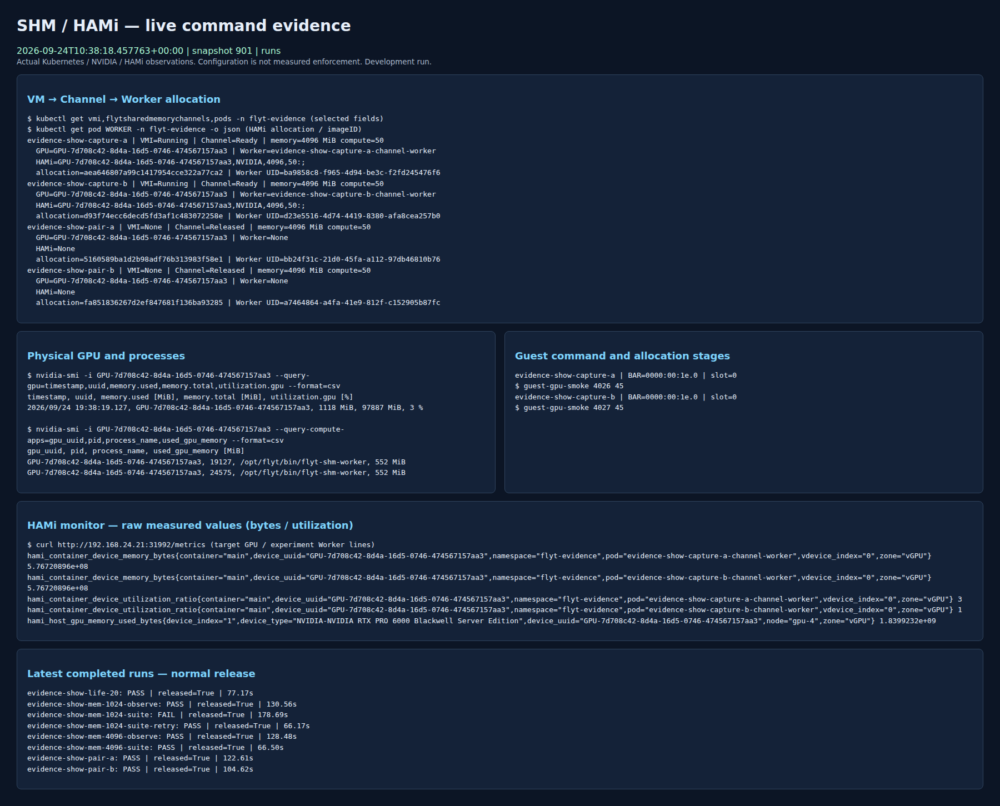
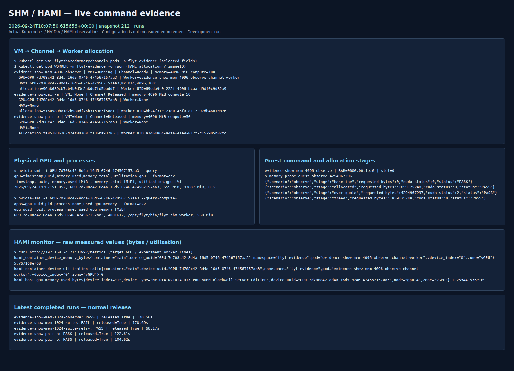
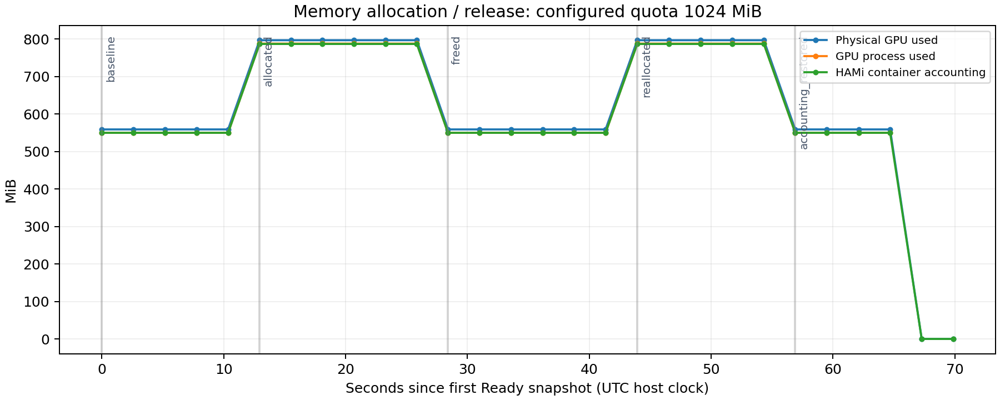
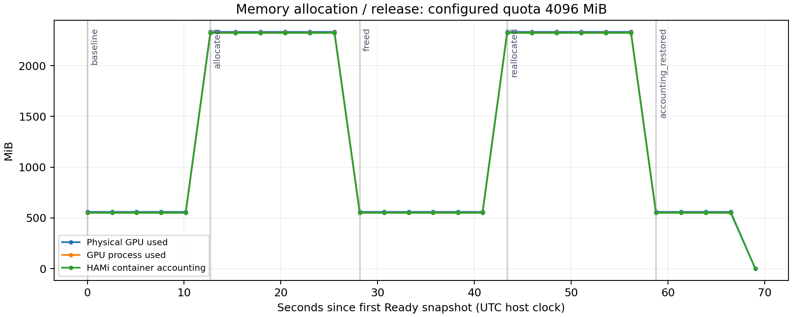
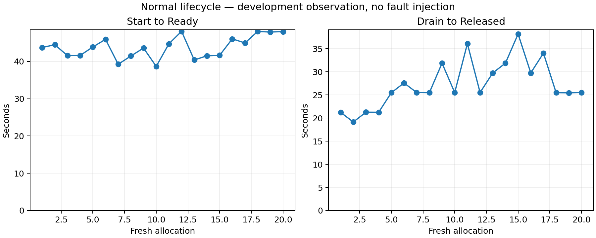
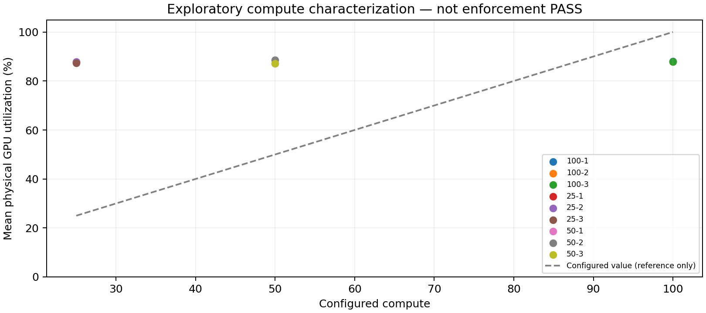

# SHM/HAMi 구현·실험 및 실제 화면 증거 — 2026-09-24

사용자 요청에 따라 **학습 정확성 비교와 장애 격리·복구 실험을 제외**하고 실제 VM 실행,
메모리 배정·제한·재할당, 정상 회수·재사용, 연산 부하 관측을 수행했다.
[변경된 계획](IMPLEMENTATION_EXPERIMENT_PLAN.md), [공개 결과](results/2026-09-24-showcase/README.md)를 함께 따른다.
실제 브라우저 캡처와 원본 관측값을 보존했다. 생성 그림이나 과거 실행 화면을 새 실험 화면으로 대체하지 않았다.

## 결과와 범위

| 항목 | 결과 | 적용 범위 |
|---|---|---|
| 두 VM SHM GPU 동시 실행 | 첫 pair 및 호스트 PID 관측 후 재실행 pair 모두 PASS | 각 VM 45초 PTX 실행, 같은 UUID·서로 다른 Channel/Worker/PVC |
| 1/4 GiB 메모리 관측 | 두 quota 모두 PASS | baseline→할당 유지→초과 OOM→해제→재할당→계상 복구 |
| 1/4 GiB 경계 suite | 두 quota 모두 PASS | 설치 limiter 조회 잔여량 경계·경계+1·OOM 후 정상 재할당 |
| 4 GiB 두 세션 합산 | PASS | 각 2,576,980,377 bytes 요청, `[성공, OOM]`, 정상 종료·회수 |
| 정상 회수·신규 allocation 재사용 | 20/20 PASS | 동일 runtime 이미지, 새 식별자, 실행 Pod 잔류 없음 |
| compute 25/50/100 부하 | 9회 관측 | 실제 설정/부하/장치 사용률. 정식 limiter 합격 판정 아님 |
| 세 방식 학습 성능 비교 | NOT_RUN | RPC·MPS baseline 및 공정 CPU/NUMA 배치·calibration 미구성 |
| 학습 tensor 정확성·장애 주입 | 이번 범위 제외 | 새 비교 또는 장애 실험을 실행하지 않음 |

총 39개 실행 기록 중 38개 PASS, 1개 FAIL을 보존했다.
FAIL은 `evidence-show-mem-1024-suite`의 준비 중 실패다. 새 allocation의 `suite-retry`와 분리했다.
이 수치를 서비스 성공률이나 E1~E5 전체 완료율로 사용하지 않는다. 정식 성능 결과는 없다.

## 실제 실행 화면

`scripts/serve-evidence-dashboard.py`가 고정된 읽기 전용 Kubernetes 명령, GPU 호스트의
`nvidia-smi`, HAMi monitor endpoint를 조회했다. Chromium에서 실제 화면을 열어 PNG로 캡처했다.
[두 VM 실제 화면 녹화(WebM)](results/2026-09-24-showcase/video/two-vm-live.webm)도 저장했다.
PNG와 같은 이름의 JSON은 캡처 당시의 원본 snapshot, 브라우저 버전, URL, 시각을 담는다.
캡처 전후 snapshot sequence가 바뀐 경우 캡처를 재시도했다.

화면의 Channel UID/allocation/Worker UID/HAMi 배정/GPU UUID를 공개 `runs/*/run/identity.json`과 연결한다.
`process-cgroups.jsonl.gz`는 GPU host PID와 Worker Pod UID가 포함된 cgroup의 연결 증거다.
물리 GPU 전체 사용량을 VM별 사용량으로 취급하지 않는다. 장치에 둘 이상의 Worker가 있을 때
process 메모리를 VM별로 합산하려면 반드시 PID→cgroup→Pod UID 연결을 적용한다.

처음에는 DCGM 컨테이너 내부에서 `nvidia-smi`를 실행해 장치 메모리는 보였지만 호스트 PID 목록은
비어 있었다. 이 초기 관측은 `snapshots.jsonl.gz`에 보존했다. GPU 호스트 실행으로 수정한 뒤
`snapshots-host.jsonl.gz`를 수집하고 별도 pair를 재실행해 두 실제 GPU 프로세스가 함께 나타난 화면을 확보했다.
현재 설치에는 Grafana가 없어 새 읽기 전용 화면을 사용했다. 기존 Grafana 캡처라는 의미가 아니다.
헤더와 snapshot 시각은 UTC, 호스트 `nvidia-smi` timestamp는 KST다. 그래프는 UTC snapshot 시각으로 계산했다.
각 snapshot은 여러 조회의 순차 결과이며 원자적·동시 관측으로 표현하지 않는다.

## 실제 메모리 할당·제한

각 stage는 15초 유지했고, 아래 값은 해당 stage 관측 표본의 중앙값(MiB)이다.
GPU process와 HAMi 계상은 context 예약량·할당 반올림 등으로 일치하지 않을 수 있다.

| Quota MiB | 단계 | GPU process MiB | HAMi 계상 MiB |
|---|---|---|---|
| 1024 | baseline | 550 | 550 |
| 1024 | allocated | 788 | 787 |
| 1024 | freed | 550 | 550 |
| 1024 | reallocated | 788 | 787 |
| 4096 | baseline | 550 | 550 |
| 4096 | allocated | 2324 | 2323 |
| 4096 | freed | 550 | 550 |
| 4096 | reallocated | 2324 | 2323 |

1 GiB 실험의 성공 할당 요청은 248,512,512 bytes, 4 GiB 실험은 1,859,125,248 bytes다.
단계별 quota+1 요청은 `cudaErrorMemoryAllocation`(2)으로 거절됐고 이후 같은 세션에서 정상 재할당했다.
별도 suite에서는 초기 조회 잔여량 자체와 잔여량+1 byte를 시험했다. 조회 잔여량을 모든 버전의
정적 quota 계약으로 일반화하지 않는다. 원본 JSON에는 bytes와 CUDA 반환값이 있다.

## 정상 회수·재사용

20개 새 VM/allocation에서 실제 GPU 실행→일반 drain→Released→실행 Pod 부재를 확인했다.
두 PVC를 번갈아 사용했고, 최종 읽기 전용 backing 감사에서 양쪽 디렉터리가 비어 있었다.
테스트 finalizer 제거, 강제 삭제, 장애 주입은 사용하지 않았다.

- VM 시작 요청→Ready: 중앙값 43.80s, 범위 38.66–48.07s.
- drain 요청→Released: 중앙값 25.52s, 범위 19.15–38.18s.

이는 개발 환경 관측 시간이다. CPU/NUMA 통제 또는 서비스 SLO·방식 간 성능 우위를 뜻하지 않는다.
2026-09-22의 다른 runtime 버전 반복 횟수와 합산하지 않는다.

## 연산 부하 관측과 아직 남은 성능 작업

설치 `libvgpu.so` SHA256은 `e98badc7ab64065af728fcca833ed372f16702d1e1c18eec01b1d8f6cbf7a9fb`이다.
바이너리의 `GIT_HASH_b216ba1`과 HAMi v2.10.0의 submodule commit
`b216ba1be1b8e21488d1c7370ed3357b3049aad1`을 확인했다.
[해당 소스의 limiter](https://github.com/Project-HAMi/HAMi-core/blob/b216ba1be1b8e21488d1c7370ed3357b3049aad1/src/multiprocess/multiprocess_utilization_watcher.c)는
설정·utilization switch와 관측 루프를 사용한다. 설치 바이너리의 전체 빌드 옵션을 재현 검증한 것은 아니다.

compute probe는 2048 blocks × 256 threads의 PTX 부하를 사용했다. 새로운 VM/세션마다 10초 warm-up 후
약 61초를 실행하며 설정별 3회, 순서를 교차했다. 아래 값은 측정 시작 이벤트를 관측한 뒤 얻은
장치 사용률 표본의 산술평균이다. 완료 JSON이 나타난 표본은 제외해 종료 후 유휴 구간을 섞지 않았다. 표본 간격·경계 때문에 관측 span은 실제 부하 시간보다 짧다.
CUDA 실행 PASS는 제한 계약의 PASS와 구분하며, `formal_enforcement_verdict=NOT_EVALUATED`를 유지한다.
이번 부하는 thread당 1,048,576회의 종속 FMA를 수행하는 긴 kernel이다. **9회의 장치 사용률 평균은
설정에 관계없이 87.1~88.6%였다. 이번 부하에서 25/50% 비례 제한은 입증하지 못했다.** 부하 특성과 실제 정책·관측 지표의 의미를
분리해 후속 검증해야 하며, 이 자료만으로 HAMi의 모든 workload에서 제한이 동작하지 않는다고 일반화하지 않는다.

| 설정 | 반복 | 장치 사용률 평균 | HAMi container 지표 평균(원본 단위) | 장치 표본 최소–최대 | 표본 수 | 관측 span |
|---|---|---|---|---|---|---|
| 100 | 1 | 88.0% | 87.5 | 85–91% | 22 | 57.3s |
| 100 | 2 | 88.0% | 87.3 | 85–90% | 22 | 58.4s |
| 100 | 3 | 87.8% | 87.2 | 85–90% | 22 | 58.4s |
| 25 | 1 | 87.7% | 87.2 | 85–91% | 22 | 58.1s |
| 25 | 2 | 88.0% | 87.6 | 86–90% | 22 | 57.5s |
| 25 | 3 | 87.3% | 87.3 | 85–90% | 21 | 55.7s |
| 50 | 1 | 87.2% | 87.1 | 85–91% | 22 | 57.7s |
| 50 | 2 | 88.6% | 87.9 | 85–91% | 22 | 56.8s |
| 50 | 3 | 87.1% | 87.5 | 84–90% | 21 | 55.9s |

`compute-settings/`에는 실제 Worker 배정과 제한 관련 환경변수만 선택해 저장했다.
두 번째 반복부터 `compute-libraries/`에 실제 Worker 프로세스의 libvgpu mapping·선택된 환경변수·라이브러리 해시도 보존했다.
프로세스/장치 사용률을 시간 분할 limiter의 정확한 내부 토큰·연산량과 동일시하지 않는다.
포화 대조 부하와 제한 허용오차·관측 계약을 검토하기 전에는 25/50 설정 전달만으로 합격을 선언하지 않는다.

세 방식 성능 비교의 읽기 전용 준비 점검은 `performance-readiness.json`이다. 당시 RPC·MPS Pod가 없고,
보존 passthrough VM은 Halted, 관측 Worker의 CPU request/limit도 없었다. 따라서 8-vCPU guest라는
설정만으로 공정 CPU 예산을 충족했다고 볼 수 없다. RPC·MPS 구성, CPU/NUMA 및 비용 수집 고정,
전체 방식 calibration과 독립 반복은 남겨 둔다. 이번 PTX 관측을 학습 처리량 비교로 대체하지 않는다.

## 준비 실패와 조치

첫 실행 전 로컬 이미지가 노드에서 없어 동일 OCI digest로 import했다. 이후 실행 사이 다시 이미지가
조회되지 않아 Worker/hook에서 RegistryUnavailable/ImagePullBackOff가 발생했다. 노드에 pull 가능한
localhost registry가 없다는 오류도 저장했다. 이 준비 과정의 첫 1 GiB suite는 Guest가 Ready 전에
종료해 FAIL로 보존됐으며, 원래 Channel은 정상 Released됐다.

동일 이미지 복원 후 GPU를 요청하지 않는 임시 image-retention Pod로 세 이미지를 실행 상태로 유지했다.
새 allocation의 suite는 PASS였다. 이미지 보조 Pod는 반복 실험 동안 유지했고 최종 감사 후 삭제했다.
이미지 소실의 원인을 이 관측만으로 전부 확정하지 않는다. 장기 배포에는 pull 가능한 registry가 필요하다.

## 최종 감사·재현성

최종 감사: 새 Channel 39개 Released, allocation 39개 모두 서로 다름,
실험 VMI/Worker 잔류 없음, 두 backing 비어 있음, 대상 GPU compute process 없음.
기존 `basic-vm` launcher UID와 Running 상태, 기존 `shm-channel-a` Draining/`b` Released를 보존했다.
완료 Channel·Halted VM·완료 준비/회수 Pod는 읽기 전용 재검토를 위해 보존했다.

controller 30개, evidence 도구 17개, export 보안 검사 1개가 통과했다. CUDA probe를 실제 사용 shim에
연결해 컴파일하고 GPU 실행으로 확인했다. 새 수집/실행/분석 스크립트의 Python/JavaScript 구문 검사와
Git whitespace 검사도 수행했다. CPU 도구 검사는 GPU 실험 성공 횟수에 포함하지 않는다.

재현 명령은 [계획 문서](IMPLEMENTATION_EXPERIMENT_PLAN.md#실행-도구-사용-예)를 따른다.
`images.json`, `source-artifact-hashes.json`, 실행별 manifest/program hash와 `SHA256SUMS`로 버전을 연결한다.
실행 당시 base commit은 `2912677`이며 이번 변경은 미커밋 파일의 해시로 기록했다.
GitHub 공개 commit에는 후속 보고서·분석도 포함되므로 실행 파일 해시를 함께 확인한다.
첫 관측용 runner와 최종 compute 지원 runner는 소스 hash로 구분하고, 초기 runner 원본도 `sources/`에 보존했다.
SSH/TLS 키, cloud-init userdata, 전체 Pod 환경변수, OCI·private `.local` 전체는 공개하지 않았다.
