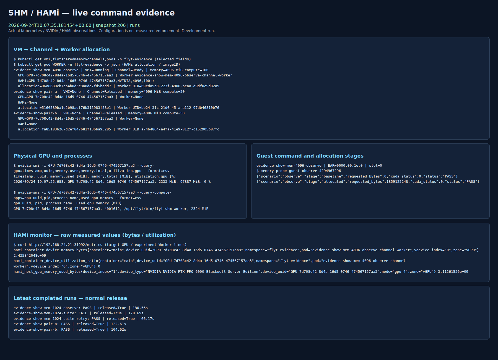

# 2026-09-24 SHM/HAMi 실제 실행 증거

[실험 결과 보고서](../../IMPLEMENTATION_EXPERIMENT_RESULTS_2026-09-24.md)와
[변경된 계획](../../IMPLEMENTATION_EXPERIMENT_PLAN.md)을 따른다.
학습 정확성 비교와 장애 격리·복구 실험은 제외했다.

- `screenshots/`: 실제 live dashboard Chromium 캡처 PNG와 같은 시점의 JSON.
- `video/`: 실제 두 VM 실행·회수 대시보드 녹화 WebM과 시작/종료 snapshot.
- `runs/`: allowlist로 내보낸 probe 결과, 상태 timeline, 배포 식별자, 실행/소스 해시. 실패 시도도 포함한다.
- `plots/`: 실측 메모리·정상 회수·연산 부하 그래프, CSV, 요약 JSON.
- `snapshots-host.jsonl.gz`: GPU 호스트 관측 원본. gzip 해제 후 한 행이 한 snapshot이다.
- `snapshots.jsonl.gz`: 관측 위치 수정 전 컨테이너 내부 자료. GPU PID 목록 부재를 성공 증거로 세지 않는다.
- `process-cgroups.jsonl.gz`: GPU host PID→Pod cgroup 연결 관측.
- `compute-settings/`, `compute-protocol.json`: 제한 관련 실제 설정과 탐색 관측의 범위.
- `performance-readiness.json`: 세 방식 정식 성능 비교의 남은 조건.
- `final-audit.json`: Released/고유 allocation/잔여 실행 자원/backing/기존 자원 보존 감사.
- `sources/`: 실제 초기 실행·재시작 coordination 및 초기 runner의 소스 보존. 키 파일 경로만 있고 키 내용은 없다.
- `SHA256SUMS`: 이 디렉터리 공개 파일의 SHA256(SHA256SUMS 자신 제외).

compute 실행의 PASS는 workload 완료 및 정상 회수다. limiter 계약·학습 성능 PASS가 아니다.
판정 단위는 실행별 scope를 따른다. 이미지 준비 실패를 삭제하거나 정상 회수 20회에 섞지 않았다.

