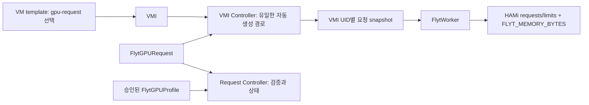

# 4단계: VM GPU 요청과 quota 변환

**소스 구현 완료·검증 미실행(NOT_RUN).** `stage/03-controller`의
`cdf086e921e6ce14a46ccca50528c2115a1f1fb3`에서 `stage/04-gpu-request`를 분기했다.
이번 작업은 Go 소스, CRD 매니페스트, 설치 예제와 문서 작성이다. 의존성 해결,
빌드, 정적 검사, CRD/CEL 검사, 렌더 검사, Controller 시험, GPU 실행, 배포를 하지 않았다.

## 관리 구조

| CRD | 관리 책임 |
|---|---|
| `FlytGPUProfile` | 관리자 승인, GPU UUID·node·image·RuntimeClass, Worker별 요청 상한 |
| `FlytGPURequest` (신규, `fgr`) | VM UID에 연결된 count/compute/memory 요청, 검증과 적용 상태 |
| `FlytWorker` | VMI UID별 실행 자원과 승인 당시 요청의 불변 snapshot |
| `FlytControlPlane` | 기존 공유 Manager·동적 binding 경로 |

새 Request는 동일 namespace의 VM, Profile, ControlPlane을 이름과 UID로 참조한다.
`count`, `compute`, `memory`는 변경할 수 있고 세 참조는 CEL로 불변 처리한다.
같은 이름의 VM/Profile/ControlPlane을 다시 만들면 기존 요청의 UID가 맞지 않으므로
자동 승계하지 않는다. 새 리소스에 맞는 새 Request를 만들어 명시적으로 선택한다.

Profile의 기존 `cores`와 `memoryMiB`는 요청 모드에서 **Worker 한 개의 상한**이다.
기존 Profile 선택 모드에서는 여전히 그 값을 그대로 할당한다. 기존 필드의 schema와
기본 동작은 보존했으며 요청자가 `approved`를 바꾸거나 GPU UUID를 지정하는 기능은 없다.
Profile의 `maxClients`, image, runtimeClass 등 실행 설정도 그대로 상속한다.



Request Controller는 Worker를 생성하지 않는다. VMI Controller가 legacy/request 모드
모두에서 생성 책임을 맡는다. Request Controller는 Request 삭제 시 해당 Request UID의
Worker 삭제를 요청하고, Worker의 기존 finalizer가 완료될 때까지 기다린다.

## 입력과 변환 규칙

선언 예제는 `request.example.yaml`이다.

```yaml
apiVersion: flyt.dev/v1alpha1
kind: FlytGPURequest
metadata:
  name: vm-a-gpu
  namespace: flyt-hami-stage3
spec:
  vmRef: {name: vm-a, uid: REPLACE_WITH_VM_UID}
  profileRef: {name: gpu2-small, uid: REPLACE_WITH_PROFILE_UID}
  controlPlaneRef: {name: main, uid: REPLACE_WITH_CONTROL_PLANE_UID}
  count: 1
  compute: 30
  memory: 8Gi
```

| 입력 | 허용 범위 | 적용 위치 |
|---|---|---|
| `count` | 1만 허용 | `nvidia.com/gpu` |
| `compute` | 정수 1..100, Profile cores 이하 | `nvidia.com/gpucores` |
| `memory` | 양의 정수 + `Mi` 또는 `Gi`, 정규화 후 256..1048576 MiB, Profile memoryMiB 이하 | `nvidia.com/gpumem` |

`8Gi`와 `8192Mi`는 모두 8192 MiB로 정규화한다. `8192`(단위 없음), `8G`, `1.5Gi`,
0, 음수는 허용하지 않는다. 이번 단계는 정수 binary 단위로 제한하여 묵시적 반올림을 피한다.
하나의 정규화 값에서 Pod requests, limits와 `FLYT_MEMORY_BYTES=memoryMiB*1024*1024`를
계산한다. 30%/8Gi 요청은 각각 `1`, `30`, `8192`, `8589934592`로 변환된다.

CRD schema는 타입·형식·count/compute 범위와 참조 불변성을 제한한다. 정규화된 memory 범위,
타 리소스 UID와 Profile 상한·승인은 Controller가 확인한다. 따라서 문법상 유효하지만
상한을 넘는 CR은 API에 저장될 수 있으며 `Accepted=False`로 차단된다. admission webhook을
추가하지 않았으며 CR이 생성됐다는 사실은 GPU 승인이나 할당 성공을 의미하지 않는다.

## VM 선택과 변경 시점

VM의 `spec.template.metadata.annotations`에 다음을 저장한다.

```yaml
flyt.dev/gpu-request: vm-a-gpu
```

기존 `flyt.dev/profile`, `flyt.dev/control-plane` annotation은 요청 모드와 동시에
지정하지 않는다. Request가 이미 두 리소스를 참조하므로 추가 지정은 InputConflict다.
Controller는 VM template을 수정하거나 VM을 시작하지 않는다. 관리자가 VM template을
수정하면 이후 생성되는 VMI가 이를 사용한다. 기존 VMI의 annotation도 자동 동기화하지 않는다.

현재 VMI에 아직 할당이 없는 경우, 해당 VMI의 annotation으로 최초 Request를 선택할 수도
있다. Request는 그 VMI를 제어하는 **VM UID**와 일치해야 한다. VM 소유자가 없는 standalone
VMI는 새 요청 모드에서 지원하지 않으며 기존 Profile 모드를 사용할 수 있다.

Running VMI와 요청·Profile 승인 조건을 확인하면 VMI에
`flyt.dev/request-snapshot`을 **Worker 생성 전에** 기록한다. snapshot은 VMI UID, VM UID,
Request UID/generation, Profile/ControlPlane UID 및 정규화된 자원값을 포함한다.
이 admission 시점 이후에는 같은 VMI에서 요청값을 다시 선택하지 않는다.

- Request 자원 수정: 현재 snapshot과 Worker를 유지하고, 다른 값이면 `PendingRestart`를 표시한다.
- Worker Pod/컨테이너 재시작: 기존 Worker spec의 snapshot을 계속 사용한다.
- Worker CR 삭제 후 자동 재생성: VMI에 남은 snapshot을 다시 사용한다.
- Worker suspend/resume: 자원은 회수·재생성하지만 요청값은 그대로 유지한다.
- Request 선택 이름 변경·annotation 제거: 현재 요청 할당을 유지하며 다음 VMI에서 선택을 반영한다.
- VM 종료 후 재시작: 새로운 VMI UID에서 최신 요청값을 채택한다. Guest OS 내부 reboot만으로는 VMI UID가 바뀌지 않을 수 있으므로 적용 기준은 새 VMI다.
- Request 삭제 또는 Profile 승인 철회: 명시적 해제 동작이므로 현재 할당을 정리한다.

기존 legacy Worker를 관찰하거나 생성하면 `flyt.dev/legacy-vmi`에 해당 VMI UID를 기록한다.
그 VMI를 request 모드로 전환하려면 새 VMI가 필요하다. legacy만 사용하는 기존 방식의
Profile 선택 변경/개별 Worker 정리는 3단계 동작을 유지한다. 단계 전환 중에는 먼저
Controller가 기존 Worker를 관찰하도록 한 뒤 선택을 변경한다.

두 내부 annotation은 Controller 전용 상태다. VM template에 복사하거나 사용자가 삭제·편집하지
않아야 한다. admission으로 annotation 소유권을 강제하지는 않으므로 namespace 관리자 신뢰가
전제다. 이는 악의적인 VMI 편집을 차단하는 보안 경계가 아니다.

## 상태와 정리

Request는 공통 Ready 조건에 Accepted와 Applied를 추가한다.

| 상태 | 의미 |
|---|---|
| `Accepted=True` | 현재 요청이 정규화·참조·승인 상한 조건을 만족함. 물리 자원 예약은 아님 |
| `Applied=True` | 해당 Request의 고정값을 사용하는 최신 관찰 Worker가 Ready임 |
| `Ready=True` | 현재 요청량과 Ready Worker의 할당량이 일치함 |
| `Pending / PendingRestart` | 현재 VMI의 선택 또는 고정값과 달라 새 VMI를 기다림 |
| `Blocked / ProfileLimit` | 미승인 Profile 또는 요청량 상한 초과 |
| `Blocked / InputConflict` | legacy/request 혼용 또는 다른 모드 Worker 충돌 |
| `Terminating / WorkersReleasing` | Request 삭제 후 Worker finalizer 완료 대기 |

`status.requested`와 `status.applied`는 정규화 값이다. `workerRef`, `vmiRef`,
`appliedRequestGeneration`으로 적용 대상을 추적한다. 요청을 수정해도 기존 Worker가 Ready면
`Accepted=True`, `Applied=True`, `Ready=False`, reason `PendingRestart`가 함께 나타날 수 있다.
Applied는 **status.applied에 표시된 과거 요청 generation**을 의미한다. 현재 desired 값의
적용 여부는 Ready와 requested/applied를 함께 읽는다. 같은 정규화 값으로 표현만 바꾸면
새 Worker를 만들지 않고 Ready를 유지하며 appliedRequestGeneration은 원래 값을 보존한다.

노드/HAMi/Manager 준비는 기존 Worker Controller가 확인하므로 요청이 Accepted여도
Worker는 Pending/Blocked일 수 있다. Ready는 제어 경로 관찰이며 CUDA 실행 결과가 아니다.
상태는 API 간 원자적 snapshot이 아니며 watch/15초 reconcile로 갱신한다.

Request에는 VM ownerReference와 자체 `flyt.dev/cleanup` finalizer를 붙인다. VM이 삭제되면
owner GC 또는 UID 관찰을 통해 관련 할당 정리로 이어진다. 단순 VM 중지는 Request를 보존한다.
Request 삭제 시 해당 Request UID의 Worker만 삭제 요청하고, Worker의 binding 해제·Pod 소멸·
부속 리소스 정리가 완료된 뒤 Request finalizer를 해제한다. 강제 finalizer 제거는 하지 않는다.

Request를 삭제 후 같은 이름으로 재생성하면 UID가 달라 현재 VMI의 snapshot을 승계하지 않는다.
새 VMI가 필요하다. 기존 VMI Worker의 정리가 남아 있으면 새 VMI의 Request Worker 생성도
기다리도록 했다. 공유 Manager나 다른 Request의 Worker를 재생성하지 않는다.

Profile/ControlPlane의 기존 삭제 보호는 Worker 참조 기준이다. 실행 전 대기 Request만 있는
경우 삭제를 막지 않으며, 이후 Request는 DependencyUnavailable로 차단된다. Request는 별도의
물리 자원 reservation이 아니다. 상한은 Worker별이며 namespace 전체 합산 budget, 사용자별
공정성, 다중 tenant 권한·자원 격리와 과다 요청 방지는 후속 작업이다.

## 향후 설치 — 이번 작업에서 미실행

기본 전제는 [3단계 안내](../controller/README.md)를 따른다. 외부 플랫폼의 GPU 사용 해제,
승인 UUID 하나만 노출한 HAMi, NetworkPolicy, IPv4 라우팅, stage-3 runtime 이미지와
인증 Secret은 그대로 필요하다. 이 작업은 GPU Enable이나 플랫폼 소유권을 변경하지 않는다.

4단계는 **기존 `flyt-hami-stage3` namespace의 Controller 업그레이드**다. 별도 namespace,
새 HAMi release, 네 번째 webhook 범위는 만들지 않는다. Deployment 이름·Pod label·Lease ID를
유지하여 기존 등록 정책을 재사용한다. 두 버전을 별도의 리더로 동시에 실행하지 않는다.

1. 별도 환경에서 의존성·소스·CRD 검증 후 명시적으로 빌드한다. 커밋된 HEAD만 입력으로 사용한다.

   ```bash
   ./experiments/gpu-request/build.sh REGISTRY/flyt/controller:stage4
   ```

   이미지 push는 도구가 실행하지 않는다. 명시적으로 push한 뒤 실제 digest를
   `deploy/controller.yaml`에 넣는다. stage-3 Worker/Manager/guest runtime은 재사용한다.
   Go go.sum은 아직 없고 향후 빌드의 `/metadata/go.mod`, `/metadata/go.sum`으로 추출해야 한다.
   Go builder tag·미해결 전이 의존성 등 기존 재현성 한계도 남아 있다.

2. 기존 3단계 전제가 준비된 검토 대상 context에서 다음 순서로 설치한다.

   ```bash
   FLYT_CONTEXT=REPLACE_WITH_CONTEXT
   kubectl --context "$FLYT_CONTEXT" apply -f experiments/gpu-request/deploy/flytgpuprofiles.json
   kubectl --context "$FLYT_CONTEXT" apply -f experiments/gpu-request/deploy/flytcontrolplanes.json
   kubectl --context "$FLYT_CONTEXT" apply -f experiments/gpu-request/deploy/flytworkers.json
   kubectl --context "$FLYT_CONTEXT" apply -f experiments/gpu-request/deploy/flytgpurequests.json
   kubectl --context "$FLYT_CONTEXT" wait --for=condition=Established crd/flytworkers.flyt.dev crd/flytgpurequests.flyt.dev --timeout=60s
   kubectl --context "$FLYT_CONTEXT" apply -f experiments/gpu-request/deploy/rbac.yaml
   kubectl --context "$FLYT_CONTEXT" apply -f experiments/gpu-request/deploy/request-rbac.yaml
   kubectl --context "$FLYT_CONTEXT" apply -f experiments/gpu-request/deploy/controller.yaml
   kubectl --context "$FLYT_CONTEXT" -n flyt-hami-stage3 rollout status deployment/flyt-controller --timeout=120s
   ```

   요청 CRD와 추가 VM 읽기 권한을 먼저 설치한다. 기존 Worker의 새 `spec.request`는 optional이며,
   Request 생성·VM 선택 변경 전에는 새 Controller rollout 완료와 리더 동작을 확인한다.
   존재 여부와 내용 모두 immutable이다. legacy Worker에 request를 나중에 덧붙일 수 없다.
   `kustomization.yaml`도 제공하지만 CRD 초기 설치의 Established 대기는 별도다.

3. `request.example.yaml`에 실제 VM/Profile/ControlPlane 이름·UID와 요구량을 채운다.
   VM 선택도 실제 이름으로 검토한 뒤 적용한다.

   ```bash
   kubectl --context "$FLYT_CONTEXT" apply -f experiments/gpu-request/request.example.yaml
   kubectl --context "$FLYT_CONTEXT" -n flyt-hami-stage3 patch vm REPLACE_WITH_VM_NAME --type=merge --patch-file experiments/gpu-request/vm-template.patch.yaml
   kubectl --context "$FLYT_CONTEXT" -n flyt-hami-stage3 get fgr,fw
   kubectl --context "$FLYT_CONTEXT" -n flyt-hami-stage3 get fgr vm-a-gpu -o yaml
   ```

   VM template patch는 기존 두 Profile 모드 annotation을 지운다. 실행 중인 VMI나 GPU 프로세스를
   이 명령으로 종료하지 않는다. 새 VMI가 필요하면 작업 종료 시점을 정한 뒤 VM stop/start를
   별도로 수행해야 한다. Controller가 이를 자동으로 수행하지 않는다.

4. 요청 변경 예제와 개별 중지·삭제는 다음과 같다. 실제 운영 작업 전에 의미를 확인한다.

   ```bash
   # 상한 내 변경: 현재 VMI에는 자동 적용되지 않음
   kubectl --context "$FLYT_CONTEXT" -n flyt-hami-stage3 patch fgr vm-a-gpu --type=merge -p '{"spec":{"compute":20,"memory":"4Gi"}}'
   # 현재 Worker 중지: CR과 고정 요청값은 보존
   kubectl --context "$FLYT_CONTEXT" -n flyt-hami-stage3 patch fw REPLACE_WITH_FW_NAME --type=merge -p '{"spec":{"suspend":true}}'
   # 요청 삭제: 해당 요청 Worker의 정상 정리를 기다림
   kubectl --context "$FLYT_CONTEXT" -n flyt-hami-stage3 delete fgr vm-a-gpu
   ```

   guest 연결 설정은 3단계 `guest-config.py`를 사용할 수 있다. Request Ready와 Worker Ready를
   먼저 관찰하고 올바른 VMI에 명시적으로 설치한다. Controller는 guest에 SSH하지 않는다.

## RBAC, 버전 보존과 롤백

`request-rbac.yaml`은 기존 Controller ServiceAccount에 Request metadata/status/finalizer
갱신과 VM read 권한만 추가한다. GPU Profile 승인 권한이 없는 별도 요청 작성 Role도 제공하며
사용자에게 자동 바인딩하지 않는다. 이 Role은 Worker 작성, VMI annotation 수정, Profile 승인,
VM 시작·정지 권한을 부여하지 않는다. VM 선택은 기존 플랫폼 관리자 권한으로 처리한다.
네임스페이스 관리자에게는 내부 snapshot 편집 권한도 있으므로 상용 tenant 보안으로 주장하지 않는다.

1·2·3단계 실험 디렉터리는 변경하지 않았다. Go Controller 소스는 이 브랜치에서 확장했으므로
과거 Controller 빌드는 반드시 해당 단계 브랜치/커밋을 사용한다. stage-4 매니페스트 작성 도구
`author-crds.py`는 보존된 stage-3 schema를 바탕으로 새 Request와 확장 Worker CRD를 작성하며,
Profile/ControlPlane/RBAC 원본 사본도 배포 디렉터리에 둔다. 이 도구는 검증기가 아니다.

롤백은 이미지 교체만으로 처리하면 안 된다. stage-3 Controller는 Request snapshot을 이해하지
못하므로 먼저 Request와 그 Worker를 정상 삭제하고 VMI를 종료해 내부 snapshot을 정리한다.
VM template을 legacy 입력으로 되돌리고 새 VMI에서 legacy Worker를 사용하는 상태로 전환한
뒤 이전 Controller로 복귀한다. 소비자가 남은 상태에서 CRD를 삭제하거나 축소 schema를 덮어쓰면
상태 유실 또는 잘못된 quota 적용 위험이 있다. 이를 자동 실행하는 rollback 도구는 제공하지 않는다.

## 검증 대기 항목

아래 항목은 모두 **NOT_RUN**이며 `versions.json`에 기록했다.

| 항목 | 필요한 검증 |
|---|---|
| API | Request schema/CEL, optional Worker snapshot의 presence 불변성, 기존 Worker update 호환성 |
| 정규화 | 8Gi=8192Mi, 최소·최대 경계, 잘못된 단위, count>1, Profile 상한 초과 |
| 할당값 | requests=limits, memoryMiB→byte guard 일치, legacy Profile 값 유지 |
| 상태 | Accepted/Applied/Ready 분리, PendingRestart, 관찰 generation과 snapshot generation |
| 변경 | 실행 중 수정, 동등 단위 표현, VMI annotation 변경, Worker CR 재생성, suspend/resume |
| 충돌 | 두 입력 모드 동시 지정, 다른 VM UID, 다른 Request snapshot, 중복 이벤트/생성 경합 |
| 수명주기 | Request/VM 삭제, finalizer 중 재시작, snapshot 기록 후 crash, 기존 VMI Worker 정리 대기 |
| 업그레이드 | 새 CRD→RBAC→Controller 순서, 기존 legacy Worker 관찰, leader election, 정상 정리 후 rollback |
| 실제 환경 | 승인 UUID 밖 GPU 불변, HAMi quota/회수, 요청 A 변경·삭제 시 B 유지, 기존 CUDA/PyTorch 회귀 |

3단계 자체의 빌드·runtime·lifecycle 검증도 여전히 선행 검증 의존성으로 남는다.
