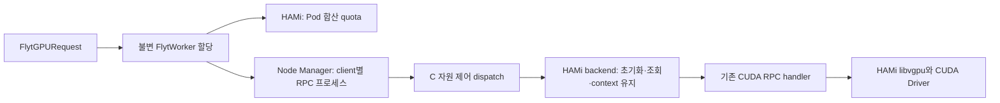

# 5단계: HAMi 자원 제어 backend 분리

**소스 구현 완료·검증 미실행(NOT_RUN).** 기준은 `stage/04-gpu-request`의
`ed46a8939521ee5a59f38a39c6a15359d85fb34a`, 개발 브랜치는 `stage/05-hami-backend`다.
패치 적용 검사, 빌드, 정적 검사, 실행 시험, 매니페스트 검증, 클러스터 배포와 GPU 실행을
하지 않았다. 아래 설치·시험 절차는 향후 작업이며 이번 개발에서 실행한 결과가 아니다.

이번 단계는 2단계에서 조건문으로 우회했던 MPS 자원 제어를 C backend 모듈과 Rust 공통
정책으로 분리한다. 4단계 Go Controller, CRD, 요청 snapshot, quota 변환은 그대로 사용한다.
CUDA ONC RPC 정의, pointer/handle mapping, 기본 CUDA API 구현을 새로 작성하지 않는다.

## 실행 경로와 소유권



| 책임 | 구현 |
|---|---|
| VM 요청 승인·상한·수명주기 | 4단계 CRD/Controller |
| GPU memory/core 제한 | 기존 HAMi 2.8.0의 Pod 할당 및 interception |
| GPU endpoint·세션 등록 | 3단계 binding API와 Manager |
| RPC 프로세스 생성·종료 | Node Manager와 기존 Worker supervisor |
| Context 선택과 자원 정보 조회 | 새 C HAMi backend |

HAMi 사용률 제한을 MPS의 물리 SM 분할과 같은 것으로 해석하지 않는다. `compute`는 요청
비율이며 `FLYT_REPORTED_SM`/`cur_num_sm_cores`는 CUDA가 보고한 capability 값이다.
후자는 quota 비율이나 실제 성능 보장값이 아니다.

## C backend 분리

`cpu-server-resource-controller.c`는 기존 함수 이름을 유지하는 dispatch가 된다.
`resource-backend.h`의 함수 표를 통해 HAMi 또는 legacy MPS 구현을 선택한다.

- `resource-backend-hami.c`: 초기화·메모리 관찰·context 유지. 자체 allocation 합산 장부는 만들지 않는다.
- `resource-backend-mps.c`: 기존 baseline 자원 제어 코드를 `mps_*` 심볼로 옮긴 보존 경로.
- `cpu-server-resource-controller.c`: 선택 정책과 기존 호출 인터페이스 유지.
- `resource_backend.rs`: Manager/Node Manager/CLI의 공통 backend 정책과 Worker 설정 검사.

5단계 Containerfile은 빌드 시 `FLYT_BUILD_BACKEND=hami`를 지정한다. C Makefile은
`FLYT_HAMI_ONLY`를 정의해 legacy MPS 구현을 컴파일 대상 코드에서 제외하고, Rust는
`option_env!`로 해당 빌드 정책을 내장한다. 실행 시 `FLYT_RESOURCE_BACKEND=hami`가 없거나
오타/다른 값이면 종료한다. HAMi에 `CUDA_MPS_*`가 섞인 설정도 거절한다.
Manager/Node Manager는 `FLYT_BINDING_API=1`을 요구하며 stage-2 정적 매핑 배포용 이미지가 아니다.

일반 소스 빌드에서는 빌드 정책을 지정하지 않으면 명시적 `mps` 또는 환경변수 부재를 legacy
선택으로 유지한다. 이 일반 빌드 경로는 검증하지 않았으며 과거 결과가 있는 기준 버전의 대체물이
아니다. 기존 MPS 동작을 재현할 때는 보존된 baseline 브랜치를 사용한다. CUDA의 MPS 오류
상수·NVML 호환 API 등은 이름만 보고 삭제하지 않았다.

## 초기화와 메모리 오류 처리

HAMi RPC 서버 초기화는 다음 입력을 확인하도록 작성했다.

- 노출 CUDA device가 하나이고 ordinal이 0인지
- 실제 CUDA UUID와 지정한 `FLYT_GPU_UUID`가 일치하는지
- `libvgpu.so`가 매핑되어 있고 Cricket client가 서버에 preload되지 않았는지
- 전달된 memory bytes와 `FLYT_MEMORY_BYTES`가 일치하고 허용 범위 안인지
- CUDA가 보고한 SM capability와 Worker guard의 값이 일치하는지
- 현재 CUDA context가 존재하고 NVML을 지정 UUID로 열 수 있는지
- 메모리 조회가 성공하며 `0 < total <= configured quota`, `free <= total`인지

`libvgpu.so` 매핑과 메모리 관찰은 시작 조건일 뿐 interception·quota enforcement를 입증하지
않는다. 이번 단계의 엄격한 total 검사는 대상 HAMi 버전에서 실제 시험해야 한다. 정상 환경에서도
보고값이 다른 경우 초기화가 거절될 수 있으며, 이를 quota 성공으로 기록하거나 물리 전체 메모리로
대체하지 않는다.

기존 `cuda_mem_get_info_1_svc`는 free/total을 각각 구한 후 항상 cudaSuccess를 반환했다.
새 경로는 한 번의 backend 조회 결과를 사용하고 CUDA 오류를 그대로 반환한다. 잘못된 total/free
조합은 `cudaErrorUnknown`, 미초기화는 `cudaErrorInitializationError`다. 실패 데이터는 0으로
초기화하며 config의 quota를 조회 성공값으로 대신 보고하지 않는다.

`allow_mem_alloc`은 HAMi 초기화 후에는 별도 per-process quota 계산을 하지 않는다.
실제 allocation의 성공/실패는 HAMi/CUDA가 결정한다. CPU 메모리 추적 함수는 이 경로에서
합산 quota를 재계산하지 않으며 기존 array allocation의 HAMi 우회는 보존한다.

현재 runtime context를 보관하고 push/pop 및 set-current를 수행하며 MPS affinity context
생성·교체·destroy는 호출하지 않는다. pop 결과를 공유 primary 포인터에 덮어쓰지 않고 thread별
push 깊이를 추적한다. 기존 API의 synchronization 호출은 유지한다. context 조작 실패는 해당
RPC 서버 종료로 이어진다. 그 CUDA 세션의 투명 복구를 제공하지 않는다.

## 지원하지 않는 제어 명령

HAMi runtime은 실행 중 SM/memory 변경, increase/decrease, migration, checkpoint/restore,
VM grouping 제어를 지원하지 않는다. quota 수정은 4단계 Request 변경과 새 VMI 생성 절차를 따른다.

| 진입점 | 처리 |
|---|---|
| `flytctl` 실행 | 조회 명령만 허용. 자원 변경은 소켓 연결·단위 변환 전에 종료 코드 2 |
| `flytctlnet` 실행 | 기존 TCP scaling frontend 시작을 거절하고 종료 코드 2 |
| Manager Unix socket | 조회 명령 외에는 501 반환. 세션 탐색·증감 산술·pause/resume 전에 차단 |
| Manager 내부 함수 | 자원 변경·migration·checkpoint/restore도 별도 backend 검사 |
| Node Manager의 영속 TCP 연결 | 변경 payload를 소비한 뒤 501 반환, 다음 명령의 framing 유지 |
| Node Manager 프로세스 관리 함수 | checkpoint/restore/change_resources를 다시 차단 |
| RPC 서버의 SysV 제어 queue | 자원 변경·checkpoint/restore에 501 응답 |
| C checkpoint/restore 함수 | 직접 호출도 HAMi 모드에서 거절 |

Manager의 기존 자원 감소 명령은 하위 HAMi 거절에 도달하기 전에 unsigned subtraction을
실행할 수 있었다. 새 guard는 이 계산 이전에 작동한다. legacy MPS 경로의 전체 산술이나
CLI parser를 재설계한 것은 아니다.

종료/DEALLOC 및 GPU 정보·사용량 조회 명령은 유지한다. Node Manager의 거절 응답만으로
Worker 전체를 종료하지 않도록 기존 payload 길이를 소비하고 연결을 계속 사용한다.
불완전한 payload, 비정상 peer의 지연 등 전체 프로토콜 강화는 별도 한계로 남는다.

## Manager 자원 장부와 RPC 생성

HAMi session 생성은 `gpu_id=0`, legacy `compute_units=0`, `memory=0`만 받는다.
이 0은 무제한 quota가 아니라 **해당 장부 비활성** 표시다. Manager는 이 경로에서 물리
GPU 가용량 비교 및 allocated SM/memory 증감을 하지 않는다. Node Manager는 Worker의
정규화된 byte quota와 guard가 관찰한 CUDA capability를 RPC 프로세스에 전달한다.

client가 전달하는 기존 `sm_core` 값은 HAMi에서 요청량 기록을 덮어쓰지 않는다. MongoDB SM
갱신 우회는 기존 단계대로 유지된다. 실제 요청·적용량의 기준은 CRD와 Worker Pod이며 Manager의
legacy 목록에 보이는 0을 GPU 용량/잔여량으로 해석하면 안 된다. 세션 목록과 endpoint 관리는 유지한다.
이 변경은 7단계의 Manager 역할 정리 전체를 수행한 것은 아니다.

Worker supervisor, bounded client 수, RPC 세대, binding UID와 종료 시 자식 프로세스 정리는
기존 경로를 재사용한다. Kubernetes Worker Ready는 Node Manager 등록 상태이며 개별 RPC
서버 초기화와 모든 CUDA API의 성공을 보장하지 않는다. 초기화 오류는 Worker/Manager 로그와
client 할당 실패 응답으로 확인해야 한다.

## 파일과 빌드

실행 패치는 `patches/0001-hami-resource-backend.patch`, 신규 모듈의 읽기용 원본은 `src/`에 있다.
이미지는 patch series를 적용한 Flyt 소스를 컴파일한다. `src/`만 수정하면 빌드에 반영되지
않으므로 패치 안의 해당 모듈도 함께 갱신해야 한다. 기존 baseline·stage-2·stage-3 patch는
수정하지 않았다. 패치 순서는 **기본 → 2단계 → 3단계 → 5단계**다. 4단계는 runtime 패치가 없다.

향후 검증을 수행할 환경에서 명시적으로 빌드한다. 이 스크립트는 커밋된 HEAD만 사용하고
이미지 push는 실행하지 않는다.

```bash
./experiments/hami-backend/build.sh worker REGISTRY/flyt/worker:stage5
./experiments/hami-backend/build.sh cluster-manager REGISTRY/flyt/manager:stage5
./experiments/hami-backend/build.sh guest-artifacts REGISTRY/flyt/guest:stage5
```

guest-artifacts target은 동일 빌드 입력의 guest 산출물을 내보내기 위한 것이다. CUDA RPC ABI는
유지했으므로 5단계용 전송 프로토콜 교체가 필요한 것은 아니다. 기존 guest와의 호환성도 미검증이다.
이미지에는 `/opt/flyt/metadata/STAGE5_PATCHES.sha256`, `STAGE5.json`과 이전 단계 checksum을
기록하도록 했다. CUDA 12.8.1, Rust 1.97.1 및 기존 기반 image digest를 재사용한다.
이 설정이 빌드 성공·의존성 재현성을 검증했다는 의미는 아니다.

## 향후 단계 전환 — 미실행

4단계 Controller/CRD와 기존 HAMi 인프라를 사용한다. 신규 CRD, node label 수정, GPU mode
변경이나 MPS daemon 시작·정지 명령은 추가하지 않았다. 외부 플랫폼의 GPU 사용 해제,
대상 UUID 확정, NetworkPolicy와 guest 라우팅은 [3단계 전제](../controller/README.md)를 따른다.

기존 Profile/ControlPlane의 image 필드는 불변이므로 이미지 값을 덮어쓰지 않는다.
`examples.yaml`은 별도 이름의 `main-stage5`, `gpu2-stage5`를 제공하고 Profile은 미승인이다.
`request.example.yaml`은 이들을 참조하는 새 Request다. 전환 절차는 다음과 같다.

1. 이전 단계와 이번 단계의 patch/build 검증을 완료하고 runtime 이미지를 registry에 게시한다.
2. 실제 image digest·GPU UUID·node·RuntimeClass를 `examples.yaml`에 채운다.
3. 3단계의 랜덤 token 생성 절차로 별도 `flyt-binding-auth-stage5` Secret을 준비한다.
4. 새 ControlPlane/Profile만 생성하고 준비 상태를 확인한 뒤 해당 Profile을 승인한다.
5. 생성된 두 CR과 기존 VM의 실제 UID를 `request.example.yaml`에 채우고 새 Request를 생성한다.
6. 해당 VM의 template에서 `flyt.dev/gpu-request`를 `vm-a-stage5`로 바꾼다. 다른 VM의 선택은 유지한다.
7. CUDA 작업 종료 시점을 정하고 해당 VM을 정상 stop/start하여 새 VMI를 만든다. 기존 Worker
   정리와 HAMi 할당 회수를 확인한 뒤 새 Worker의 Ready 및 실제 CUDA 작업을 확인한다.

명시적으로 검토한 환경에서 사용할 생성 명령 예제다. placeholder를 그대로 적용하면 안 된다.

```bash
FLYT_CONTEXT=REPLACE_WITH_CONTEXT
kubectl --context "$FLYT_CONTEXT" apply -f experiments/hami-backend/examples.yaml
kubectl --context "$FLYT_CONTEXT" -n flyt-hami-stage3 get fcp,fgp
# 새 CR UID를 request.example.yaml에 채운 뒤 실행
kubectl --context "$FLYT_CONTEXT" apply -f experiments/hami-backend/request.example.yaml
kubectl --context "$FLYT_CONTEXT" -n flyt-hami-stage3 get fgr,fw
```

현재 VMI는 4단계 snapshot 정책에 따라 이전 할당을 유지한다. guest OS 내부 reboot만으로는
새 VMI가 생기지 않을 수 있다. Controller가 자동으로 VM을 재시작하거나 새 Profile을 승인하지 않는다.
새 ControlPlane을 선택하면 guest의 Manager endpoint도 달라지므로 새 Worker Ready 후
`experiments/controller/guest-config.py`로 설정을 다시 생성해 해당 VMI에 설치한다.

이전 ControlPlane/Profile은 다른 VM이 참조하는 동안 보존한다. 변경된 VM에서 실패하면
해당 Request/Worker를 정상 정리하고 이전 Request 선택·guest 설정으로 되돌린 후 새 VMI로
재개한다. shared Manager 전체 교체·GPU reset·다른 Worker 일괄 삭제는 전환 절차에 포함하지 않는다.

## 검증 대기

| 항목 | 필요한 검증 |
|---|---|
| 패키징 | 기본→2→3→5 패치 적용, C/Rust 컴파일, C MPS 심볼 제외, build policy 내장, image metadata |
| 선택 정책 | backend 누락·오타·mps·CUDA_MPS 환경 거절, 동적 binding 모드 필수 조건 |
| 명령 차단 | CLI/raw socket/NM queue/direct function 경로, 감소 명령 underflow 회피, framing 유지 |
| 메모리 | 조회 성공·실패·모순 값, 실제 allocation 실패 전달, per-process 중복 quota 없음 |
| Context | primary push/pop balance, 다중 client, stream/event/module/graph 유지, context 실패 종료 |
| 수명주기 | RPC 초기화 실패·종료, Worker/Manager crash, request snapshot 유지, A 전환 중 B 유지 |
| HAMi | libvgpu interception 실제 경로, 합산 memory quota, compute 제한, 종료 후 allocation 회수 |
| 호환성 | 기존 CUDA/PyTorch 19항목, Graph/cuBLAS/cuDNN 등 회귀, legacy baseline과 비교 |
| 범위 | 승인 UUID 외 GPU 설정·프로세스 불변, 외부 플랫폼 간섭 없음 |

현재 모든 항목은 NOT_RUN이다. 특히 **6단계 HAMi interception 검증은 아직 수행하지 않았다.**
동작을 확인하지 않은 소스 분리를 “MPS 없이 실제 GPU 실행 검증 완료”로 표현하지 않는다.
