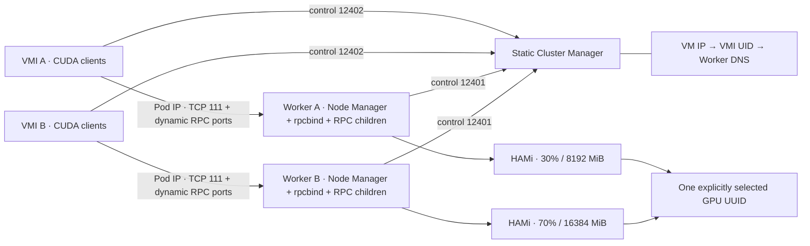

# 2단계: VM별 정적 HAMi Worker

**구현 완료·검증 미실행 (`NOT_RUN`).** `stage/01-hami-standalone`의
`260e3cd1bb2f1683926e892bdbb41485e2dec38e`에서 분기했다.
사용자 요청에 따라 패치 적용, 빌드, 정적 검사, 매니페스트 렌더 검사, GPU 실행,
클러스터 배포와 기존 19개 호환성 시험을 실행하지 않았다. 아래 명령도 실행하지 않았다.
1단계의 HAMi 단독 quota 시험 역시 미실행이므로, 이 브랜치를 실행 가능한 것으로
인증하거나 MPS 기준 결과를 HAMi 결과로 인용해서는 안 된다.

## 구현 범위



- 하나의 VMI에 replicas=1, `Recreate` 방식의 Worker Deployment를 정적으로 연결한다.
  Worker는 Node Manager와 rpcbind를 실행하고, CUDA 클라이언트 프로세스마다 RPC
  서버를 생성한다. `max_clients`는 Worker당 동시 RPC 서버 수의 상한이다.
- 정적 Cluster Manager는 MongoDB 대신 설정 파일의 VM IP/VMI UID/Worker DNS를
  사용한다. Headless Service가 정확히 하나의 IP로 해석되고 해당 Node Manager가
  GPU 하나를 등록한 경우에만 배정한다. 매핑 누락·다중 IP·미등록이면 할당을 거절한다.
- ONC RPC wire format, CUDA API 처리, 포인터/핸들 매핑은 기존 경로를 사용한다.
  VM 안의 Client Manager와 프로세스별 연결 방식도 유지한다. 프로세스를 하나의
  RPC 서버로 합치는 grouping은 HAMi 모드에서 비활성화한다.
- `FLYT_RESOURCE_BACKEND=hami` 실행 경로에서 MPS context 교체와 SM affinity 제어,
  Flyt의 프로세스별 메모리 admission을 우회하고 HAMi Pod quota에 맡긴다.
  여러 RPC 프로세스가 **하나의 Pod quota를 공유하도록 구성**한다. 실제 합산 제한은
  추후 시험으로 확인해야 한다. SM capability 숫자를 `gpucores` 백분율로 사용하지 않는다.
- RPC 서버의 NVML 조회는 CUDA ordinal을 물리 GPU index로 해석하지 않고 설정된
  GPU UUID를 사용한다. 기존 Flyt metrics는 quota 판정이나 스케줄링 근거로 사용하지 않는다.
- 런타임 quota 변경, migration, checkpoint/restore는 이 모드에서 거절한다.
  이는 2단계를 실행하는 데 필요한 최소한의 5단계 자원 관리 변경을 앞당긴 것이다.

기존 `patches/series`, `images/flyt/Containerfile`, 배포 템플릿, 1단계 파일은 변경하지
않는다. 이 디렉터리의 별도 이미지 빌드만 기본 patch series 뒤에 추가 patch series를
적용한다. VM/Worker 자동 생성 controller, VM annotation 기반 quota 모델,
SHM transport, elastic scaling은 후속 단계 범위다.

## 파일

| 파일 | 역할 |
|---|---|
| `patches/0001-hami-worker.patch` | HAMi 자원 경로, 정적 배정, RPC 프로세스 수·종료 관리 |
| `Containerfile`, `build.sh` | 기존 baseline 패치 뒤에 2단계 패치를 적용하는 별도 이미지 |
| `guard.cu` | HAMi 로딩, 단일 CUDA device, 예상 GPU UUID 시작 조건 확인 |
| `worker.py` | rpcbind/Node Manager와 RPC 하위 프로세스 종료·readiness 관리 |
| `stage2.py` | render, preflight, webhook 범위 확장, apply, status, collect, 개별 삭제, guest 설정 생성 |
| `helm-post-render.py` | 기존 HAMi release의 향후 업그레이드에 유지할 webhook scope |
| `config.example.json`, `versions.json` | 명시적 환경 입력과 버전·미실행 상태 |

## 실행 전 필요한 환경

1. 외부 ML Platform 관리자가 대상 GPU 소유권을 해제하고 이 실험에 예약해야 한다.
   현재 알려진 `gpu-4`의 INFINITIX/ixgpu 공유 상태는 이 조건을 충족하지 않는다.
   도구는 해당 공유 label이나 다른 device plugin이 남아 있으면 중단한다.
   GPU가 idle이라는 이유만으로 소유권 해제를 추정하지 않는다.
2. 1단계와 같은 **기존 HAMi 2.8.0 release 하나**를 재사용한다.
   `flyt-hami-stage1` release가 선택한 노드의 대상 UUID 하나만 등록하고 다른 GPU UUID를
   exclusion 목록에 보존해야 한다. 2단계는 device plugin을 새로 설치하지 않는다.
   기존 vendor plugin과 같은 kubelet device-plugin 경로를 경쟁적으로 사용하지 않는다.
3. KubeVirt와 실행 중인 VMI들이 필요하다. VMI와 Worker는 같은 전용
   `flyt-hami-*` namespace에 둔다. 도구는 namespace·VM·VMI를 생성하거나 수정하지 않는다.
   VMI name/UID와 pod network IPv4를 설정에 정확히 기록한다.
4. VM에서 Cluster Manager Service IP와 Worker Pod IP로 TCP 연결할 수 있어야 한다.
   CM/Worker가 관찰하는 VM의 source IP가 설정된 pod network IP와 같아야 한다.
   guest 내부 masquerade IP를 무조건 사용하면 안 된다. NAT/라우팅으로 여러 VM의
   source IP가 합쳐지는 환경은 지원하지 않는다.
5. NetworkPolicy를 실제 집행하는 CNI가 필요하다. 생성 정책은 같은 namespace의
   지정 Worker/Manager와 VM `/32` IP만 허용한다. DNS는 `kube-system`의
   `k8s-app=kube-dns` Pod를 허용한다. NodeLocal DNS나 다른 DNS label을 사용하는
   환경은 정책을 먼저 환경에 맞게 확장하고 검증해야 한다. namespace에 이미 있는
   광범위 allow 정책이 선택한 Pod에 적용되면 제한이 약화되므로 함께 검토해야 한다.
6. GPU 노드에 Python 3.10+, `kubectl`, `helm`, `nvidia-smi`가 필요하다.
   이미지는 별도 빌드하고 registry에 push한 후 digest로 설정한다.
   post-renderer 사용 시에만 `requirements.txt`의 PyYAML이 필요하다.
   기존 NVIDIA RuntimeClass 또는 NVIDIA를 제공하는 기본 runtime을 사용한다.
   자동 RuntimeClass 생성이나 driver/MIG/MPS/compute-mode 변경은 제공하지 않는다.

`platform_release_confirmed`, `network_policy_enforced_confirmed`,
`guest_pod_routing_confirmed`는 운영자가 확인한 전제 조건을 기록하는 필드다.
이를 `true`로 설정하는 행위가 격리·소유권·연결성을 시험한 증거는 아니다.

## 추후 빌드와 설정

검증을 재개하기 전에는 아래를 실행하지 않는다. 명령은 저장소 루트 기준이다.
`build.sh`는 HEAD에 커밋된 두 디렉터리만 build context에 넣는다. `.local`, 개인 config,
SSH 키와 작업 중인 미커밋 파일을 자동으로 빌드에 포함하지 않는다.

```bash
bash experiments/per-vm-worker/build.sh worker REGISTRY/flyt-worker:stage2
bash experiments/per-vm-worker/build.sh cluster-manager REGISTRY/flyt-manager:stage2
bash experiments/per-vm-worker/build.sh guest-artifacts REGISTRY/flyt-guest:stage2
# 각각 registry에 push한 뒤 worker/manager의 실제 digest를 기록한다.
mkdir -p .local/hami-stage2
cp experiments/per-vm-worker/config.example.json .local/hami-stage2/config.json
# placeholder, VMI identity, GPU inventory, image digest와 사전 조건을 작성한다.
python3 experiments/per-vm-worker/stage2.py render \
  --config .local/hami-stage2/config.json --output .local/hami-stage2/render-001
```

이미지는 CUDA 12.8.1 devel/runtime digest, Flyt upstream commit, 기본/추가 patch series와
기존 Rust toolchain을 고정한다. 빌드에 사용한 patch SHA256과 upstream commit을 이미지
`/opt/flyt/metadata`에 넣는다. 실제 이미지 digest와 빌드 로그는 빌드 후 보관해야 한다.
apt 패키지와 외부 빌드 의존성을 전부 snapshot으로 고정한 환경은 아니다.

`gpu_uuid`는 GPU index가 아닌 UUID다. example의 30%/8 GiB와 70%/16 GiB는 입력 예시다.
`gpu_capacity_mib`는 실제 inventory보다 클 수 없고, 설정 전체의 합산 cores는 100 이하,
메모리는 capacity 이하여야 한다. 같은 config에 이 배포가 관리하는 Worker 전체를 넣는다.
`deviceSplitCount=10` profile 때문에 Worker 수는 최대 10개다.

## 추후 배포 순서

```bash
# 기존 stage-1 release의 webhook selector 두 필드만 제한적으로 확장한다.
# preflight를 내부에서 실행하며 VMI/플랫폼/기존 HAMi 조건 불충족 시 쓰기 전에 중단한다.
python3 experiments/per-vm-worker/stage2.py enable-webhook --config .local/hami-stage2/config.json
python3 experiments/per-vm-worker/stage2.py preflight --config .local/hami-stage2/config.json
python3 experiments/per-vm-worker/stage2.py apply --config .local/hami-stage2/config.json
python3 experiments/per-vm-worker/stage2.py status --config .local/hami-stage2/config.json
```

`enable-webhook`은 namespace를 기존 stage1 namespace와 명시한 stage2 namespace로,
Pod label을 `hami-stage1`과 `hami-stage2-workers`로 한정한다. resourceVersion을
확인하는 JSON patch만 사용한다. HAMi scheduler/device plugin Deployment/DaemonSet이나
GPU filter 설정은 수정하지 않는다. 이후 Helm upgrade가 이 selector를 되돌리지 않도록
`FLYT_HAMI_NAMESPACES=flyt-hami-stage1,flyt-hami-stage2`와 이 디렉터리의 post-renderer를
사용해야 한다. stage1의 기존 install 명령을 그대로 재실행하면 scope가 좁아질 수 있다.

`apply`는 기존 객체의 소유 label, VMI owner, 원하는 필드를 확인한다. 동일하면 유지하고
충돌은 전체 snapshot을 확인하는 단계에서 거절한다. 설정 변경에는 `--restart-sessions`가
필요하다. 이 옵션은 세션 중단을 허용하는 명시적 운영 선택이며 이 작업에서 실행하지 않았다.
정적 quota를 바꿀 때는 해당 Worker를 먼저 삭제하고 종료·반납을 확인해야 한다.
Kubernetes 쓰기 여러 건은 transaction이 아니므로 중간 오류가 나면 일부 객체가 남을 수
있다. 같은 config로 상태를 확인한 후 재시도한다. 자동 rollback으로 기존 세션을 되살리지 않는다.

Manager config는 Worker 전체의 정적 매핑 snapshot이다. VM 추가·제거 또는 IP 변경으로
이 config가 바뀌면 Manager Deployment가 재시작하고 **모든 stage2 세션이 중단될 수 있다**.
이 한계는 다음 단계 controller와 동적 endpoint 등록에서 해결할 대상이다.

## Guest 연결

```bash
python3 experiments/per-vm-worker/stage2.py guest-config \
  --config .local/hami-stage2/config.json --worker vm-a --output .local/hami-stage2/guest-a-001
```

이 명령은 현재 VMI UID/IP와 Manager Service를 읽고 실제 ClusterIP를 포함한
`client-mgr.toml`과 바인딩 메타데이터를 **로컬에만** 생성한다. VM에 SSH 접속하거나
파일을 덮어쓰지 않는다. 대상 VM에서 CUDA 애플리케이션을 종료하고 Client Manager를
중지한 뒤 기존 `/etc/flyt/client-mgr.toml`을 백업하고 생성 설정을 설치한다.
기존 설치 절차의 client binary/library 배치를 유지하며 필요하면 같은 stage2 빌드의
`guest-artifacts` target에서 `/opt/flyt/guest` 산출물을 추출한다.
Client Manager를 다시 시작한 후 새 CUDA 프로세스로 연결한다.

Guest에는 HAMi preload를 설치하지 않는다. Cricket client preload는 기존 guest 설정을
사용한다. Worker에는 Cricket client preload를 넣지 않는다. stage2 Manager는 기존
metrics TCP listener를 활성화하지 않으며 telemetry 기반 자동 scaling도 제공하지 않는다.
생성 guest config는 기존 Client Manager가 읽는 metrics 항목까지 포함한다.

Worker별 Service는 `clusterIP: None`, `publishNotReadyAddresses: true`다.
Service DNS가 Node Manager 등록 전에 해석되어야 하므로 readiness와 DNS의 순환 의존을
피하도록 구성한다. 이 Service의 TCP 111 항목이 동적 RPC 포트를 중계하는 것은 아니다.
Cluster Manager가 실제 Worker Pod IP와 기존 RPC version을 guest에 돌려주며 guest는
해당 Pod IP에 직접 접속한다. 이 단계에서 NodePort/LoadBalancer나 고정 단일 RPC 포트를
통한 접근은 지원하지 않는다.

## 종료·재시작·수집

Worker 시작 guard는 실제 실행 시에만 HAMi library 로딩, 단일 CUDA device, GPU UUID를
확인한다. MPS 환경변수가 있으면 시작을 거절한다. HAMi가 주입한 preload·visibility·quota
환경은 RPC 자식 프로세스에 전달한다. Readiness는 rpcbind와 Node Manager 프로세스,
GPU 정보 전송 marker를 확인한다. 이는 CUDA E2E 성공 또는 quota 격리를 의미하지 않는다.

rpcbind 또는 Node Manager가 종료되면 supervisor가 모든 RPC 자식을 종료한다.
Manager 연결 EOF가 감지되어도 Worker generation을 끝내고 Kubernetes가 컨테이너를
재시작하도록 한다. 이전 Flyt IPC queue만 제거하고 rpcbind warm start를 사용하지 않는다.
새 RPC version의 시작값을 무작위로 바꾸어 이전 generation의 version 재사용 가능성을
줄인다. 세션 복구 프로토콜이나 무충돌 보장은 아니다. 끊어진 CUDA 프로세스는 다시 시작해야
하며, 네트워크 단절 감지용 heartbeat와 세션 상태 재구성은 아직 구현하지 않았다.

```bash
python3 experiments/per-vm-worker/stage2.py collect \
  --config .local/hami-stage2/config.json --output .local/hami-stage2/evidence-001
python3 experiments/per-vm-worker/stage2.py delete-worker \
  --config .local/hami-stage2/config.json --worker vm-a
```

`collect`는 소유 리소스 JSON과 제한된 Pod 로그를 수집한다. Secret과 guest 파일은 읽지
않는다. 이전 출력 디렉터리를 덮어쓰지 않는다. 로그에는 VM IP/UID 등 환경 정보가 있으므로
공개 결과에 넣기 전에 내용을 검토한다.

`delete-worker`는 원래 config의 Worker ID/VMI UID를 사용한다. VMI가 이미 삭제돼도
사용할 수 있다. UID/resourceVersion 조건으로 그 Worker의 Deployment, Service,
NetworkPolicy, ConfigMap만 삭제한다. 먼저 Deployment의 foreground 삭제가 완료되고
활성 Pod가 없어야 NetworkPolicy 등을 제거한다. 45초 내 종료되지 않으면 정책을 보존하고
중단하므로 상태를 보고 재시도한다. shared Manager, 다른 Worker, VMI, namespace,
HAMi release는 남는다. `apply`를 다시 실행하면 설정에 남아 있는 삭제 Worker가 재생성된다.

Worker 리소스에는 같은 namespace의 실제 VMI UID를 non-controller ownerReference로
설정한다. VMI 삭제 시 Kubernetes GC가 해당 리소스를 정리하도록 구성했지만, GC는
비동기이며 노드 장애 시 GPU 반납 완료 시점은 별도 확인해야 한다.
VMI 재생성 시 UID를 자동 갱신하거나 Worker를 다시 만드는 controller는 없다.
Manager에는 삭제된 VMI의 정적 매핑이 남을 수 있다. 단일 Worker 삭제만으로 Manager를
재시작하지 않지만, 매핑 영구 제거에는 전체 세션 중단을 고려한 config 갱신이 필요하다.

전체 stage2 종료 시에는 각 Worker를 먼저 정리하고, shared Manager와 그 Service,
NetworkPolicy, ConfigMap을 별도 검토 후 정리한다. 광범위 namespace 삭제 명령이나
HAMi uninstall은 제공하지 않는다. MPS baseline 복귀는 기존 브랜치/이미지와 백업한
guest 설정을 사용하는 별도의 운영 작업이며, GPU 소유권 이전을 자동 수행하지 않는다.

## 알려진 한계와 후속 검증

정적 VMI UID는 배포 시 API 객체를 확인하고 GC 소유자를 지정하기 위한 값이다.
현재 RPC 연결 자체가 UID를 인증하는 것은 아니다. 런타임 식별은 source IP에 의존하므로
IP 재사용·NAT·VMI migration·잘못된 네트워크 정책이 있는 환경을 자동 복구하지 않는다.
VMI 변경을 watch하지 않으며 API 확인과 생성 사이 경쟁도 controller 수준으로 해결하지
않았다. 신뢰할 수 없는 tenant를 대상으로 한 production 격리 완료 상태가 아니다.

Worker host-memory/CPU 기본 limit은 4 GiB/4 CPU다. GPU quota와 별개이며 실제 모델과
동시 RPC 수에 맞게 조정·시험해야 한다. Kubernetes Pod 재시작 자체가 애플리케이션의
CUDA context, handles, 실행 중인 kernel 상태까지 보존하지 않는다.

| 추후 확인 항목 | 현재 상태 | 확인해야 할 내용 |
|---|---|---|
| 기본 + 추가 patch 적용 / 이미지 빌드 | NOT_RUN | 고정 upstream과 patch series 충돌, Rust/C/CUDA 빌드·동적 library |
| JSON render / API schema / admission | NOT_RUN | VMI owner, 서비스 DNS, HAMi annotation·preload 주입 |
| 1단계 standalone quota | NOT_RUN | 메모리 초과 실패와 30%/100% compute 비교 |
| Guest → CM → 지정 Worker → CUDA | NOT_RUN | 실제 source IP, rpcbind·동적 TCP 연결, 잘못된 매핑 거절 |
| 여러 RPC 프로세스의 합산 quota | NOT_RUN | 단일 Worker 전체 메모리·compute 제한과 종료 후 회수 |
| 2 VM 동시 실행 | NOT_RUN | 30/70 quota, 한 VM의 OOM·종료가 다른 VM에 미치는 영향 |
| 재시작·삭제·VMI 재생성 | NOT_RUN | 모든 RPC 종료, GC, stale UID/IP 거절, 재연결 실패 처리 |
| 기존 PyTorch 19개 호환성 | NOT_RUN | 기준 MPS와 같은 workload/버전에서 HAMi interception 경로 |
| GPU 0/1 보존 | 실행 변경 없음 | 추후 배포 전후 UUID filter·설정·기존 workload 비교 |

검증을 재개할 때 위 항목을 먼저 수행하고 다음 단계의 자동화 의존 조건을 판단한다.
현재 구현 완료 표시는 이 검증 항목의 PASS를 뜻하지 않는다.

참고: [HAMi 2.8.0 chart](https://github.com/Project-HAMi/HAMi/tree/v2.8.0/charts/hami),
[Kubernetes NetworkPolicy](https://kubernetes.io/docs/concepts/services-networking/network-policies/),
[Kubernetes GC](https://kubernetes.io/docs/concepts/architecture/garbage-collection/),
[kubectl 1.29 raw delete 구현](https://github.com/kubernetes/kubectl/blob/v0.29.12/pkg/cmd/delete/delete.go).
