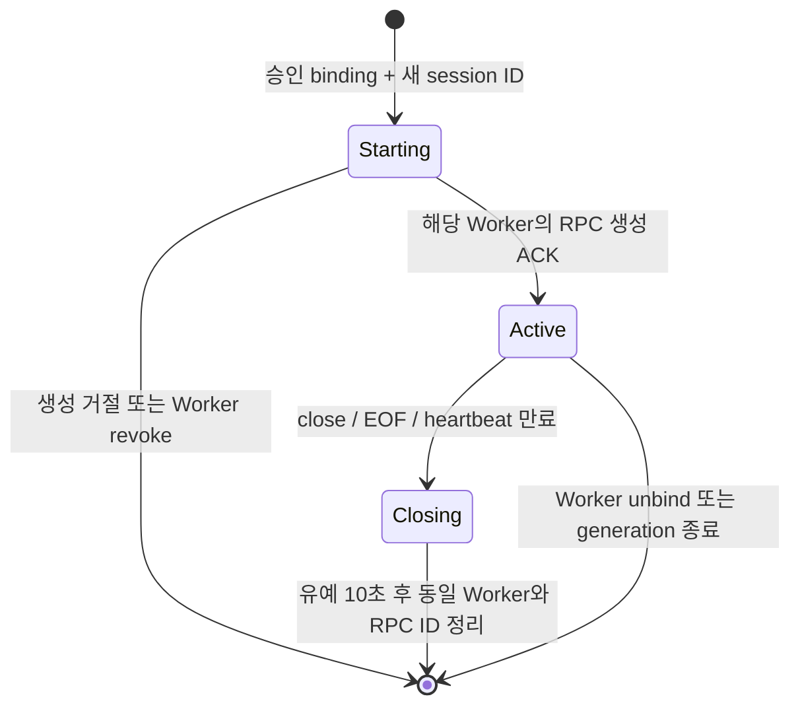

# Stage-7 control contracts (implemented, NOT_RUN)

CUDA ONC RPC와 C client의 SysV 메시지 형식은 바꾸지 않는다. 아래는 Rust Manager 사이의
제어 프로토콜이다. Manager와 Guest Client Manager는 함께 7단계로 전환해야 한다.

## Controller → Manager: TCP 12404

기존 v3 JSON 요청/응답을 유지한다. 각 연결에서 요청 1개, 응답 1개를 전달한다.
요청의 `token` 검사를 통과한 경우에만 다음 연산을 허용한다.

| op | 요청 필드 | 성공 응답의 본문 |
|---|---|---|
| `observe` | `pod_ip`, `pod_uid` | `generation` |
| `bind` | `binding` | 동일한 `binding` |
| `unbind` | `worker_uid` | 빈 본문 |
| `list` | 없음 | `bindings` |

모든 응답은 `ok`, `epoch`, 추가 필드 `session_protocol: flyt-session-v7`를 포함한다.
실패 응답에는 `error`가 있다. 기존 Go Reply는 추가 필드를 무시할 수 있는 구조를 유지한다.
binding에는 `worker_uid`, `vmi_uid`, `vm_ip`, `pod_uid`, `pod_ip`, `generation`이 있다.
quota 복사나 변경 연산은 없다. `unbind`는 기존 Controller 계약에 따라 Worker UID의
현재 binding과 그 Worker 연결을 종료한다. 세션 종료 연산과는 별개다.

이 Controller 계약은 worker UID만으로 unbind한다. 같은 UID의 오래된 관리 요청을 CAS로
검사하는 새 프로토콜을 추가한 것은 아니다. 현재 단일 활성 Controller와 reconcile 순서를
전제로 하며, 세션별 nonce 보호를 관리 API 전체의 replay 방지라고 해석하지 않는다.

## Node Manager → Manager: TCP 12401

기존 `flyt-worker-v3` hello (`pod_uid`, `generation`)를 사용한다. peer IP와 두 식별자를
Worker 등록에 묶는다. Manager는 `RMGR_SNODE_SEND_GPU_INFO`로 단일 ordinal 0의 응답을
확인하되 memory/SM 숫자를 자원 장부에 저장하지 않는다. 신규 GPU 선택 알고리즘은 없다.

RPC 생성은 기존 `RMGR_SNODE_ALLOC_VIRT_SERVER`와 `0,0,0`을 전송한다. 여기의 0은
5단계 Node Manager 프로토콜의 비활성 legacy 필드이며, 무제한 quota가 아니다. Node Manager는
Worker 환경에서 정규화된 quota를 가져온다. 종료는 해당 Worker 연결에 기록된 RPC ID로
`RMGR_SNODE_DEALLOC_VIRT_SERVER`를 전송한다. 제어 채널은 Worker별 mutex로 직렬화한다.

등록은 token 인증을 추가하지 않았다. 기존 Pod network scope와 Controller의 승인 binding을
사용한다. UID·IP를 알고 있다는 사실만으로 외부 불신 client에 대한 인증이 성립하지 않는다.
해당 network scope·guest 접근 제어는 배포 전제다.

## Guest Client Manager → Manager: TCP 12402

Guest의 CUDA client마다 별도 제어 연결을 연다. 최초 요청 예시는 다음과 같다.

```json
{"protocol":"flyt-session-v7","op":"open","vmi_uid":"VMI_UID","worker_uid":"WORKER_UID","guest_instance":"32_HEX_CHARACTERS","client_id":1}
```

`guest_instance`는 Guest Client Manager 프로세스 시작 시 생성한 128-bit 난수의 hex다.
`client_id`는 기존 Guest IPC의 양수 GID다. VMI UID/Worker UID는 해당 VMI용 설정에 고정한다.
Manager는 peer IP로부터 임의 Worker를 선택하지 않고, 전달한 UID와 현재 binding의 IP를
모두 비교한다. 같은 Guest instance·GID에 활성 세션이 이미 있으면 재사용하지 않고 거절한다.

성공 응답은 다음 필드를 가진다.

```json
{"ok":true,"epoch":"MANAGER_EPOCH","session_protocol":"flyt-session-v7","session_id":"SERVER_ASSIGNED_32_HEX","pod_ip":"WORKER_IP","rpc_id":123}
```

Guest는 기존 SysV client 응답 형식인 `address,rpc_id`만 CUDA client에 전달한다. 그 뒤 같은
TCP 연결에서 5초마다 heartbeat를 보내고 정확한 epoch/session ID 응답을 요구한다.

```json
{"op":"heartbeat","epoch":"MANAGER_EPOCH","session_id":"SERVER_ASSIGNED_32_HEX"}
```

해당 연결에서 다음 요청으로 정상 종료할 수도 있다.

```json
{"op":"close","epoch":"MANAGER_EPOCH","session_id":"SERVER_ASSIGNED_32_HEX"}
```

현재 Guest 구현은 client deinit/reap 시 전용 소켓을 닫아 EOF로 종료를 알린다. Manager는
EOF·읽기 오류·30초 heartbeat 대기 만료·close를 모두 해당 세션의 Closing 전환으로 처리한다.
별도 연결에 `close`를 보내거나 다른 session ID를 넣어 다른 세션을 종료할 수 없다.
응답 실패나 연결 단절 후 자동 재접속/기존 RPC 인수는 지원하지 않는다.

`CLIENTD_RMGR_CONNECT`, `DISCONNECT`, `ZERO_VCUDA_CLIENTS` 등의 기존 CSV 제어 입력은
허용하지 않는다. 7단계 Guest에는 IP 전체를 대상으로 한 zero-clients 요청이 없다.

## 세션 수명주기



세션의 기본 키는 서버가 부여한 session ID다. 보조 키는 VMI UID, Worker UID, Pod UID,
Worker generation, Guest instance, GID의 조합이다. Closing 전환 시 보조 키를 해제하여
새 연결을 허용할 수 있지만, 이전 세션 레코드는 자체 RPC 정리가 끝날 때까지 남긴다.
이전 cleanup은 자신의 session ID를 제거하고 보조 키도 아직 자신을 가리킬 때만 제거한다.

할당/정리의 응답을 확정할 수 없으면 해당 Worker 연결을 종료한다. 기존 supervisor는 그
Worker의 Node Manager와 RPC 자식을 종료한다. **같은 Worker의 다른 CUDA client도 종료될 수
있다.** 다른 Worker의 연결이나 GPU 설정을 변경하는 복구 절차는 없다.

## 관리 조회: Unix socket

소켓은 `/run/flyt/flyt-frontend-socket`, mode는 0600이다. 한 연결당 JSON 요청 1개다.
`list-bindings`, `list-workers`, `list-sessions`만 제공하고 quota 변경 명령은 없다.

```json
{"op":"list-sessions","after":null}
```

응답은 `schema: flyt-session-view-v7`, `resource_authority: Kubernetes/HAMi`, `data`를
포함한다. 세션에는 identity, state, RPC endpoint를 표시하며 SM/memory의 0 장부를 표시하지
않는다. `list-sessions`는 session ID 정렬로 최대 128개와 다음 cursor를 반환한다.
페이지 사이 상태가 바뀔 수 있으므로 전체 pagination을 원자적 snapshot으로 보장하지 않는다.

CLI의 예전 `list-vms`, `list-servernodes`, `list-virt-servers` 이름과 CSV/table 형식은
지원하지 않는다. v7 JSON을 v5 출력처럼 해석하지 않도록 명시적으로 구분한다.
