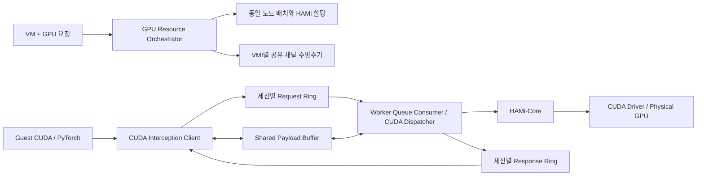

# 10-01: SHM 전환 계약과 인터페이스

**계약·코드 인터페이스 작성 완료, 검증 NOT_RUN.** 기준은 7단계
`c3d381f312b32012738d0c105517b789b5b72f5d`, 브랜치는 `stage/10-01-shm-contract`다.
8·9단계 검증과 CPU 배포 실험은 보류한다. 보류된 검증을 성공으로 간주하지 않는다.

이번 요청은 검토에서 정한 10-01 개발을 시작하는 것으로 범위를 고정했다. 10-02~10-10 전체를
완료한 것이 아니다. 실제 Queue, dispatcher 함수 본체, VM 장치 연결, CRD/Controller 확장은
후속 단계에 남아 있다. 기존 runtime을 이 인터페이스로 연결하거나 배포하지 않았다.

## 첨부 아키텍처에 대응하는 목표

VM에는 물리 GPU를 노출하지 않는다. 초기에는 하나의 VMI에 하나의 GPU Worker Pod를 두고
client별 실행 프로세스·CUDA 상태·handle mapping을 유지한다. VMI별 backing 안에 세션별
Queue와 payload arena를 배정한다. HAMi는 실제 CUDA를 호출하는 Worker 프로세스에 적용한다.

최종 목표는 SHM 전용 CUDA data path다. RPC 오류 fallback이나 dual-runtime 운영을 추가하지
않는다. 이전 브랜치가 RPC 구현의 보존 지점이다. Kubernetes API와 Controller 관리 연결까지
모두 SHM으로 바꾸는 것은 이번 목표에 포함하지 않는다.

## 이번 산출물

| 파일 | 내용 |
|---|---|
| `include/flyt_shm_contract.h` | Descriptor offset·상태·API ID와 dispatcher/Queue 함수 선언 |
| `schema/channel.schema.json` | VMI 생성 전 allocation과 생성 후 binding 데이터 계약 |
| `schema/session.schema.json` | RPC 필드가 없는 SHM 세션 endpoint 데이터 계약 |
| [PROTOCOL.md](PROTOCOL.md) | Header/ring layout, 메모리 순서, 소유권, 오류·비동기 의미 |
| [LIFECYCLE.md](LIFECYCLE.md) | 동일 노드 배치, VM 시작 gate, 채널 준비·연결·회수 순서 |
| `versions.json` | 작성 범위와 NOT_RUN 상태 |

JSON Schema는 설치 가능한 CRD가 아니다. C 헤더는 standalone 선언이며 현재 빌드에 포함하지
않았다. Schema의 형태 검사 외에 layout 범위·overlap·overflow·identity·상태 전이 검사가 필요하다.
미구현 함수에 성공을 반환하는 mock 본체를 넣지 않았다.

주요 결정은 다음과 같다.

- VM UID + 별도 allocation ID로 채널을 먼저 준비하고 VMI 생성 후 UID를 고정한다.
- 초기에는 Profile의 승인 node/GPU UUID를 사용한다. 자동 다중 GPU 선택은 별도 범위다.
- 초기 세션은 SPSC ring 쌍과 하나의 in-flight API 요청을 사용한다. 멀티스레드 제출은 로컬 직렬화한다.
- wire 주소는 offset/length이며 native pointer/struct를 공유하지 않는다.
- 입력을 Host private memory로 복사해 검증한다. 최초 구현에서 zero-copy 성능을 약속하지 않는다.
- API 반환과 GPU 완료를 구분한다. timeout 이후 요청 자동 재실행과 RPC fallback은 없다.
- active 채널 live migration과 기존 CUDA 세션의 투명 복구는 초기 지원에서 제외한다.

## 이후 브랜치별 작업과 RPC 제거

| 단계 | 구현 범위 | 경계 |
|---|---|---|
| 10-02 `cuda-dispatch` | `svc_req`, XDR 결과 수명과 CUDA handler 분리 | handler가 transport를 몰라도 동작하도록 구성 |
| 10-03 `shm-queue` | ring·payload·encode/decode·검사·polling | Host 프로세스 시험과 VM 시험을 구분 |
| 10-04 `vm-shm-channel` | ivshmem 후보 adapter, Guest/Host mapping·알림 | 실제 플랫폼 제약을 확인해야 연결 완료 가능 |
| 10-05 `channel-controller` | 채널 CRD, 시작 gate, 배치·mapping ACK·회수 | 기존 실행 VMI에 무조건 소급 적용하지 않음 |
| 10-06 `shm-cuda-core` | 최소 Runtime/Driver API와 endpoint 전환 | 미지원 API는 명시적 오류 |
| 10-07 `shm-async` | kernel·stream·event·async memory | staging 수명과 API별 completion 정의 |
| 10-08 `shm-compatibility` | Graph·라이브러리·기존 PyTorch 사용 API | API별 payload/handle 변환과 지원 목록 관리 |
| 10-09 `shm-lifecycle` | crash·timeout·동시 세션·세대 변경 | late response 및 old cleanup 처리 |
| 10-10 `rpc-removal` | ONC RPC 코드·의존성·배포 자원 삭제 | SHM 전용 이미지와 배포 구성 |

10-02 대상은 `cpu-client*.c`, `cpu-server*.c`, `resource-map.c`, `cpu_rpc_prot.x` 등에 걸친
인자/결과 변환과 수명이다. CUDA 구현 전체를 재작성하지 않는다. RPC stub을 호출하는 SHM
wrapper로 끝내지 않고 공통 dispatcher를 직접 호출하도록 옮긴다.

10-10 제거 목록은 rpcgen, 실행용 XDR/stub, libtirpc, rpcbind, RPC program/version ID,
RPC endpoint와 포트용 Service/NetworkPolicy, RPC readiness 및 이미지 패키지다. 7단계의
`Session.rpc_id`와 Guest `address,rpc_id` 응답, Node Manager RPC 생성 명령도 새 채널 계약으로
교체해야 한다. 오래된 참조 문서까지 삭제해서 과거 실험 근거를 없애지는 않는다.

## 검증과 완료 표시

이번에는 헤더 compile, JSON Schema 검증, 테스트, build, Kubernetes/VM 배포, GPU 실행을
전부 수행하지 않았다. 파일 작성과 Git 반영은 runtime 성공의 근거가 아니다.

후속 검증에서는 encode/decode, Queue 순서와 overflow, 부정확한 descriptor, timeout과 늦은
응답, 다중 client, VM mapping, 동일 node 배치, 실패 회수와 실제 CUDA/HAMi 경로를 각각
확인해야 한다. 기존 8·9단계의 호환성·Multi-VM 검증은 최종 SHM 개발 이후에도 남는다.

이 브랜치는 기존 1~7단계 소스·CRD·runtime 패치를 보존한다. GPU/노드/외부 플랫폼 설정을
변경하지 않았다. 별도의 배포 명령이나 자동 실행 CI는 추가하지 않는다.
